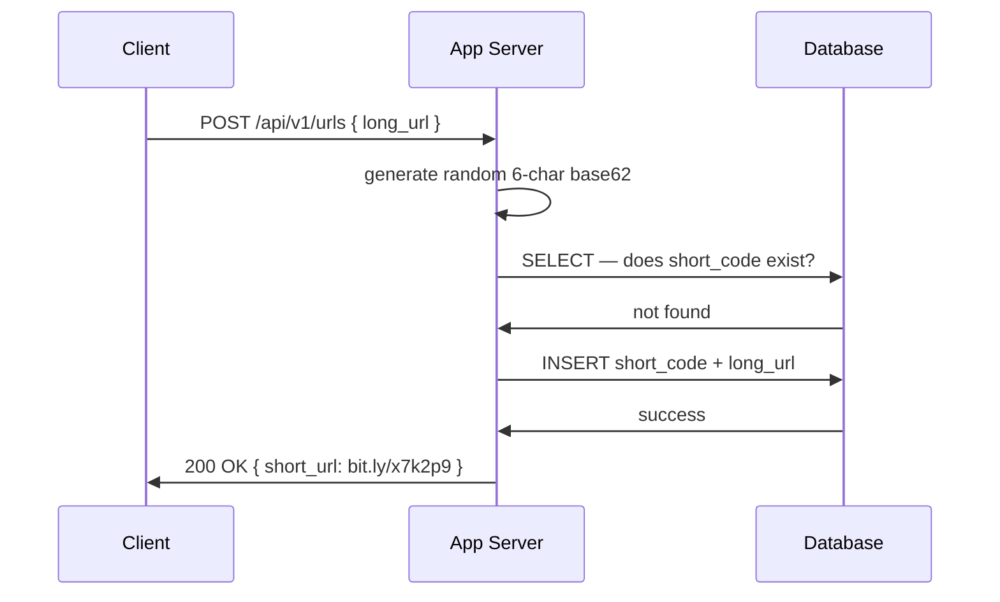
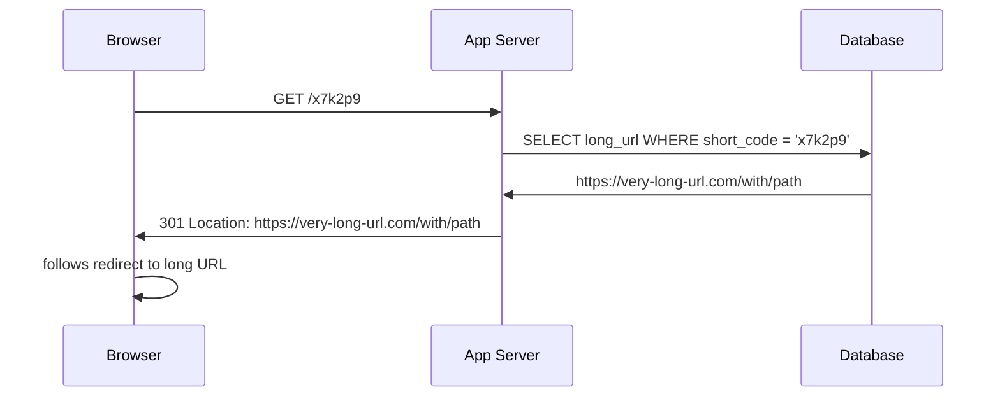
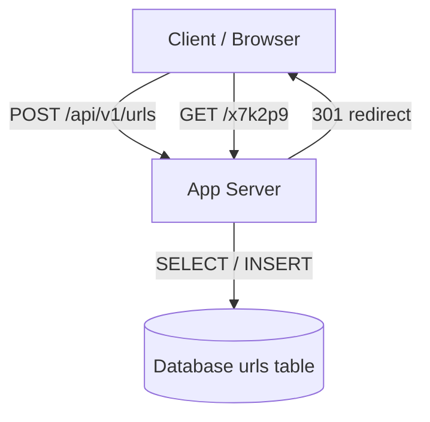

> [!info] The base architecture
> After working through every short code generation approach, we have what we need to build the simplest end-to-end system that actually works. No caching, no sharding, no fancy ID service — just the skeleton. Everything else is a deep dive.

---

## The components

The base architecture has exactly two components — an app server and a database. Nothing else.

The temptation is to immediately add an API Gateway in front of the app server. API gateways give you rate limiting, auth, and request routing across multiple services. But for a base architecture with a single app server, it adds complexity without adding value. You skip it here and add it in deep dives when you actually need it — for example, when you split creation and redirect into separate services.

```
Client → App Server → Database
```

That's it. Two boxes.

---

## Creation flow — end to end

```
1. Client sends:
   POST /api/v1/urls
   { "long_url": "https://very-long-url.com/with/path" }

2. App server generates a random 6-char string
   e.g. → x7k2p9

3. App server queries DB:
   SELECT 1 FROM urls WHERE short_code = 'x7k2p9'

4a. Not found → INSERT INTO urls (short_code, long_url, created_at)
                VALUES ('x7k2p9', 'https://...', NOW())
    Return 200: { "data": { "short_url": "bit.ly/x7k2p9" } }

4b. Found (collision) → go back to step 2, generate new code, retry
```



---

## Redirect flow — end to end

```
1. User clicks bit.ly/x7k2p9
   Browser sends: GET /x7k2p9

2. App server extracts short code from path: x7k2p9

3. App server queries DB:
   SELECT long_url FROM urls WHERE short_code = 'x7k2p9'

4a. Found → respond with:
    HTTP 301
    Location: https://very-long-url.com/with/path

4b. Not found → respond with HTTP 404
```



The browser never asks the app server for the destination explicitly. It hits the short URL, gets a 301, and follows the `Location` header directly. The app server is out of the loop after that first request.

---

## Full system diagram



One app server. One database. That's it.

---

## Known limitations — flagged for deep dives

The base architecture is intentionally simple. The point is not to handle every problem — the point is to build the simplest thing that works end to end, name the limitations honestly, and let the deep dives fix them one by one.

| Limitation | Why it matters | Deep dive fix |
|---|---|---|
| 100k reads/sec | Single Postgres handles ~10k-50k reads/sec — it falls over at this load | Caching (Redis) |
| 250TB over 10 years | Cannot fit on a single machine | DB sharding |
| Collision retries | Increase as DB fills up, write latency degrades | Pre-generated key database |
| No fault isolation | Creation and redirect share the same app server and DB | Separate services |
| Peak traffic | Average 100k/sec, peak 1M+/sec — DB will fall over | Caching + load balancing |

Caching is the more urgent fix. Even if your DB had infinite storage, it would fall over under read load long before storage becomes a problem. That's why caching is deep dive number one — not sharding.

---

> [!tip] Interview framing
> "For the base architecture: client hits the app server directly — no API gateway needed yet. One app server, one DB. Creation flow — generate a random 6-char base62 string, check for collision via unique index, insert. Redirect flow — look up the short code, return a 301. A single Postgres instance handles roughly 10k-50k reads/sec — 100k QPS will overwhelm it, so caching is the first deep dive. 250TB over 10 years won't fit on one machine, so sharding is the second."
