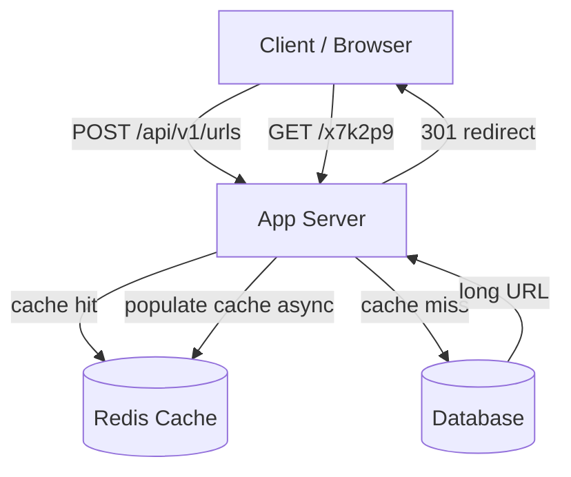
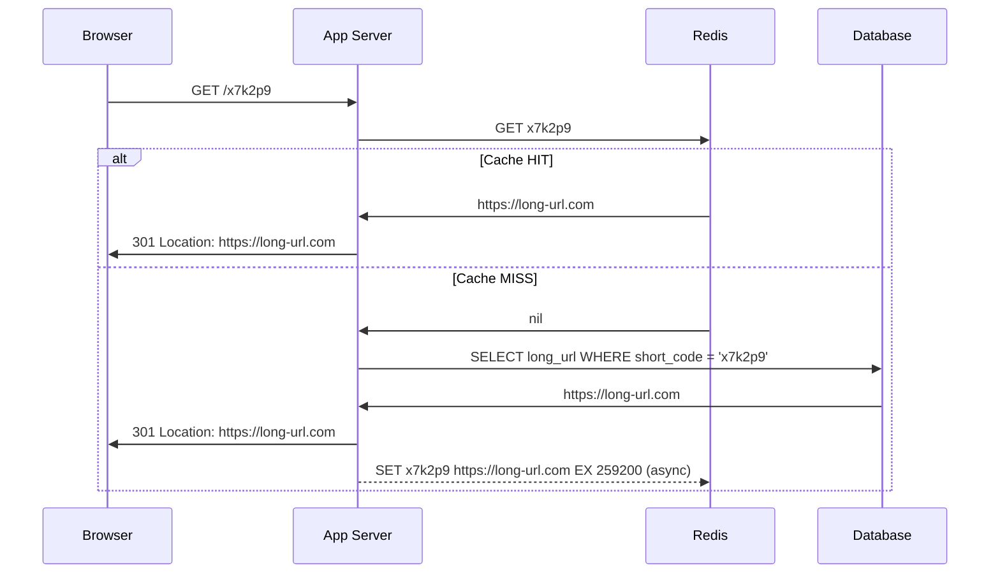

> [!info] The updated architecture
> With caching in place, the redirect flow no longer hits the database for every request. 80% of reads are served from Redis in memory. Only 20% reach the database — bringing the effective DB read load from 100k/sec down to ~20k/sec, well within a single Postgres instance's capacity.

---

## Updated system diagram



---

## Creation flow — unchanged

The creation flow does not change. Write-around means the cache is not touched on creation.

```
1. Client sends POST /api/v1/urls { long_url }
2. App server generates random 6-char base62 short code
3. App server checks DB for collision
4. If unique → INSERT into DB
5. Return 200 { short_url: bit.ly/x7k2p9 }

Cache is never touched during creation.
```

---

## Redirect flow — updated with Redis

```
1. User clicks bit.ly/x7k2p9
   Browser sends: GET /x7k2p9

2. App server extracts short code: x7k2p9

3. App server checks Redis:
   GET x7k2p9

4a. Cache HIT → Redis returns long URL
    → App server returns 301 Location: https://long-url.com
    → Done. DB never involved.

4b. Cache MISS → App server queries DB:
    SELECT long_url FROM urls WHERE short_code = 'x7k2p9'
    → DB returns long URL
    → App server returns 301 Location: https://long-url.com
    → App server asynchronously writes to Redis:
      SET x7k2p9 https://long-url.com EX 259200  (TTL = 3 days in seconds)
```



---

## The numbers after caching

```
Total redirect load     → 100k reads/sec (average)
Cache hit rate          → 80%
Requests served by Redis → 80k/sec  ← never touch the DB
Requests reaching DB    → 20k/sec   ← within Postgres capacity

Peak load               → 1M reads/sec
Requests reaching DB    → 200k/sec  ← still too much at peak
```

At average load, caching solves the problem entirely. The DB receives 20k reads/sec — well within Postgres capacity.

At peak load (1M/sec), even 20% of that is 200k DB reads/sec — still too much for a single instance. This is why the next deep dive is DB read replicas — to handle the remaining load at peak. Caching is always the first fix. Replicas come after.

---

## What the cache actually stores

Each Redis entry is a simple key-value pair:

```
Key   → short code (6 chars)     e.g. "x7k2p9"
Value → long URL (up to ~250B)   e.g. "https://very-long-url.com/with/path"
TTL   → 259200 seconds (3 days)
```

No metadata, no timestamps, no user info. Just the mapping the redirect flow needs. Lean and fast.

---

> [!tip] Interview framing
> "With write-around caching and a 3-day TTL, 80% of redirects are served from Redis — DB load drops from 100k to 20k reads/sec. Cache miss flow: check Redis, miss, query DB, return 301, async populate cache. At peak 1M/sec, 20% cache misses still means 200k DB reads — that's where read replicas come in as the next deep dive."
