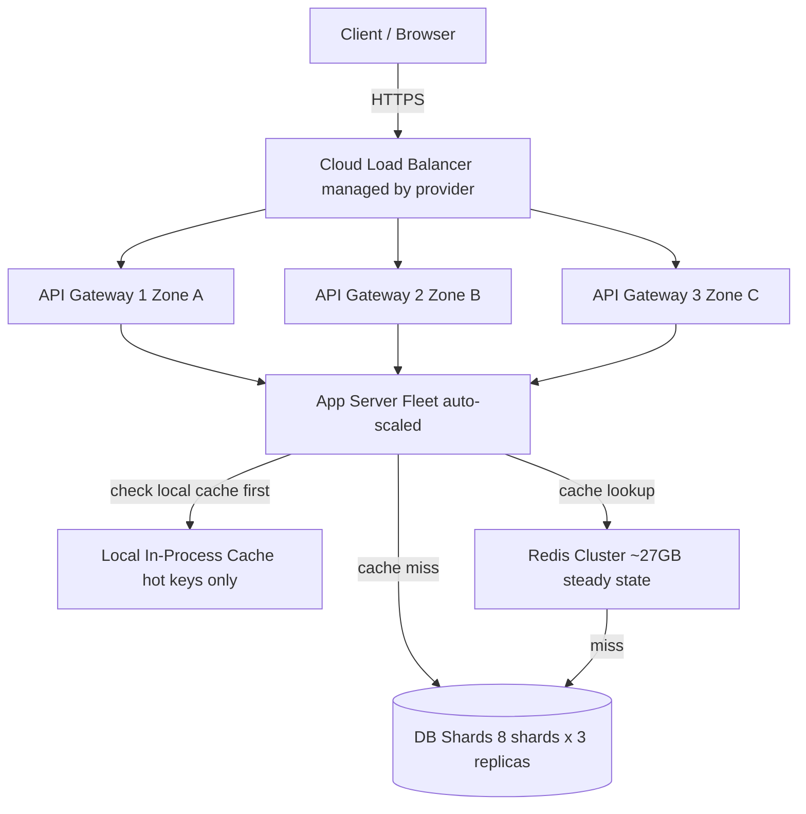

> [!info] The full scaled architecture
> After caching, DB sharding, and peak traffic handling — this is what the complete system looks like. Every layer is redundant, every bottleneck has been addressed.

---

## Full system diagram



---

## Request flow at peak — redirect

```
1. User clicks bit.ly/x7k2p9
   Browser → HTTPS → Cloud LB

2. Cloud LB routes to one of 3 API Gateway instances

3. API Gateway:
   - Rate limit check
   - TLS already terminated
   - Load balance to one app server

4. App server:
   a. Check local in-process cache → HIT (hot key) → return 301 immediately
   b. Miss → check Redis Cluster → HIT → return 301, async populate local cache
   c. Miss → query DB shard → return 301, async populate Redis + local cache

5. Browser follows 301 → Location: https://long-url.com
```

---

## Request flow at peak — creation

```
1. Client → POST /api/v1/urls { long_url }
   → Cloud LB → API Gateway → App server

2. App server:
   - Generate random 6-char base62 short code
   - Check DB shard for collision (unique index lookup)
   - If collision → regenerate
   - INSERT into DB shard primary
   - Set cookie: ryow_until = now + 30s
   - Return 200 { short_url: bit.ly/x7k2p9 }

3. Cache NOT populated on creation (write-around)
   First click populates cache
```

---

## The numbers after all deep dives

```
Total reads at peak     → 1M/sec
Local cache absorbs     → hot keys, ~varies
Redis serves            → 80%+ of remaining reads
DB sees at peak         → ~200k/sec → spread across 8 shards × 2 secondaries = 16 read nodes
                        → ~12.5k reads/sec per node ← within Postgres capacity ✓

Total writes            → 1k/sec → all to shard primaries → ~125 writes/sec per shard ← trivial
```

---

## Every SPOF eliminated

| Component | Redundancy |
|---|---|
| Cloud LB | Managed by provider, multi-zone |
| API Gateway | 3 instances across 3 availability zones |
| App servers | Auto-scaled fleet, stateless |
| Redis | Cluster mode, multiple nodes |
| DB | 8 shards × 3 replicas = 24 machines |

No single machine failure takes down the system at any layer.

---

## Known remaining limitations

```
Pre-generated key DB  → collision retry degrades at high DB fill rate → next deep dive
Fault isolation       → creation and redirect share app servers → next deep dive
Analytics             → out of scope, but 301 means no click tracking possible
```

---

> [!tip] Interview framing
> "Full stack at peak: Cloud LB → 3 API Gateway instances → auto-scaled app server fleet → local cache for hot keys → Redis Cluster → 8 DB shards with 3 replicas each. 1M reads/sec: local cache absorbs hot keys, Redis absorbs 80%+, DB sees ~200k/sec spread across 16 read nodes — ~12.5k each, within capacity. No single point of failure at any layer."
