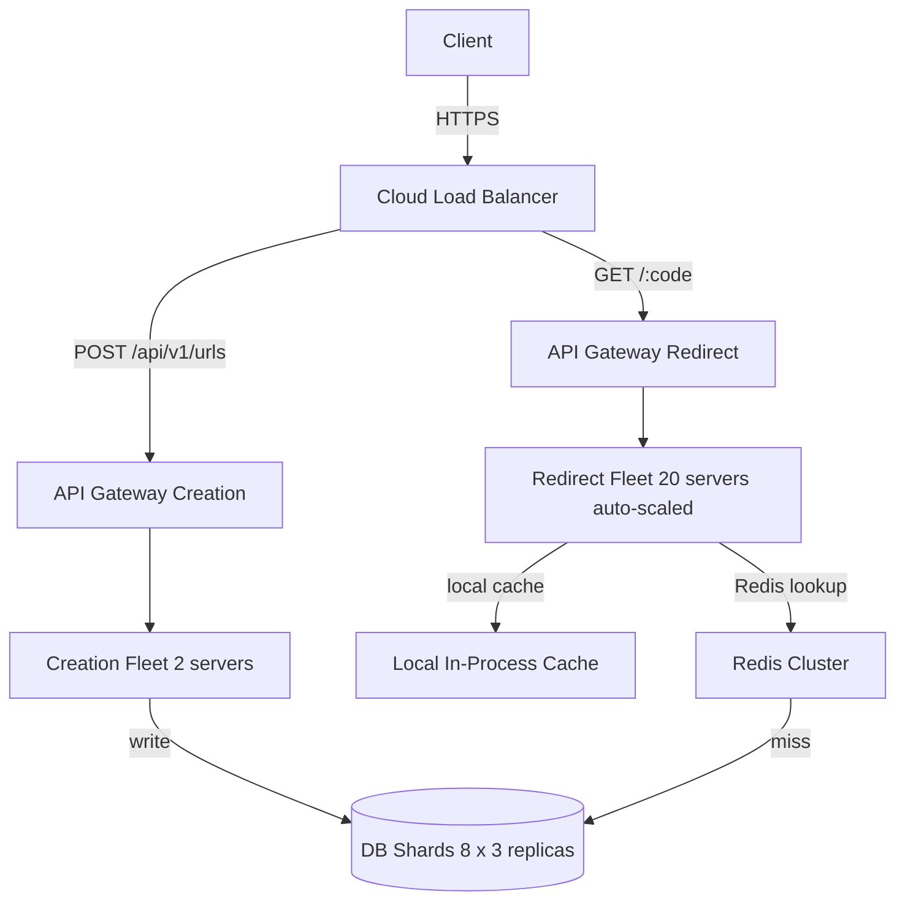

> [!info] The problem — two operations sharing one fleet
> Creation (POST /urls) and redirect (GET /:code) are completely different operations. One is write-heavy, one is read-heavy. One gets 1k requests/sec, one gets 1M requests/sec. But in the base architecture, both run on the same app server fleet. That shared fleet is the problem.

---

## What the base architecture looks like

```
Client
→ API Gateway
→ App Server Fleet (20 servers)
   ├── POST /api/v1/urls   → creation logic
   └── GET /:code          → redirect logic
```

All 20 app servers handle both types of requests. The fleet is sized to handle redirect load — 1M requests/sec at peak. Creation is just riding along on those same servers doing almost nothing.

This looks fine at first glance. The code works. URLs get created and redirected. But there are three serious problems hiding underneath.

---

## Problem 1 — Fault coupling

If the creation service has a bug that causes it to crash or consume excessive memory, it crashes the entire app server process. That means redirect goes down too.

```
Bug in creation logic
→ App server process consumes 100% memory
→ OS kills the process
→ API Gateway health check fails
→ Server removed from pool
→ Redirect requests also lose that server
```

Redirect had nothing to do with the bug. It was perfectly healthy. But it died anyway because it shared a process with creation.

The fix is to separate them into two independent services running as completely separate fleets:

```
Client
→ API Gateway
   ├── POST /api/v1/urls  → Creation Fleet (2 servers)
   └── GET /:code         → Redirect Fleet (20 servers)
```

Now if creation crashes, redirect is untouched. Users can still click short URLs and reach destinations. The system degrades gracefully — creation is down, but the primary use case (visiting a short URL) still works. That is the goal: **never let a write failure take down reads.**

---

## Problem 2 — Independent scaling

This is the numbers problem. Look at the traffic gap:

```
Redirect (GET /:code)    → 1,000,000 requests/sec at peak
Creation (POST /urls)    → 1,000 requests/sec at peak

Ratio: 1000x
```

With a shared fleet, you size the fleet for the biggest consumer — redirect. So you run 20 app servers. Creation gets 20 servers worth of capacity when it needs maybe 2.

```
Redirect needs: 1,000,000 / 50,000 per server = 20 servers
Creation needs: 1,000 / 50,000 per server = 0.02 servers → round up to 2
```

Creation is sitting on 20 servers and using less than 1% of the capacity you're paying for on 18 of them. That's pure waste.

Separate fleets let you size each one independently:

```
Redirect Fleet → 20 servers, auto-scaled aggressively on CPU + requests/sec
Creation Fleet → 2 servers, barely auto-scales unless someone runs a bulk URL campaign
```

Auto-scaling also behaves differently. Redirect needs to scale fast — a viral tweet can send traffic from 100k to 1M in under a minute. Creation traffic is far more gradual. With a shared fleet, you'd configure auto-scaling aggressively for redirect, which means creation also over-provisions unnecessarily during spikes.

---

## Problem 3 — Deployment isolation

This one requires some background because it's not obvious if you haven't worked on production systems before.

In a real engineering team, **creation and redirect are changed by different people at different times for different reasons**. Creation gets new features — custom slugs, expiry dates, bulk upload. Redirect rarely changes — it's a cache lookup and a 301. These two codepaths have completely different rates of change.

Every time you deploy a change, there's a risk. You push new code, something unexpected happens. Maybe the new creation logic has a memory leak under load. Maybe a new regex for URL validation has a pathological edge case. Production bugs that only show up under real traffic happen all the time.

With a shared fleet, every creation deploy also touches the redirect code. Even if the redirect code hasn't changed at all, a bad creation deploy can destabilize the entire fleet:

```
Deploy new creation feature
→ Deploy goes to all 20 shared app servers
→ New creation code has a memory leak
→ All 20 servers start leaking memory
→ Redirect starts failing 30 minutes later as memory fills up
→ 1M redirects/sec goes down
```

Redirect had zero changes in that deploy. But it's dead because it shared a fleet with creation.

With separate fleets, a creation deploy only touches the 2 creation servers:

```
Deploy new creation feature
→ Deploy goes to 2 creation servers only
→ New code has a memory leak
→ 2 creation servers degrade
→ Creation fails → users get an error creating new URLs
→ Redirect fleet completely unaffected
→ All existing short URLs still work
```

The blast radius is contained. When something goes wrong — and it will — the damage is limited to the service that changed.

This principle has a name in engineering: **blast radius reduction**. Every architectural decision that limits how far a failure can spread is reducing blast radius. Separate fleets is one of the most effective ways to do it.

---

## The updated architecture



The API Gateway routes by path — POST to /api/v1/urls goes to the creation fleet, GET to /:code goes to the redirect fleet. The two fleets share the same DB and Redis, but they never share app server processes.

---

## The trade-off — more infrastructure to operate

Separate fleets means two codebases (or at least two deployable units), two sets of auto-scaling configs, two health check endpoints, two sets of alerts. The operational complexity doubles for the app server layer.

For a URL shortener at this scale, it is absolutely worth it. The redirect service is the core product — a user who clicks a short link expects it to work, and "the creation service had a bug" is not an acceptable explanation for why clicking a link failed. The two operations have different enough profiles, different enough rates of change, and different enough failure modes that keeping them coupled is the riskier choice.

---

> [!tip] Interview framing
> "Creation and redirect are sharing app servers — three reasons to separate them. Fault isolation: a creation bug can crash the shared fleet and take down redirect. Independent scaling: redirect gets 1M/sec, creation gets 1k/sec — 1000x difference, size them separately. Deployment isolation: creation deploys frequently, redirect rarely changes — a bad creation deploy shouldn't be able to destabilize the redirect fleet. Separate fleets, same DB and Redis. API Gateway routes by path."
