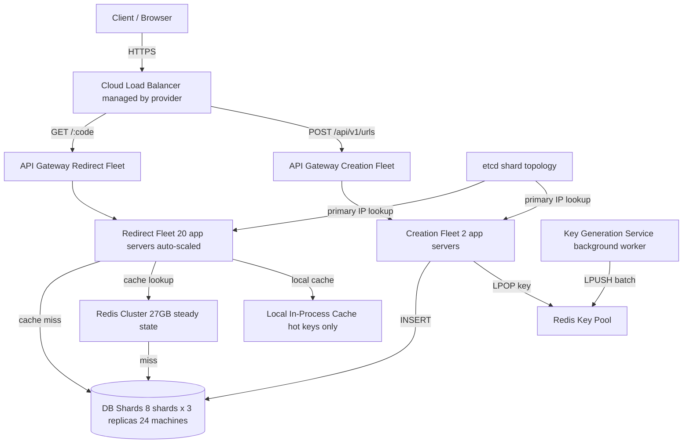

> [!info] The complete URL Shortener — end to end
> This is the full system after every checkpoint. Not the base architecture — the production-ready design after caching, sharding, replication, peak traffic handling, fault isolation, and pre-generated keys. Every component is here with its justification.

---

## Full system diagram



---

## The numbers

```
Users:              100M MAU
Daily active:       10M DAU
Reads per day:      10M × 10 clicks  = 100M/day  → ~1,150/sec avg → 1M/sec peak
Writes per day:     10M × 0.1 create = 1M/day    → ~11/sec avg    → 1k/sec peak

Read:write ratio    1000:1 — heavily read dominant

URLs total (10yr):  1M/day × 365 × 10 = 3.65B → ~50B with safety margin
Storage (10yr):     50B × 500B per row = 25TB → ~250TB with indexes

Short code:         6-char base62 → 62^6 = 56.8B unique codes → covers 50B ✓
```

---

## Layer by layer — what each component does and why

### Cloud Load Balancer
Managed by the cloud provider (AWS ALB, GCP Cloud LB). Replicated across availability zones — not your problem to make redundant. Routes by path: POST /api/v1/urls to creation fleet, GET /:code to redirect fleet. This is the single entry point for all traffic.

### API Gateway — two separate fleets
Creation and redirect are separated into independent fleets. Three reasons:

1. **Fault isolation** — a bug in creation cannot crash the redirect fleet
2. **Independent scaling** — redirect gets 1M/sec, creation gets 1k/sec (1000x difference). Size each fleet for its actual load
3. **Deployment isolation** — deploy creation without touching redirect. A bad creation deploy has blast radius of 2 servers, not 20

Each fleet has 3 API Gateway instances across 3 availability zones. N+1 — lose one zone, remaining two absorb the load.

### App Server Fleets

**Creation fleet (2 servers):**
- Receives POST /api/v1/urls { long_url }
- LPOPs a pre-generated key from Redis key pool
- INSERTs into correct DB shard (consistent hashing on short_code)
- Sets ryow_until cookie (now + 30s)
- Returns { short_url: bit.ly/x7k2p9 }

**Redirect fleet (20 servers, auto-scaled):**
- Receives GET /:code
- Checks local in-process cache (hot keys) → HIT → 301 immediately
- Checks Redis Cluster → HIT → 301, async populate local cache
- Checks DB shard → 301, async populate Redis + local cache
- If ryow_until cookie present → route read to shard primary (not secondary)

Both fleets are stateless. Crash → auto-scaling replaces in seconds.

### Redis Cluster — 27GB steady state
Caches short_code → long_url mappings. Sized for the active window:

```
Active window:      3 days (80% of traffic from URLs created in last 3 days)
Active URLs:        1M/day × 3 days × 20% viral = 600k → round to 54M with buffer
Size per entry:     ~500 bytes
Total:              54M × 500B = 27GB steady state
```

Eviction: volatile-lru. TTL set on all keys (3 days). When memory pressure hits, LRU evicts least recently used keys. Hot keys stay in cache naturally.

Circuit breaker sits between app servers and Redis. After 5 consecutive failures in 10 seconds, circuit opens — requests skip Redis and go straight to DB. No 500ms timeout stalls. Circuit half-opens when Redis recovers, closes fully after successful test request.

### Redis Key Pool
Separate Redis structure (list) holding pre-generated short codes. App servers LPOP keys atomically — Redis single-threaded guarantees no two servers get the same key.

App servers batch-fetch 100 keys at startup and refill when empty — reduces Redis traffic from 1k/sec to ~10/sec.

Pool monitored by watcher:
```
Pool < 20M keys → auto-restart KGS (5.5 hours runway)
Pool < 10M keys → page on-call engineer (2.7 hours runway)
```

### Key Generation Service (KGS)
Background worker running on one cheap server. Walks base62 space sequentially (000000 → zzzzzz). Stores checkpoint (last generated code) durably so it resumes correctly after crash. Pushes batches of 50M keys into Redis pool every few hours.

No UUID. No Snowflake. No collision checks. Sequential generation guarantees uniqueness without coordination.

### DB — 8 shards × 3 replicas = 24 machines

**Schema:**
```sql
CREATE TABLE urls (
    short_code  CHAR(6)      PRIMARY KEY,
    long_url    TEXT         NOT NULL,
    created_at  TIMESTAMPTZ  DEFAULT NOW(),
    expires_at  TIMESTAMPTZ
);

CREATE INDEX idx_short_code_covering
    ON urls (short_code)
    INCLUDE (long_url);
```

Covering index includes long_url — eliminates row lookup on redirect, halves disk I/O per read.

**Sharding:**
- Shard key: short_code
- Algorithm: consistent hashing (K/N keys move on node add, not all keys)
- 8 shards day 1 → scale to 64 long-term (always power of 2 for even splits)

**Replication:**
- 3 replicas per shard (1 primary + 2 secondaries)
- Reads go to secondaries (reduces primary load)
- Writes always go to primary
- RYOW exception: recent reads (ryow_until cookie valid) go to primary

**etcd** stores shard topology:
```
shard-1/primary     → 10.0.1.1
shard-1/secondaries → [10.0.1.2, 10.0.1.3]
```
App servers read from etcd to route requests to correct node IP. No hardcoded IPs anywhere.

---

## Request flows

### Redirect — the hot path

```
1. User clicks bit.ly/x7k2p9
   Browser → HTTPS → Cloud LB → API GW (redirect) → app server

2. App server checks local in-process cache
   HIT (hot key) → return 301 immediately ← fastest path

3. Miss → check Redis Cluster
   HIT → return 301, async populate local cache

4. Miss → check ryow_until cookie
   Valid → route to shard primary
   Invalid → route to shard secondary
   → return 301, async populate Redis + local cache

5. Browser follows 301 → Location: https://long-url.com
```

### Creation

```
1. Client → POST /api/v1/urls { long_url }
   → Cloud LB → API GW (creation) → app server

2. App server:
   - LPOP key from local batch (or refill from Redis pool)
   - INSERT INTO urls (short_code, long_url) → correct DB shard
   - Set-Cookie: ryow_until = now + 30s
   - Return 200 { short_url: bit.ly/x7k2p9 }

3. Cache NOT populated on creation (write-around)
   First redirect populates cache
```

---

## Load distribution at peak

```
1M reads/sec total:
→ Local cache absorbs:   hot keys (viral URLs)
→ Redis absorbs:         ~800k/sec (80%+ hit rate)
→ DB sees:               ~200k/sec
→ Spread across:         16 read nodes (8 shards × 2 secondaries)
→ Per node:              ~12.5k reads/sec ← within Postgres capacity ✓

1k writes/sec total:
→ Spread across:         8 shard primaries
→ Per primary:           ~125 writes/sec ← trivial
```

---

## No single point of failure at any layer

| Component | Redundancy |
|---|---|
| Cloud LB | Managed by provider, multi-zone |
| API Gateway | 3 instances × 2 fleets across 3 availability zones |
| App servers | Stateless, auto-scaled, health-checked |
| Redis Cluster | Cluster mode, multiple nodes, circuit breaker |
| Redis Key Pool | Monitored, KGS auto-restarts on pool drop |
| DB | 8 shards × 3 replicas = 24 machines |
| etcd | Replicated, stores shard topology |
| KGS | Auto-restarts, resumes from checkpoint |

---

## Failure handling summary

| Failure | Impact | Recovery |
|---|---|---|
| Redis cluster down | Circuit breaker opens, API GW throttles reads, partial 503s | Redis recovers → circuit closes → normal |
| DB shard primary down | ~1/8 creations fail for 60s, RYOW fails for 30s window | Replica promoted, etcd updated, full recovery |
| KGS crash | Pool drains at 1k/sec, watcher alerts at 20M keys | Auto-restart, resumes from checkpoint |
| App server crash | Stateless, auto-scaling replaces in seconds | No user impact |

---

> [!tip] Interview closing statement
> "Full stack: Cloud LB → two independent API Gateway fleets (creation + redirect) → auto-scaled stateless app servers → local in-process cache for hot keys → Redis Cluster at 27GB → 8 DB shards with 3 replicas each. 1M reads/sec: local cache absorbs hot keys, Redis absorbs 80%, DB sees 200k/sec across 16 nodes — 12.5k each, within capacity. Short codes from a pre-generated key pool via Redis LPOP — zero collision checks, zero retries. KGS walks base62 space sequentially, 62^6 = 56.8B codes covers 50B requirement. No single point of failure at any layer."
