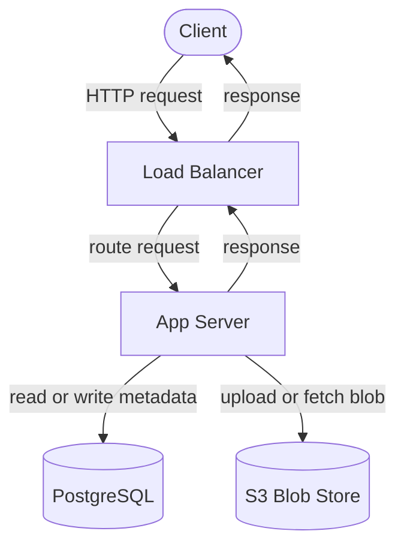
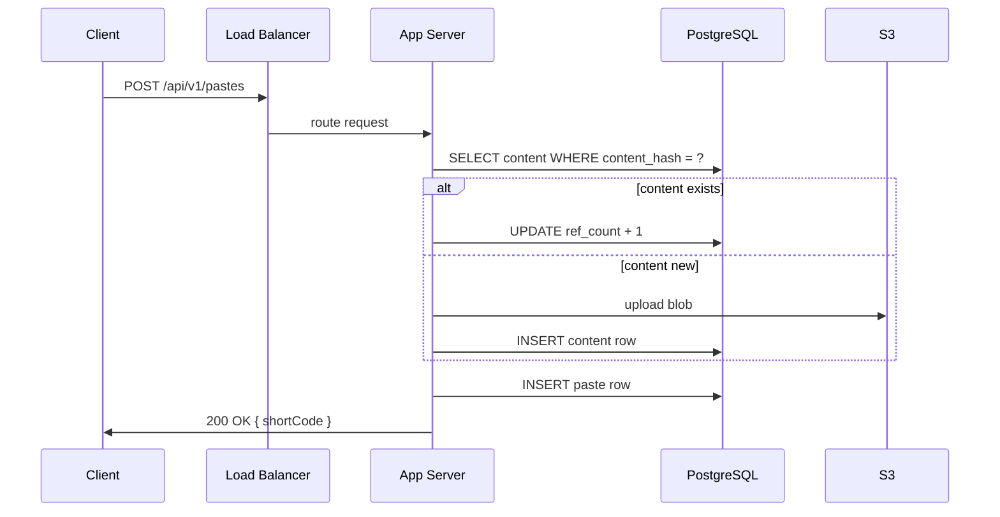
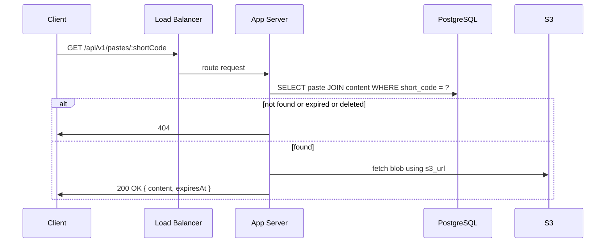

## Components

```
Client          — browser or API consumer
Load Balancer   — distributes traffic, handles SSL termination, single entry point
App Server      — handles all business logic (create, read, delete)
PostgreSQL      — stores metadata (pastes table, content table, users table)
S3              — stores paste content blobs (10KB each)
```

No cache yet. No sharding. No separate read/write fleets. One app server (or a small pool behind the LB), one Postgres primary, one S3 bucket. This works correctly at base scale — 10 writes/sec and 1,000 reads/sec are well within what a single Postgres instance handles.

---

## Architecture Diagram



---

## Write Flow — Creating a Paste

```
1. Client sends POST /api/v1/pastes
   Body: { content, expiryDays, customAlias? }
   Header: Authorization: Bearer <JWT>

2. Load balancer routes to app server

3. App server:
   a. Validates JWT → extracts user_id
   b. Computes content_hash = SHA-256(content)
   c. Checks Postgres: does content_hash already exist?
      → EXISTS:   increment ref_count
      → NOT EXISTS: INSERT content row, upload blob to S3
   d. Generates short_code (random Base62 or validates custom alias)
   e. INSERTs paste row into Postgres

4. Returns { shortCode } → 200 OK
```



---

## Read Flow — Viewing a Paste

```
1. Client sends GET /api/v1/pastes/:shortCode
   No auth required

2. Load balancer routes to app server

3. App server:
   a. Queries Postgres: SELECT paste + content WHERE short_code = ?
   b. Checks: not deleted, not expired → else 404
   c. Fetches blob from S3 using s3_url
   d. Returns { content, expiresAt }
```



---

## Delete Flow — Removing a Paste

```
1. Client sends DELETE /api/v1/pastes/:shortCode
   Header: Authorization: Bearer <JWT>

2. App server:
   a. Validates JWT → extracts caller_user_id
   b. Looks up paste row
      → not found or already deleted → 204 (idempotent)
   c. Checks paste.user_id == caller_user_id → else 403
   d. In one transaction:
      - Soft delete paste row (set deleted_at = NOW())
      - Decrement content.ref_count
      - If ref_count = 0: delete content row, schedule S3 deletion
   e. Returns 204
```

---

## What This Design Does NOT Have Yet

```
No Redis cache        → every read hits Postgres + S3
No read replicas      → all reads and writes go to one Postgres primary
No sharding           → single Postgres instance (fine at base scale, not at 150TB)
No separate services  → one app server handles creates, reads, deletes
No CDN                → S3 fetches come from one region
No expiry worker      → expired pastes not cleaned up yet
```

These are the bottlenecks the deep dives will address one by one. At base scale (10 writes/sec, 1k reads/sec), this design works. The single Postgres instance handles up to 50k reads/sec — we're at 1k. No problem yet.

The first bottleneck to hit as scale grows: every read makes two network round-trips (Postgres + S3). Adding Redis caching eliminates the Postgres hop for hot pastes. That's Deep Dive 1.

---

> [!tip] Interview framing
> "Base architecture: client → load balancer → app server → Postgres for metadata, S3 for content blobs. Write: hash content, check if exists, upload to S3 if new, insert paste row, return short_code. Read: lookup by short_code in Postgres, fetch blob from S3, return content. Delete: verify ownership, soft delete + decrement ref_count in one transaction. No cache, no sharding yet — works correctly at 1k reads/sec, bottlenecks appear at scale."
