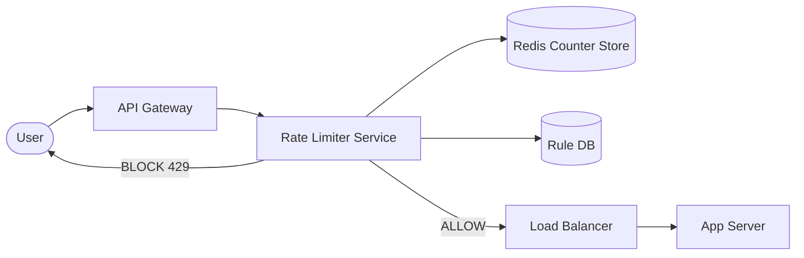

## The Full Request Flow

Every request the API gateway receives goes through this exact sequence before touching any backend service:



---

## Step by Step Inside the Rate Limiter

When the API gateway calls the rate limiter, this is what happens:

```
1. Extract identifier
     - user_id present → use user_id as the key
     - user_id null    → fall back to ip_address

2. Load the rule for this endpoint
     - rules are cached in-process memory (refreshed from Rule DB periodically)
     - no network call needed — just an in-memory map lookup
     - e.g. rule: /login → 5 requests per user per minute

3. Look up the counter in Redis
     - key: user_endpoint:{user_id}:{endpoint}:{window}
     - this is a single Redis GET — returns current count

4. Make the decision
     - count < limit  → increment counter in Redis → return ALLOW
     - count ≥ limit  → return BLOCK with retry_after seconds

5. Return result to API gateway
     - ALLOW  → gateway forwards request to load balancer → app server
     - BLOCK  → gateway returns 429 with Retry-After header to user
```

---

## Why Rules Are Cached In-Process

The Rule DB stores the configuration — which endpoints have which limits, which user tiers get which thresholds. But rules change rarely. A rule for `/login` set to 5 req/min might not change for months.

Hitting the Rule DB on every request at 400K QPS would add a DB query to every single request path. That kills the <10ms latency requirement.

The solution: the rate limiter loads rules into an in-process hash map on startup, and refreshes them on a short polling interval (say every 30 seconds). Rule lookups become a local memory read — nanoseconds, not milliseconds. When an admin updates a rule, it propagates to all rate limiter instances within one polling cycle.

> [!important] This is the right trade-off
> A 30-second propagation delay on a rule change is completely acceptable. You are not updating rules 400,000 times per second — you are updating them maybe once a week. The cost of a slightly stale rule for 30 seconds is negligible. The cost of a DB query on every request is not.

---

## Why Redis for Counters

The counter store needs three properties:
- **Fast** — sub-millisecond reads and writes
- **Shared** — all rate limiter instances must see the same counter for a user
- **Atomic increment** — read and increment must happen as one operation 

Redis delivers all three. It is in-memory (fast), it is a standalone shared service (all nodes talk to it), and it has native atomic operations like `INCR` and `EXPIRE`.

This is why the counter state cannot live inside the rate limiter service itself — rate limiter nodes are stateless and horizontally scaled. If each node kept its own counter, User A could hit Node 1 five times and Node 2 five times and bypass a limit of 5 completely.

---

## Components Summary

```
API Gateway        — intercepts every request, calls rate limiter,
                     forwards or rejects based on response

Rate Limiter       — stateless service, horizontally scalable
                     reads rules from in-process cache
                     checks and increments counters in Redis

Redis              — shared counter store
                     one key per (user/ip + endpoint + window)
                     TTL = window size (keys auto-expire)

Rule DB            — persistent storage for rate limit rules
                     read rarely, updated by admins
                     rate limiter polls it every ~30 seconds

Load Balancer      — receives allowed requests from API gateway
                     routes to app servers

App Server         — never sees blocked requests
                     only receives traffic that passed rate limiting
```
