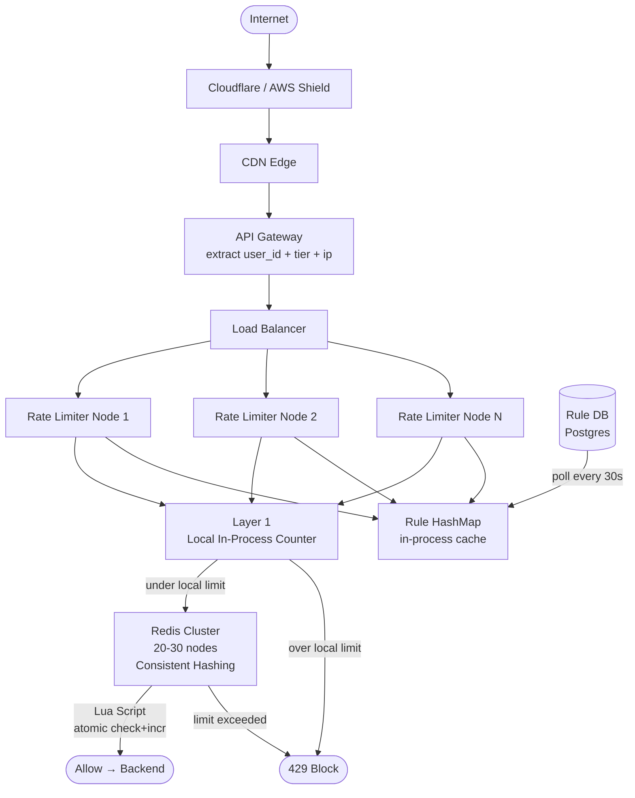

## Final Architecture

This is the base architecture evolved through all deep dive decisions. Every component here exists because a specific problem demanded it.

---

## What Changed From Base Architecture

```
Base Architecture                 Final Architecture
─────────────────────────────────────────────────────────────
Single Redis node                 Redis Cluster (20-30 nodes)
                                  Consistent hashing on user_id

No atomicity solution             Lua scripts for atomic
                                  read-modify-write

No hot key protection             Two-layer counter:
                                  Local in-process + Redis

No DDoS layer                     Cloudflare/AWS Shield at edge

Single rate limiter node          Multiple stateless RL nodes
                                  behind Load Balancer

Rules hardcoded                   Rule DB + in-process HashMap
                                  (30s polling refresh)

Algorithm unspecified             Sliding Window Counter (default)
                                  Sliding Window Log (/login, /payment)
                                  Token Bucket (bursty clients)
```

---

## Full Request Flow



---

## Step by Step — What Happens on Every Request

```
1. Traffic hits Cloudflare/AWS Shield
     Volumetric DDoS absorbed at edge
     Known malicious IPs blocked
     Only clean traffic passes

2. CDN Edge
     Static content served directly
     Geographic filtering
     Cached responses returned without hitting origin

3. API Gateway
     Extracts from JWT: user_id, tier (free/premium/admin)
     Extracts IP address from request headers
     Falls back to ip_address if user_id missing (unauthenticated)
     Calls rate limiter:
       GET /api/v1/rate_limit?user_id=abc&ip=1.2.3.4&endpoint=/login&tier=free

4. Load Balancer
     Routes to one of N rate limiter nodes
     Health checks — removes dead nodes automatically

5. Rate Limiter Node — Layer 1 (Local Counter)
     Looks up local in-process counter for user_id
     local_limit = global_limit / num_rl_nodes
     if local_count >= local_limit → return 429 immediately (no Redis call)
     Protects Redis from hot key storms

6. Rate Limiter Node — Rule Lookup
     hashmap.get(tier + ":" + endpoint)
     → {max_limit: 5, window_sec: 60}
     Nanosecond lookup, no network call

7. Rate Limiter Node — Layer 2 (Redis)
     Compute: window_id = floor(timestamp / 60)
     Compute: overlap = (60 - timestamp%60) / 60
     Consistent hash on user_id → pick Redis node
     Run Lua script atomically:
       GET prev window counter
       GET curr window counter
       estimate = (prev × overlap) + curr
       if estimate < limit → INCR curr → return 1 (allow)
       else → return 0 (block)

8. Rate Limiter returns to API Gateway
     allow → API Gateway forwards request to backend
     block → API Gateway returns 429 with Retry-After header to user

9. Backend Services
     Only see allowed traffic
     Own circuit breakers + concurrency limits as last resort
```

---

## Redis Cluster Detail

```
20-30 Redis nodes
Consistent hashing on user_id → same user always hits same node
Each node owns ~1/20th of keyspace

Node down:
  Fail open for affected users (~5%)
  Fresh counter on recovery
  No replication — losing counters acceptable

Hot key protection:
  Layer 1 local counter absorbs the flood
  Redis never sees more than local_limit requests per user per node
```

---

## Algorithm Selection Per Endpoint

```
Endpoint type              Algorithm              Reason
────────────────────────────────────────────────────────────────
General API (/search,      Sliding Window Counter  Memory efficient,
/feed, /profile)                                   good approximation,
                                                   production standard

Sensitive endpoints        Sliding Window Log      Exact accuracy,
(/login, /payment,                                 low limit so memory
/password-reset)                                   cost acceptable

Bursty clients             Token Bucket            Two knobs — burst
(webhooks, mobile SDK,                             + sustained rate
API integrations)

Downstream protection      Leaky Bucket            Constant output rate,
(SMS gateway, external                             zero burst to
payment API)                                       downstream
```

---

## Failure Mode Summary

```
Component              Failure              Response
─────────────────────────────────────────────────────────────
Rate Limiter node      Crash                LB reroutes, no state lost
Redis node             Down                 Fail open for 5% of users
                                            Fresh start on recovery
Redis cluster          Full outage          Local counters take over
                                            Approximate enforcement
Rule DB                Down                 Zero request impact
                                            Stale rules from HashMap
API Gateway            Down                 Full outage — outside scope
DDoS attack            Volumetric flood     Cloudflare absorbs at edge
                                            RL handles legitimate abuse
```
