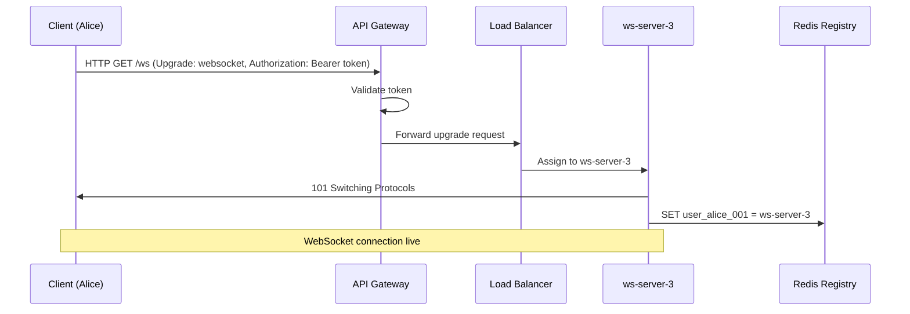

> [!info] How a client connects
> Before Alice can send or receive a single message, her phone needs to establish a WebSocket connection to a connection server. This flow covers everything that happens from the moment she opens the app to the moment the persistent connection is live.

---

## The connection flow step by step

```
Step 1 — Alice opens WhatsApp
Step 2 — Client sends HTTP Upgrade request to API Gateway
Step 3 — API Gateway validates auth token
Step 4 — Load Balancer assigns a connection server
Step 5 — HTTP upgrades to WebSocket
Step 6 — Connection server registers Alice in Redis
Step 7 — Connection is live — Alice can now send and receive
```

---

## Step 2 — The HTTP Upgrade request

WebSocket connections start as HTTP. The client sends a special HTTP request asking to upgrade:

```
GET /ws HTTP/1.1
Host: chat.whatsapp.com
Upgrade: websocket
Connection: Upgrade
Authorization: Bearer eyJhbGci...   ← auth token
Sec-WebSocket-Key: dGhlIHNhbXBsZQ==
Sec-WebSocket-Version: 13
```

This is a normal HTTP request — the API GW can read every header, validate the token, check rate limits. This is the **last moment** the API GW has full visibility into this connection.

---

## Step 3 — API Gateway validates auth

The API GW reads the `Authorization` header and validates the token. If valid, it forwards the upgrade request. If invalid, it returns `401 Unauthorized` and the connection is rejected before it ever reaches a connection server.

```
Token valid   → forward upgrade request → LB → Connection Server
Token invalid → 401 Unauthorized        → connection rejected
```

This is why auth happens here — at the HTTP layer, before the upgrade. After the upgrade there are no HTTP headers to read. The connection server trusts that any connection that made it through the API GW is authenticated.

---

## Step 4 — Load Balancer assigns a connection server

The LB picks a connection server and forwards the upgrade request. It uses **sticky sessions** — once Alice is assigned to ws-server-3, all her WebSocket frames go to ws-server-3 for the entire session. The LB does not round-robin each frame to a different server — that would break the persistent connection model entirely.

---

## Step 5 — HTTP upgrades to WebSocket

The connection server accepts the upgrade and responds:

```
HTTP/1.1 101 Switching Protocols
Upgrade: websocket
Connection: Upgrade
Sec-WebSocket-Accept: s3pPLMBiTxaQ9kYGzzhZRbK+xOo=
```

`101 Switching Protocols` — the connection is now a WebSocket. From this point, no more HTTP. Raw WebSocket frames flow in both directions over the same TCP connection.

```
Before upgrade:  HTTP request → HTTP response (stateless, connection closes)
After upgrade:   persistent TCP pipe, both sides push frames at any time
```

---

## Step 6 — Connection registry update

The connection server immediately writes Alice's entry to Redis:

```
SET user_alice_001 ws-server-3
```

This is how the rest of the system knows where Alice is. When someone sends Alice a message, the app server looks up `user_alice_001` in Redis, gets `ws-server-3`, and knows exactly which connection server to forward the message to.

On disconnect, the connection server deletes the entry:

```
DEL user_alice_001
```

If Alice's entry is not in Redis, she is offline.

---

## Step 7 — Connection is live

Alice's phone now has a persistent full-duplex connection to ws-server-3. The connection stays open until Alice closes the app or loses network. No polling, no reconnection per message — the pipe is open and ready.


