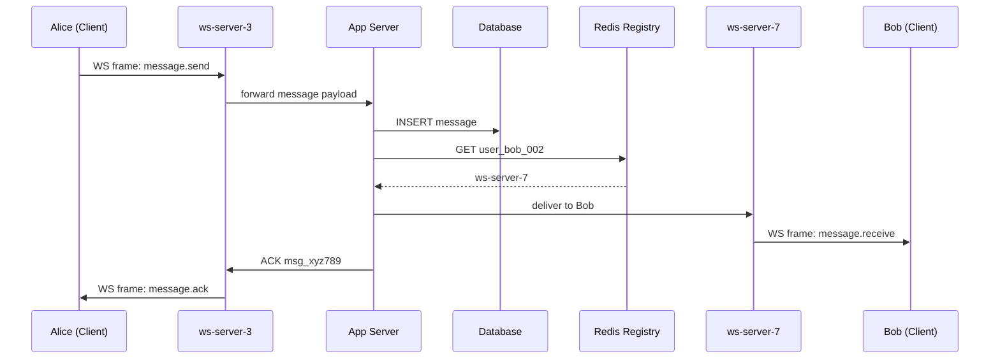

> [!info] What happens when Alice sends Bob a message
> This is the core flow of the system. Everything else — connection setup, registry, routing — exists to make this work correctly, reliably, and fast.

---

## The full flow

```
Step 1 — Alice sends a WebSocket frame to ws-server-3
Step 2 — ws-server-3 forwards to App Server
Step 3 — App Server writes message to DB
Step 4 — App Server looks up Bob in Redis registry
Step 5 — App Server forwards message to ws-server-7
Step 6 — ws-server-7 pushes frame to Bob
Step 7 — App Server ACKs back to Alice
```

---

## Step 1 — Alice sends the frame

Alice hits send. Her client emits a WebSocket frame to ws-server-3 (her assigned connection server):

```
event: "message.send"
payload: {
  conversation_id: "conv_abc123",
  sender_id:       "user_alice_001",
  message_id:      "msg_xyz789",← client-generated for    
                                  deduplication
  
  content:         "hey",
  timestamp:       1713087600000
}
```

The frame travels over the already-open WebSocket connection — no new handshake, no new connection, zero overhead.

---

## Step 2 — Connection server forwards to App Server

ws-server-3 receives the frame. Its job is connection management, not business logic. It forwards the message payload to an App Server over an internal HTTP or gRPC call.

---

## Step 3 — App Server writes to DB

The App Server validates the payload and writes the message to the database **before doing anything else**.

Write to DB first — this is the durability guarantee. If anything fails after this point (Bob is offline, ws-server-7 crashes, network blip), the message is not lost. It is in the database and can be delivered later.

> [!danger] Never ACK before writing to DB
> Some designs ACK the sender first and write to DB async. If the server crashes between ACK and write, the message is lost forever. Alice thinks it was delivered. It wasn't. The correct order is: write to DB → then ACK → then deliver.

---

## Step 4 — Look up Bob in Redis

App Server queries the connection registry:

```
GET user_bob_002
→ "ws-server-7"
```

One O(1) Redis lookup. The App Server now knows Bob is online and connected to ws-server-7.

If Bob is not in Redis — he is offline. The message is already in the DB. Delivery will happen when Bob reconnects. (Offline delivery is a deep dive topic.)

---

## Step 5 — Forward to Bob's connection server

App Server sends the message to ws-server-7 over an internal call:

```
→ ws-server-7: deliver message_id msg_xyz789 to user_bob_002
```

---

## Step 6 — ws-server-7 pushes to Bob

ws-server-7 has Bob's open WebSocket connection. It pushes the frame:

```
event: "message.receive"
payload: {
  conversation_id: "conv_abc123",
  sender_id:       "user_alice_001",
  message_id:      "msg_xyz789",
  content:         "hey",
  timestamp:       1713087600000
}
```

Bob's phone receives this instantly — no polling, no request from Bob's side. The server pushed it the moment it arrived.

---

## Step 7 — ACK back to Alice

Once the message is written to DB (not necessarily delivered to Bob — Bob could be offline), the App Server sends an ACK back to Alice's connection:

```
event: "message.ack"
payload: {
  message_id: "msg_xyz789",
  status:     "sent"
}
```

Alice sees the single tick — message delivered to server. If Bob's delivery also succeeds, a second ACK can be sent for the double tick. (Read receipts are out of scope for base architecture.)

---

## Full sequence diagram



---

## Latency breakdown

```
Alice → ws-server-3          → ~10ms  (network)
ws-server-3 → App Server     → ~2ms   (internal, same DC)
App Server → DB write        → ~5ms   (fast write path)
App Server → Redis lookup    → ~1ms   (in-memory)
App Server → ws-server-7     → ~2ms   (internal)
ws-server-7 → Bob            → ~10ms  (network)

Total                        → ~30ms
```

30ms end-to-end — well inside the 200ms SLO.
