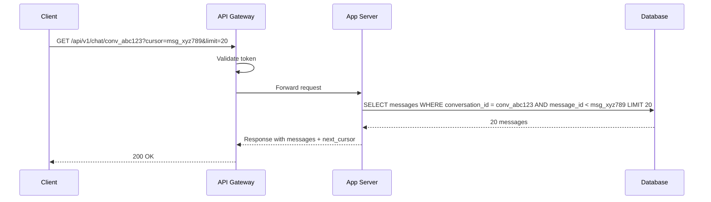

> [!info] Loading previous messages
> Chat history is a pure read path. No real-time push needed — the user opens a conversation and asks for messages. This is a standard REST API backed by a paginated database query.

---

## The flow

```
Step 1 — User opens a conversation
Step 2 — Client sends GET request to API Gateway
Step 3 — API GW validates token, forwards to App Server
Step 4 — App Server queries DB with cursor and limit
Step 5 — DB returns matching messages
Step 6 — App Server returns response to client
```

---

## The request

```
GET /api/v1/chat/conv_abc123?cursor=msg_xyz789&limit=20
Authorization: Bearer token123
```

- `conversation_id` in the path — which conversation to load
- `cursor` — the message ID to paginate from (load messages older than this)
- `limit` — how many messages to return per page (20 is a sensible default)

On first open, no cursor is provided — load the 20 most recent messages.

---

## Why cursor-based pagination

The cursor is a `message_id`, not a page number. This matters.

With offset pagination (`page=2, size=20`), the DB query is `OFFSET 20 LIMIT 20`. If new messages arrive while the user is scrolling, the offset shifts:

```
User loads page 1:  messages 1-20
New message arrives: now there are 21 messages
User loads page 2:  OFFSET 20 → returns message 21 only, skips nothing but feels wrong
                    OR worse: message 20 appears on both page 1 and page 2
```

With cursor-based pagination, the query is `WHERE message_id < cursor ORDER BY timestamp DESC LIMIT 20`. The cursor points to a specific message — regardless of new arrivals, you always get exactly the 20 messages before that point.

```
User loads first page:   20 most recent messages, last one is msg_xyz789
User scrolls up:         GET ?cursor=msg_xyz789 → 20 messages older than msg_xyz789
New messages arrive:     irrelevant — the cursor still points to the same place
```

---

## The DB query

```sql
SELECT message_id, sender_id, content, timestamp
FROM messages
WHERE conversation_id = 'conv_abc123'
  AND message_id < 'msg_xyz789'   -- cursor
ORDER BY timestamp DESC
LIMIT 20
```

Returns the 20 messages before the cursor, newest first. The client reverses them for display (oldest at top, newest at bottom).

---

## The response

```json
{
  "conversation_id": "conv_abc123",
  "messages": [
    {
      "message_id": "msg_aaa111",
      "sender_id":  "user_alice_001",
      "content":    "how are you?",
      "timestamp":  1713087500000
    },
    {
      "message_id": "msg_bbb222",
      "sender_id":  "user_bob_002",
      "content":    "good thanks",
      "timestamp":  1713087550000
    }
  ],
  "next_cursor": "msg_aaa111"
}
```

`next_cursor` is the oldest message in this batch. The client passes it as `cursor` on the next request to load the next page of older messages. When `next_cursor` is null, there are no more messages to load.

---

## Sequence diagram


