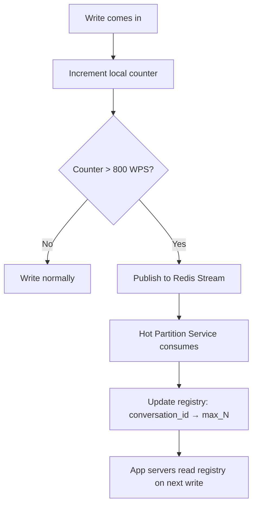

> [!info] You can't fix a hot partition you don't know about
> Detection comes before the fix. The system needs to identify which conversations are generating too many writes per second before it can route them differently. The detection mechanism must be fast, lightweight, and not add latency to the write path.

---

## The problem to detect

DynamoDB limits each partition to **1,000 WPS**. A hot conversation — one where two people are texting rapidly, or a conversation being spammed — can exceed this limit. When it does, DynamoDB throttles writes:

```
Normal write:   INSERT → DynamoDB → success (~5ms)
Throttled write: INSERT → DynamoDB → ProvisionedThroughputExceededException
```

The app server retries with exponential backoff, but if the partition stays hot, retries eventually exhaust and the message is dropped. Detection must happen **before** the partition hits 1,000 WPS — not after.

---

## The detection mechanism

Every app server maintains an **in-memory counter per conversation_id**:

```
local_counter = {
  "conv_abc123": 450,   // 450 writes in the last second
  "conv_xyz999": 12,
  ...
}
```

Every time a write comes in for a conversation, the counter increments. Every second, the app server checks all counters:

```
for each conversation_id in local_counter:
  if local_counter[conversation_id] > THRESHOLD:
    publish to Redis Stream: { conversation_id, wps: counter_value }
  reset counter to 0
```

The threshold is set **below** the DynamoDB limit — say **800 WPS** — to leave headroom before throttling kicks in.

---

## Why local counter on the app server

The counter lives in the app server's memory — not in Redis, not in a database. This is intentional:

```
Redis counter:   every write = 1 Redis INCR call → adds ~1ms latency to every message send
Local counter:   every write = 1 in-memory increment → ~nanoseconds, zero network
```

At 10k WPS, adding 1ms of Redis overhead to every write would add 10 seconds of cumulative latency per second of traffic. The local counter approach keeps the hot path clean.

The downside: each app server only sees its own slice of traffic. If `conv_abc123` generates 900 WPS total but is spread across 10 app servers, each server sees only 90 WPS — below the threshold. Detection misses it.

The fix: set the threshold proportionally lower based on the number of app servers, or aggregate counts across app servers via the Redis Stream consumer before making the salting decision.

---

## Redis Stream as the event bus

When an app server detects a hot conversation, it publishes an event to a Redis Stream:

```
XADD hot_partitions * conversation_id conv_abc123 wps 950
```

Redis Streams are append-only logs — multiple app servers can publish simultaneously without conflicts. Events are durable (with AOF) and ordered.

---

## The central service — consuming from the stream

A dedicated **hot partition service** consumes from the Redis Stream:

```
while true:
  events = XREAD hot_partitions
  for event in events:
    conversation_id = event.conversation_id
    current_wps     = event.wps
    current_N       = registry.get(conversation_id) or 1
    required_N      = ceil(current_wps / 800)
    
    if required_N > current_N:
      registry.set(conversation_id, max_N = required_N)
```

The service maintains the **hot partition registry** — a mapping of conversation_id to its current max_N. App servers read this registry on every write and read to know whether to salt and how many partitions to use.

---

## Detection flow summary


