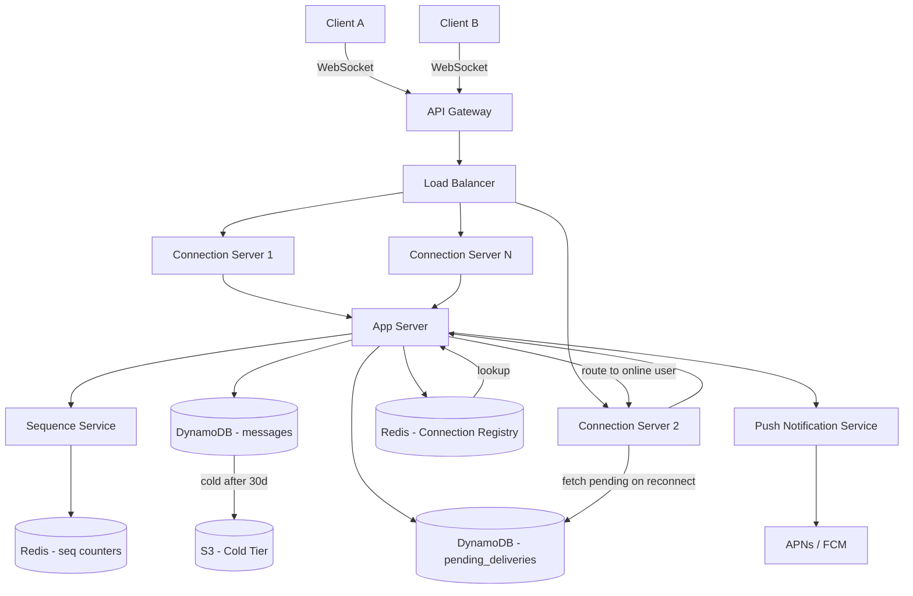

> [!info] Architecture after Offline Delivery deep dive
> A pending_deliveries table is added. Push notification service (APNs/FCM) is wired in. The delivery flow splits into online and offline paths.

---

## What changed from base architecture

The base architecture assumed both users are online. The app server looked up the recipient in Redis and delivered directly. There was no handling for offline users — if Bob wasn't connected, the message was lost.

After this deep dive, the system handles offline delivery correctly.

---

## Changes

**1. pending_deliveries table added**

A new DynamoDB table stores messages that could not be delivered because the recipient was offline:

```
pending_deliveries table:
  PK = recipient_user_id
  SK = seq_number
  Attributes: conversation_id, message_id, sender_id
```

When the app server checks Redis and finds no WebSocket for Bob, it writes to this table instead of dropping the message.

**2. Push Notification Service added**

After writing to pending_deliveries, the app server calls APNs (iOS) or FCM (Android) to wake Bob's device:

```
App Server → Push Notification Service → APNs/FCM → Bob's device wakes
```

The notification payload contains only metadata — not the message content. The device wakes, establishes a WebSocket, and the delivery flow resumes normally.

**3. Delivery flow splits into two paths**

```
Online path:
  App Server → Redis: ws:bob = ws-server-7
  → forward to ws-server-7 → deliver to Bob

Offline path:
  App Server → Redis: ws:bob = absent (offline)
  → write to pending_deliveries
  → call Push Notification Service
  → Bob's device wakes → WebSocket established
  → Bob's connection server fetches pending_deliveries
  → delivers all queued messages in seq order
  → deletes delivered rows from pending_deliveries
```

**4. last_delivered_seq tracking**

The system tracks `last_delivered_seq` per user to know which messages have been delivered. On reconnect, Bob's connection server fetches all pending messages with `seq > last_delivered_seq` and delivers them in order.

---

## Updated architecture diagram


