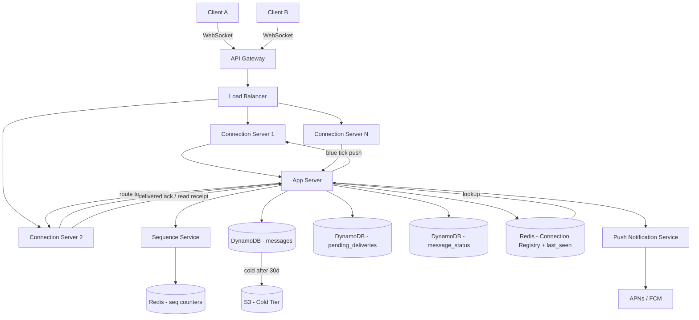

> [!info] Architecture after Message Status deep dive
> A message_status table is added for tick tracking. Read receipt events flow from Bob's client back to Alice. Privacy settings are enforced at client (read receipts) and server (last seen).

---

## What changed from base architecture

The base architecture had no concept of delivery or read status. Messages were sent and forgotten. After this deep dive, the system tracks three tick states per message and enforces privacy settings.

---

## Changes

**1. message_status table added**

A new DynamoDB table tracks delivery and read state per user per conversation using two sequence boundaries:

```
message_status table:
  PK = user_id
  SK = conversation_id
  Attributes: last_delivered_seq, last_read_seq
```

No per-message status rows. Two numbers per conversation derive the state of every message:
- `seq <= last_delivered_seq` → double grey tick (delivered)
- `seq <= last_read_seq` → double blue tick (read)
- `seq > last_delivered_seq` → single grey tick (sent, not delivered)

**2. Delivered ack — cumulative WebSocket event**

When Bob's connection server delivers messages, Bob's client sends a cumulative ack:

```
{ type: delivered_ack, conv_id: conv_abc, up_to_seq: 47 }
```

App server updates `last_delivered_seq = 47` in message_status. Pushes double grey tick to Alice.

**3. Read receipt — client-generated event**

When Bob opens Alice's chat, Bob's client sends:

```
{ type: read_receipt, conv_id: conv_abc, up_to_seq: 47 }
```

App server updates `last_read_seq = 47`. Pushes blue tick to Alice.

**4. Privacy settings — client-side and server-side enforcement**

Read receipts: Bob's client checks `read_receipts_on` flag before generating the read event. If off, the event is never sent — zero network cost. Server is unaware.

Last seen: WS server always records disconnect timestamp. Server checks Bob's `last_seen_hidden` flag before including the timestamp in Alice's conversation open response.

```
last seen stored in:
  Redis: last_seen:bob → timestamp (fast reads)
  DynamoDB users table: last_seen column (durable)
```

---

## Updated architecture diagram


