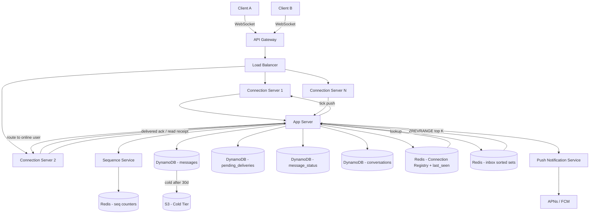

> [!info] Architecture after Inbox deep dive
> A conversations table is added with denormalized preview data. A Redis sorted set per user maintains inbox sort order. Unread count is maintained atomically on the conversations row.

---

## What changed from base architecture

The base architecture's inbox flow was a single line: "App Server → DB (read recent conversations)." There was no schema, no sort strategy, no unread count. After this deep dive, the inbox has a concrete data model and a two-layer read path.

---

## Changes

**1. conversations table added**

A new DynamoDB table stores one row per user per conversation, with denormalized preview data:

```
conversations table:
  PK = user_id
  SK = conversation_id         ← stable, never changes (no tombstones)
  Attributes:
    last_message_preview
    last_message_ts
    unread_count
    avatar_url
```

SK is `conversation_id`, not timestamp. This avoids LSM tree tombstone accumulation — every message send is an in-place attribute update, not a delete + insert.

**2. Redis sorted set per user — inbox:user_id**

Sort order is maintained in Redis, not the DB:

```
Redis sorted set:
  key:    inbox:alice
  member: conv_id
  score:  last_message_timestamp (unix ms)
```

On every message send, the app server updates both:
- DynamoDB: attribute update on conversations row (last_message, last_ts, unread_count)
- Redis: ZADD inbox:alice <new_timestamp> <conv_id>

**3. Inbox read path — two steps**

```
Alice opens inbox
→ Step 1: ZREVRANGE inbox:alice 0 19   (Redis — top 20 conv_ids from RAM)
→ Step 2: batch fetch 20 rows from DynamoDB by conv_id
→ return to client
```

No full-table scan. No in-memory sort on app server. Exactly 20 DB reads per inbox load.

**4. Unread count lifecycle**

Increment: when a message arrives for an offline user — app server already checks Redis for WebSocket presence to route delivery. Same check drives the increment:

```
ws:alice absent → queue in pending_deliveries + unread_count + 1
ws:alice present → deliver directly, skip increment
```

Reset: when Alice opens the chat and sends a read receipt event → app server sets `unread_count = 0`.

---

## Updated architecture diagram


