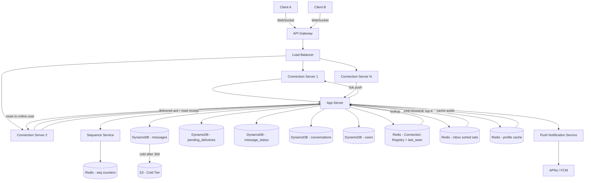

> [!info] Architecture after Caching deep dive
> A profile cache is added as a dedicated Redis node. The app server follows cache-aside for all profile reads. Cache invalidation is synchronous on profile update.

---

## What changed from base architecture

The base architecture had no caching layer for user data — every profile read hit DynamoDB directly. After this deep dive, profile reads are served from Redis on every warm request, with DynamoDB as the fallback on miss.

---

## Changes

**1. Profile cache added — dedicated Redis node**

A new Redis instance (separate from the connection registry and inbox sorted sets) stores user profiles:

```
Profile cache:
  key:   user:<user_id>
  value: { name, avatar_s3_url, status }
  TTL:   3600s + jitter(0, 600)
```

Estimated size: 500M users × 250 bytes = ~125GB. One medium Redis cluster.

**2. Cache-aside read path**

Every profile read now goes through the cache:

```
Alice opens inbox — needs Bob's profile:
→ App server: GET user:bob from Redis
→ Hit:  return cached profile
→ Miss: fetch from DynamoDB → SET user:bob in Redis → return profile
```

**3. Synchronous invalidation on profile update**

```
Bob updates profile:
→ App server writes to DynamoDB
→ App server DEL user:bob from Redis   (~1ms, same request)
→ Next read re-populates cache from DB
```

No Kafka. No outbox. One DEL in the same request handler.

**4. TTL jitter**

TTL is randomised between 3600s and 4200s to prevent synchronised mass expiry — which would cause a scheduled thundering herd exactly 1 hour after a cold start.

---

## Updated architecture diagram


