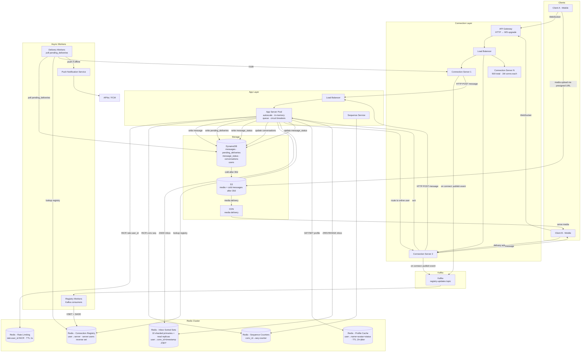

> [!info] Final WhatsApp architecture — all deep dive decisions reflected
> This is the complete system after all deep dives. Every component here was justified through an interview session. Nothing is added speculatively.

---

## Architecture diagram

---

## Decision log — what was decided and why

### Connection Layer

| Decision | Rationale |
|---|---|
| WebSocket over HTTP polling | Persistent connection for real-time delivery. HTTP polling wastes battery and adds latency. |
| 500 connection servers at 1M conns each | 500M DAU × 20% peak = 100M concurrent. 100M / 1M per server = 100 servers minimum. 500 for headroom. |
| Exponential backoff + jitter on reconnect | 1M clients reconnecting simultaneously after a server crash = thundering herd. Jitter spreads the spike. |
| Registry writes async via Kafka | 500M simultaneous registry writes on New Year's midnight overwhelms Redis. Kafka queues absorb the spike. |
| Reverse mapping: server:users Redis Set | Enables O(1) bulk cleanup of stale entries when a connection server dies — no full registry scan. |

---

### App Layer

| Decision | Rationale |
|---|---|
| In-memory queue + thread pool on app server | Absorbs 2-3 minute gap before auto-scaling kicks in. Queue full → 429 → client retries. |
| Circuit breakers to DynamoDB and Redis | Prevents cascade failures. Threads don't hang on dead dependencies. Fail fast, stay alive. |
| Rate limiting via centralised Redis INCR | Per-server counters are bypassable (reconnect to different server). Centralised counter is correct. |
| Rate limit response as WS error message | Can't return HTTP 429 over an established WebSocket. Error goes back on the same channel. |

---

### Storage

| Decision | Rationale |
|---|---|
| DynamoDB for messages | Predictable low-latency at any scale. PK: conv_id, SK: seq_id for range queries. |
| S3 cold tier after 30 days | 95% of reads are recent messages. Cold storage cuts costs without impacting active users. |
| Sequence service (Redis INCR per conv) | Monotonically increasing IDs within a conversation ensure correct message ordering. |
| Conversations GSI: (participant, last_message_at) | Enables efficient inbox query — top K conversations per user sorted by recency. |
| pending_deliveries table | Durable offline message queue. Delivery worker polls and flushes on reconnect. |

---

### Caching

| Decision | Rationale |
|---|---|
| Profile cache (Redis, TTL 1h + jitter) | Profiles read on every inbox load, change rarely. Cache eliminates K DynamoDB reads per inbox open. |
| Sync DEL on profile update | Profile updates are rare. Synchronous DEL + 1ms is simpler than Kafka/outbox for one cache key. |
| Inbox sorted sets (10 sharded primaries) | Single primary can't handle ~1M writes/second at New Year's midnight. Shard by user_id % 10. |
| Read replicas per inbox shard | Spreads 500M inbox reads across the replica fleet. Millisecond replication lag is acceptable. |
| TTL extended to 26h for known events | Prevents cold start compounding on top of thundering herd during predictable high-traffic windows. |
| Request coalescing on profile cache miss | Profile cache failure → cold start on DynamoDB. Coalescing limits each unique profile to 1 DB read per app server at a time. |

---

### Fault Isolation

| Decision | Rationale |
|---|---|
| Stale registry → offline delivery fallback | Dead server routing fails → treat as offline → pending_deliveries → delivered on registry recovery. |
| Monitoring + cleaner for registry cleanup | Reverse mapping lets cleaner bulk-delete 1M stale entries in one Redis Set read — no full scan. |
| DynamoDB circuit breaker (threshold: 1% error rate over 30s) | SLO-driven threshold. Opens before SLO breach. Half-open probes recovery. |
| Inbox Redis failure → DynamoDB GSI fallback | Inbox sorted set is a cache. Conversations table is source of truth. Slightly slower inbox load, not an outage. |
| Rate limit Redis fails open | Temporary loss of rate limiting is better than blocking all message sends during Redis outage. |
| Sequence Redis falls back to timestamp ordering | Slightly weaker ordering acceptable. Message delivery must not be blocked by a sequence counter failure. |

---

## Capacity summary at 500M DAU

| Component | Count / Size |
|---|---|
| Connection servers | 500 |
| App servers | Auto-scaled, ~1,000 at peak |
| DynamoDB | Auto-scales |
| Redis - Connection Registry | 1 cluster (~12.5GB) |
| Redis - Inbox sorted sets | 10 primaries + replicas (~12.5GB total) |
| Redis - Profile cache | 1 cluster (~125GB) |
| Redis - Rate limiting | 1 cluster (tiny — 1s TTL keys) |
| Redis - Sequence counters | 1 cluster (tiny) |
| S3 - Media | Unbounded, tiered |
| Kafka | registry-updates topic, sized for 500M events/hr at peak |
