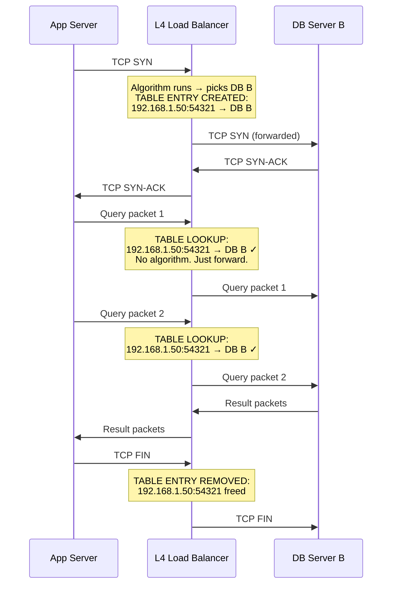

# Layer 4 — Connection Tables

> [!question] The LB picked a server for this request. But what about the next 50 packets that belong to the same conversation?
> Connection tables are how the LB remembers its decisions and ensures every packet in a conversation reaches the same server.

---

## Why a Connection Table Exists — The Problem It Solves

TCP is a **stateful, continuous conversation**. A single database query isn't one packet — it's many packets in sequence:

```
Packet 1 — TCP SYN                    (start connection)
Packet 2 — PostgreSQL auth handshake  (who are you?)
Packet 3 — SELECT * FROM users        (actual query)
Packet 4 — Result row 1               (response starts)
Packet 5 — Result row 2               (response continues)
Packet 6 — Result row 3               (response continues)
Packet 7 — FIN                        (close connection)
```

All 7 packets are one conversation. They must all go to the same server.

If Packet 1 goes to DB Server B and Packet 3 goes to DB Server A:

```
DB Server A receives: SELECT * FROM users
DB Server A thinks:   I never saw the auth handshake for this connection
DB Server A responds: Error — connection not authenticated
```

Server A has no context. The conversation is broken.

The LB runs its algorithm once — on the very first packet (TCP SYN). It picks a server and **records that decision** in the connection table. Every subsequent packet from that same connection is looked up in the table and sent to the same server, no algorithm runs again.

---

## TCP Connection Table — Structure

When the first TCP SYN arrives, one row is added:

```
┌─────────────────────┬─────────────┬───────────────┬───────────┬──────────────────┐
│ Source IP           │ Source Port │ Dest IP       │ Dest Port │ Backend Server   │
├─────────────────────┼─────────────┼───────────────┼───────────┼──────────────────┤
│ 192.168.1.50        │ 54321       │ 10.0.0.1      │ 5432      │ DB B (10.0.0.5)  │
│ 192.168.1.51        │ 61234       │ 10.0.0.1      │ 5432      │ DB A (10.0.0.3)  │
│ 192.168.1.52        │ 49812       │ 10.0.0.1      │ 5432      │ DB C (10.0.0.7)  │
└─────────────────────┴─────────────┴───────────────┴───────────┴──────────────────┘
```

These four columns together — source IP, source port, dest IP, dest port — are called the **4-tuple**. They uniquely identify one TCP connection.

---

## Why All Four Values Are Needed — The 4-Tuple

The same app server can have **multiple simultaneous connections** to the same LB on the same port:

```
App Server 192.168.1.50 opens 3 DB connections simultaneously:

Connection 1: 192.168.1.50:54321 → DB B  (running a user query)
Connection 2: 192.168.1.50:54322 → DB A  (running an analytics query)
Connection 3: 192.168.1.50:54323 → DB C  (running a write)
```

Same source IP. Same destination IP. Same destination port. Only the **source port** is different — the OS randomly assigns a new source port for each new connection.

Without source port in the table, the LB cannot tell these three connections apart. Packets from connection 2 could end up at DB B, which has no idea what that query is about.

The 4-tuple makes every connection uniquely identifiable even when the same client opens dozens of connections simultaneously.

---

## TCP Connection Table Lifecycle



**Created:** on TCP SYN (first packet of the connection)
**Used:** on every subsequent packet — lookup only, no algorithm
**Destroyed:** on TCP FIN or RST (connection closed)

---

## Connection Table Size — A Real Constraint

Every active TCP connection occupies one row in the table. An L4 LB handling:

```
100,000 concurrent connections  →  100,000 rows in memory
1,000,000 concurrent connections  →  1,000,000 rows in memory
```

The lookup must happen at **line rate** — millions of times per second without adding latency. This is why L4 LBs are implemented in kernel space or hardware (ASICs) — not as regular application code.

This is also why AWS NLB can handle millions of connections: the connection table lives in purpose-built hardware, not software.

---

## UDP — Does It Even Need a Table?

UDP has no connection — no SYN, no handshake, no FIN. Every packet is completely independent. So does the LB need to track anything?

**It depends entirely on whether the backend server needs session continuity.**

---

### Case 1 — DNS: No Table Needed

A DNS query is one packet out, one packet back. The DNS resolver doesn't remember anything between queries — each query is fully self-contained.

```
Client → UDP: "what is the IP of valorant.com?"  →  Resolver A  →  "104.16.x.x"
Client → UDP: "what is the IP of google.com?"    →  Resolver B  →  "142.250.x.x"
```

Different resolvers for different queries — completely fine. The LB can use round robin or least connections freely. No table needed.

---

### Case 2 — Valorant: Table IS Needed

A Valorant game session sends 128 UDP packets per second for the entire match. The game server holds that player's complete state — position history, health, weapons, enemies visible.

If packet 500 goes to a different server than packet 499:

```
Packet 499: playerID=7, x=44, y=01, z=89  →  Game Server A
Packet 500: playerID=7, x=45, y=01, z=90  →  Game Server B  ← doesn't know player 7
```

Game Server B has never seen player 7. It doesn't know their match, their team, their state. The session breaks immediately.

The LB needs a **UDP session table** — built using IP Hashing:

```
UDP Session Table:
┌──────────────────┬──────────────────────┬──────────────────────────┐
│ Client IP        │ Backend Server       │ Last Seen                │
├──────────────────┼──────────────────────┼──────────────────────────┤
│ 192.168.1.50     │ Game Server B        │ 0 seconds ago (active)   │
│ 192.168.1.51     │ Game Server A        │ 2 seconds ago (active)   │
│ 192.168.1.52     │ Game Server C        │ 47 seconds ago (expired) │
└──────────────────┴──────────────────────┴──────────────────────────┘
```

Every UDP packet from `192.168.1.50` always goes to Game Server B — for the entire match.

---

## TCP vs UDP Table — Key Differences

| | TCP Connection Table | UDP Session Table |
|---|---|---|
| **Key** | 4-tuple (src IP, src port, dst IP, dst port) | Source IP only |
| **Created when** | TCP SYN arrives | First UDP packet from that IP |
| **Destroyed when** | TCP FIN or RST packet | TTL expires (no packet for ~30 seconds) |
| **Why source port excluded for UDP** | UDP packets from same player use same source port per session — IP alone is enough to identify the player |
| **Algorithm used** | Any (round robin, least connections) | IP Hashing only |
| **Needed for DNS?** | N/A — DNS is stateless UDP | No — each query is independent |
| **Needed for Valorant?** | N/A — gameplay is UDP | Yes — game state lives on one server |

---

## How UDP Session Table Knows When the Game Ends

There's no FIN in UDP. The LB never explicitly learns a session ended. The player could close Valorant, lose internet, or crash — the LB has no way to know.

Solution: **TTL (Time To Live)**. Every row has a timer. Every incoming packet resets the timer for that IP.

```
Active match — packets every 8ms:
  192.168.1.50 → Server B  [last seen: 0.008 seconds ago]  ← timer keeps resetting

Player disconnects — packets stop:
  192.168.1.50 → Server B  [last seen: 5 seconds ago]
  192.168.1.50 → Server B  [last seen: 15 seconds ago]
  192.168.1.50 → Server B  [last seen: 30 seconds ago]  ← TTL expired → entry removed
```

When the entry is removed, that server slot is freed. If the same player reconnects, a new entry is created and they may be routed to a different server — which is fine since their game session would have ended anyway.

> [!tip] TTL for UDP session tables is typically 30–120 seconds depending on the protocol
> Short enough to free memory from disconnected clients. Long enough to survive brief network hiccups without breaking an active session.
