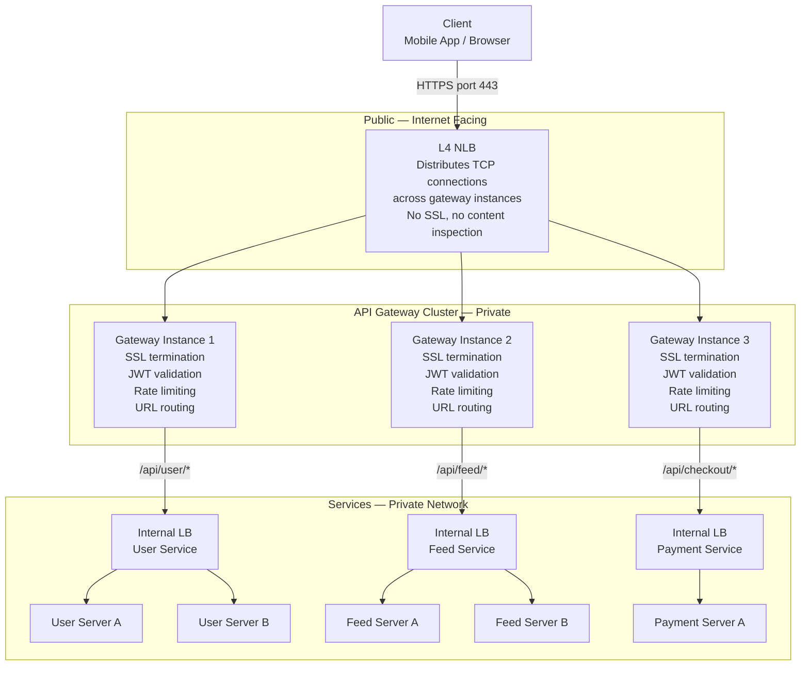

# API Gateway

> [!question] If L7 already routes by URL and handles SSL — what does an API Gateway add?
> An API Gateway is an L7 load balancer with a full set of cross-cutting concerns built on top — auth, rate limiting, transformation, analytics. It's the single front door to your entire backend.

---

## L7 Load Balancer vs API Gateway

Both operate at Layer 7. Both decrypt HTTPS. Both route by URL. The difference is responsibility.

| Responsibility | L7 Load Balancer | API Gateway |
|---|---|---|
| TLS termination | ✓ | ✓ |
| URL-based routing | ✓ | ✓ |
| Header/cookie routing | ✓ | ✓ |
| Health checks | ✓ | ✓ |
| Authentication | ✗ | ✓ |
| Rate limiting | ✗ | ✓ |
| Request transformation | ✗ | ✓ |
| API versioning | ✗ | ✓ |
| Analytics per endpoint | ✗ | ✓ |

> Every API Gateway is an L7 load balancer. Not every L7 load balancer is an API Gateway.

AWS ALB is a pure L7 LB — routes traffic, terminates SSL, nothing more. Kong, AWS API Gateway, Apigee — same routing plus auth, rate limiting, analytics.

---

## API Gateway Is Itself a Service — How It Scales

This is the part most explanations skip. The API Gateway is just software running on servers. At scale — millions of requests per second — one gateway instance is not enough. You need a cluster of gateway instances.

But if you have 10 gateway instances, who decides which gateway instance handles each incoming request?

**You need something in front of the API Gateway.**

```
Client
  ↓
L4 NLB  ←  distributes TCP connections across gateway instances
  ↓
API Gateway cluster (10+ instances)
  ↓           ↓           ↓
Service A   Service B   Service C
(pool)      (pool)      (pool)
  ↓           ↓           ↓
Internal LB  Internal LB  Internal LB  ←  picks which SERVER within each service
```

**Why L4 in front of the API Gateway, not L7?**

The API Gateway IS the L7 layer — it decrypts HTTPS and reads the request. Putting another L7 load balancer in front would mean decrypting HTTPS twice. Double the overhead, double the certificates to manage. Pointless.

L4 in front is just fast TCP forwarding across gateway instances — no decryption, no parsing. The gateway handles all the HTTP intelligence.

**Why internal load balancers after the gateway?**

The gateway decides *which service* to route to. But each service runs on multiple servers. The internal LB (or service discovery) picks *which server* within that service. Two distinct decisions, two distinct layers.

---

## The Three-Layer Architecture



Three distinct layers, each with one job:
- **L4 NLB** — distribute load across gateway instances (speed, no intelligence)
- **API Gateway** — auth, rate limiting, routing to the right service (intelligence)
- **Internal LB** — pick which server within the service (distribution)

---

## What API Gateway Adds — Each Responsibility Explained

### Authentication

Every request carries a JWT token. The gateway validates it before the request reaches any service.

```
Request arrives → Gateway extracts JWT → validates signature + expiry
    → Invalid: 401 returned immediately, no service touched
    → Valid: decode userId, attach X-User-Id header, forward to service
```

Services behind the gateway never validate tokens. They trust the `X-User-Id` header. Auth logic lives in exactly one place.

---

### Rate Limiting

Protects your backend from being overwhelmed — by traffic spikes, bugs in client code, or deliberate abuse.

```
User ID 98765 → 1000 requests in 1 minute
Gateway: rate limit exceeded → 429 Too Many Requests
Request never reaches the service
```

Types of rate limits the gateway enforces:
- **Per user** — each user gets 100 req/min
- **Per IP** — each IP gets 1000 req/min (catches unauthenticated abuse)
- **Per endpoint** — `/api/search` limited to 10 req/sec (expensive query)
- **Global** — total system cap, protects during traffic spikes

---

### Request Transformation

The gateway modifies requests before forwarding and responses before returning.

**Adding internal headers:**
```
Incoming:  GET /api/user/profile   Authorization: Bearer eyJ...
Outgoing:  GET /api/user/profile   X-User-Id: 98765   X-Request-Id: abc-123
```

**Stripping sensitive headers from responses:**
```
Service response contains:  X-Internal-Server: db-prod-3.internal
Gateway strips it — client never sees internal infrastructure details
```

**Protocol translation:**
Legacy internal services speak gRPC, not HTTP. Gateway receives HTTP from client, translates to gRPC internally, translates response back to HTTP. Client never knows.

---

### API Versioning

Old clients on v1. New clients on v2. Both run simultaneously.

```
/api/v1/user/profile  →  User Service v1 pool (legacy)
/api/v2/user/profile  →  User Service v2 pool (new)
```

Deprecate v1 gradually — announce sunset date, migrate clients, decommission v1. No big bang deployment.

---

### Analytics

Every request logged centrally:

```json
{
  "timestamp": "2026-04-02T14:23:01Z",
  "userId": 98765,
  "endpoint": "GET /api/v1/user/profile",
  "latency_ms": 34,
  "status": 200,
  "service": "user-service",
  "gateway_instance": "gw-instance-2"
}
```

Without a gateway, this logging lives in every service individually — duplicated, inconsistent, hard to aggregate.

---

## Real World Examples

### Netflix — Zuul + Internal Load Balancing

Netflix handles ~200 billion requests per day. Their architecture:

```
Netflix App (globally distributed users)
  ↓
AWS NLB (L4)
  distributes TCP connections across Zuul instances
  ↓
Zuul Gateway cluster (hundreds of instances across regions)
  - JWT validated (Netflix account token)
  - Rate limited per device (prevents one account hammering servers)
  - Routes: /api/recommendations → Recommendation Service
            /api/playback       → Playback Service
            /api/search         → Search Service
  - Strips internal headers from responses
  ↓
Eureka (Netflix's service registry)
  Zuul asks Eureka: "give me the live instances of Recommendation Service"
  Eureka returns: [10.0.1.5, 10.0.1.6, 10.0.1.7]
  Zuul picks one using Ribbon (client-side load balancer)
  ↓
Service instance handles request
```

Key detail: Netflix uses **client-side load balancing** (Ribbon inside Zuul) instead of a separate internal LB. Zuul queries the service registry directly and picks a server itself — one less network hop.

Services never validate tokens. They trust the headers Zuul attaches. An unauthenticated request is dead the moment it hits Zuul — it never reaches Recommendation Service, never touches a database.

---

### Uber — API Gateway per Domain

Uber serves two completely different user types — riders and drivers — with very different request patterns. They use **domain-specific API Gateways** rather than one central gateway:

```
Rider App
  ↓
L4 NLB
  ↓
Rider API Gateway
  - Rider JWT validation
  - Rate limiting per rider account
  - Routes: /api/ride/request   → Dispatch Service
            /api/ride/track     → Location Service
            /api/payment        → Payment Service

Driver App
  ↓
L4 NLB
  ↓
Driver API Gateway
  - Driver JWT validation (different token format, different signing key)
  - Routes: /api/trip/accept    → Dispatch Service
            /api/location/update → Location Service (high frequency — 4 updates/sec)
            /api/earnings        → Earnings Service
```

Why separate gateways?
- Riders and drivers have completely different auth tokens and rate limits
- Driver location updates happen every 250ms — the gateway handles millions of these per second. Isolating driver traffic means a surge in rider requests doesn't slow down location updates, and vice versa.
- Each gateway can be scaled independently based on its traffic pattern

Both gateways write to the same internal services (Location Service, Dispatch Service) — but through their own routing and auth rules.

---

## When to Use API Gateway vs Plain L7 LB

**Use a plain L7 LB when:**
- Internal service-to-service traffic (services already trust each other)
- Simple single-service deployments
- Auth handled inside services, no centralisation needed

**Use an API Gateway when:**
- External clients (mobile apps, browsers, third-party partners) are calling your services
- Multiple services all need auth, rate limiting, logging
- You want to decouple cross-cutting concerns from business logic
- You're building a microservices architecture

> [!tip] In a system design interview — the box at the edge facing external clients is almost always an API Gateway
> *"All external traffic hits the API Gateway first — JWT validated, rate limit checked, then routed to the appropriate microservice via internal load balancing. Services in the private network trust the X-User-Id header the gateway attaches."*
