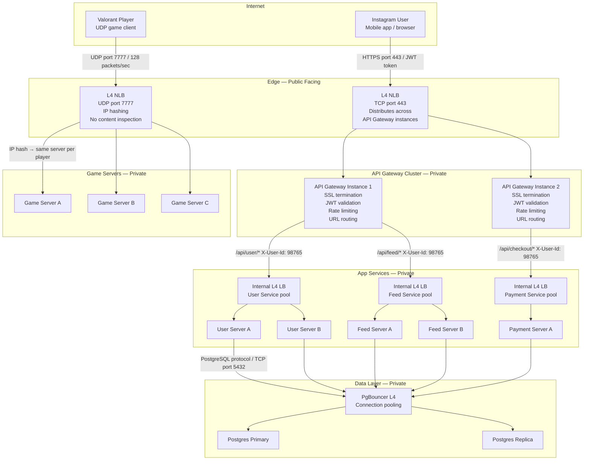

# L4, L7 and API Gateway in Production

> [!question] You now understand L4, L7 and API Gateway separately. How do all three fit together in one real system?
> Each layer has exactly one job. None of them overlap. Together they handle every traffic pattern a production system faces.

---

## The Three Layers — One Job Each

| Layer | Component | Job |
|---|---|---|
| 1 — Edge | L4 NLB | Distribute TCP/UDP connections across API Gateway instances. No intelligence, just speed. |
| 2 — Gateway | API Gateway (L7) | Decrypt HTTPS, validate JWT, rate limit, route to the right service |
| 3 — Internal | L4 Internal LB / PgBouncer | Distribute load across service servers and database connections |

None of these overlap. Each solves a problem the others can't:
- L4 NLB can't validate JWTs — it can't read HTTP content
- API Gateway can't handle UDP game traffic — it only understands HTTP
- PgBouncer can't route by URL — it speaks PostgreSQL protocol

---

## Full Production Architecture



---

## Layer by Layer — What Each Does and Why

### Layer 1 — L4 NLB at the Edge

**For HTTP traffic (Instagram):**
```
Instagram app → HTTPS port 443 → L4 NLB
  ✓ Distributes TCP connections across API Gateway instances
  ✗ Cannot read HTTPS content — it's encrypted
  ✗ Cannot validate JWT — doesn't know what a JWT is
```

Why L4 here and not L7? The API Gateway IS the L7 layer. Decrypting HTTPS twice — at the NLB and again at the gateway — would double the CPU overhead and require managing certificates in two places. L4 just forwards TCP at wire speed.

**For UDP game traffic (Valorant):**
```
Valorant client → UDP port 7777 → L4 NLB
  ✓ IP hashing — same player always hits same game server
  ✓ UDP-capable — API Gateway doesn't handle UDP at all
  ✓ No content inspection needed — all packets go to game server pool
```

---

### Layer 2 — API Gateway Cluster

```
L4 NLB forwards TCP connection → API Gateway instance
  ✓ SSL termination — decrypts HTTPS, can now read the request
  ✓ JWT validated — invalid token → 401, request dies here
  ✓ Rate limit checked — 429 if exceeded
  ✓ URL read → /api/user/* → routes to User Service internal LB
  ✓ X-User-Id: 98765 attached — service never needs to decode JWT
```

The gateway is the only component that sees the raw JWT token. Everything behind it sees only `X-User-Id` — already decoded and verified.

---

### Layer 3 — Internal L4 LBs and PgBouncer

**Service-level load balancing:**
```
API Gateway → Internal L4 LB (User Service) → picks User Server A or B
  ✓ Distributes load across service instances
  ✗ No auth needed — private network, already trusted
  ✗ No SSL needed — internal traffic is plain HTTP
```

**Database connection pooling:**
```
Service → PgBouncer (L4) → PostgreSQL
  ✓ Multiplexes hundreds of service connections into small DB connection pool
  ✓ Protocol-agnostic — PostgreSQL binary wire protocol, not HTTP
  ✗ No URL routing — all connections go to same PostgreSQL cluster
```

---

## Decision Framework

| Traffic | Component | Why |
|---|---|---|
| External HTTPS — multiple services | L4 NLB → API Gateway | Need JWT auth, rate limiting, URL routing |
| External UDP — game traffic | L4 NLB directly | Non-HTTP protocol, API Gateway can't handle UDP |
| External HTTPS — single service | L7 LB (no API Gateway needed) | No cross-cutting auth/rate limiting required |
| Internal service → service | Internal L4 LB | Private network, trust exists, no content routing needed |
| Service → PostgreSQL / MySQL | PgBouncer (L4) | Non-HTTP protocol, connection pooling needed |
| Live stream ingestion (RTMP) | L4 NLB directly | Non-HTTP protocol |

---

## The One-Line Summary Per Layer

```
L4 NLB at edge        →  fast TCP/UDP distribution, no intelligence
API Gateway (L7)      →  auth, rate limiting, SSL, routing — all in one place
Internal L4           →  speed, trust already established, no HTTP overhead
```
