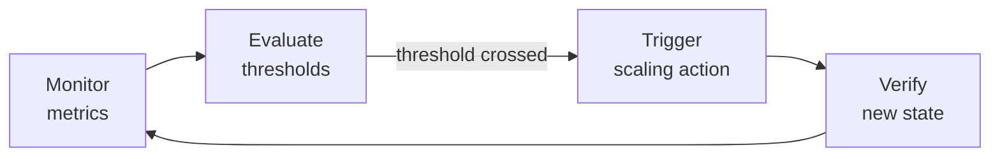

# Auto-Scaling

> [!question] Traffic triples at 9am every weekday and drops back at 7pm. Do you run peak capacity 24/7 — wasting money for 18 hours — or run minimum capacity and collapse every morning?
> Auto-scaling is the answer — add servers when load increases, remove them when it drops.

---

## The Problem It Solves

```
2am  — 10,000 users online  → 3 servers needed
9am  — 500,000 users online → 50 servers needed
6pm  — 80,000 users online  → 8 servers needed
```

Without auto-scaling you have two bad options:
- Run 50 servers 24/7 → pay for 47 idle servers at 2am
- Run 3 servers always → collapse every morning at 9am

Auto-scaling runs exactly as many servers as current load requires — no more, no less.

---

## The Feedback Loop

Auto-scaling is a continuous monitoring loop:



1. **Monitor** — agent watches CPU, memory, queue depth, connections on every server
2. **Evaluate** — is any metric above the scale-out threshold? Below the scale-in threshold?
3. **Action** — spin up N new servers, or terminate N existing ones
4. **Verify** — new servers pass health checks, register with load balancer, metrics return to normal

This loop runs continuously — every 30-60 seconds.

---

## Reactive vs Predictive Scaling

### Reactive — responds to what's happening right now

```
CPU hits 80% → alarm fires → new server spins up → 3-5 minutes to be ready
```

The fundamental problem: there is always a **lag**. While the new server is booting, existing servers remain overwhelmed. Users experience slowness during that window.

Reactive scaling works well for **gradual** traffic increases. It struggles with sudden spikes — a product launch, a viral post, a flash sale.

---

### Predictive — acts before the spike happens

You have historical traffic data. You know traffic triples every weekday at 9am. So at 8:45am, auto-scaling adds servers pre-emptively — before the load arrives. By 9am they're already registered with the load balancer and ready.

```
Historical data shows: traffic 5x every Friday at 6pm (Instagram reel peak hour)
Predictive rule: add 40 servers at 5:45pm, remove at 10pm
```

**Netflix example:** Before a major show release, Netflix analyses expected viewership and scales up Thursday evening. By Friday 3am when the show drops, all servers are warm and ready. Cold start happens off the critical path — hours before it matters.

---

## What Metrics Trigger Scaling

| Metric | Scale Out When | Scale In When | Best For |
|---|---|---|---|
| CPU utilisation | > 70% | < 30% | General purpose services |
| Request queue depth | Queue growing | Queue empty | Async workers, job processors |
| Active connections | Near thread pool limit | Well below limit | Connection-heavy services |
| Custom metric | Depends on system | Depends on system | Kafka lag, game session count |

**Custom metric example — Kafka consumer lag:**
You have 5 worker servers consuming from a Kafka topic. The lag (unprocessed messages) is growing — workers are falling behind. Auto-scaling watches this lag metric — when it exceeds 10,000 messages, spin up more workers. When it drops below 1,000, scale back down.

---

## Scale Out vs Scale In — The Asymmetry

These two directions are deliberately handled differently.

**Scale out — aggressive and fast:**
```
Threshold: CPU > 70% for 1 minute → add 5 servers immediately
```
Users feel slowness instantly. Don't wait. Add capacity fast.

**Scale in — conservative and slow:**
```
Threshold: CPU < 30% for 15 consecutive minutes → remove 2 servers
```
Why so cautious?
- A brief traffic dip followed by a spike would cause thrashing — removing then immediately re-adding servers
- Each scale-in/scale-out event has overhead (boot time, cost)
- Having a few extra idle servers costs less than the churn of constant scaling

---

## Statelessness — The Hard Requirement

Auto-scaling only works cleanly if your servers are **stateless**. If a server holds session data in memory and gets terminated — that user's session is lost.

```
Stateful server terminated:
  User mid-checkout → session on that server → session gone → user loses cart
```

This is why stateless architecture is not optional for auto-scaling:
- Session data → Redis
- Application state → database
- Servers → interchangeable, disposable, any server can handle any request

> [!warning] If your servers hold state, auto-scaling will cause data loss
> Move all state out of servers before enabling auto-scaling. Servers must be disposable.
