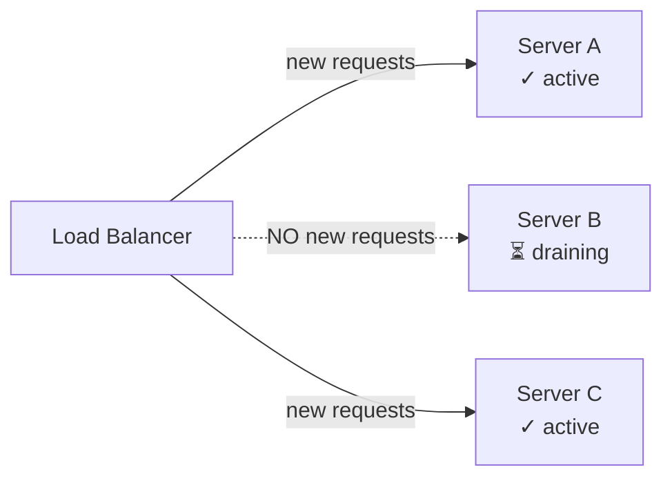
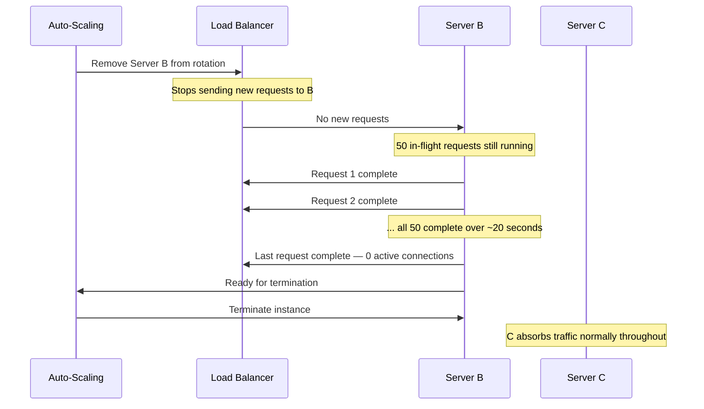

# Connection Draining

> [!question] Auto-scaling wants to terminate Server B. But Server B is currently processing 50 requests. What happens to them?
> Without draining — they all die instantly. With connection draining — every request completes naturally before the server is touched.

---

## The Problem Without Draining

Auto-scaling decides to remove a server. It terminates it immediately.

```
Server B is processing:
  Request 1  — user submitting a payment form (400ms in, not done)
  Request 2  — user uploading a profile photo (2s in, not done)
  Request 3  — user loading their feed (100ms in, not done)
  ... 47 more requests

Server B terminated instantly:
  All 50 requests → connection reset → 50 users get errors
```

50 users see "something went wrong" with no explanation. For a payment request — that user may have been charged but the confirmation never arrived.

---

## How Connection Draining Works

Three steps, automated entirely by the load balancer:

### Step 1 — Server marked for removal, new traffic stops

Auto-scaling signals the load balancer: "stop sending new requests to Server B."



Server B is still running. It just stops receiving new work.

---

### Step 2 — In-flight requests complete naturally

Server B has 50 requests in progress. They continue running completely undisturbed.

```
Server B during draining:
  Request 1  — payment form       → completes in 180ms ✓
  Request 2  — photo upload       → completes in 800ms ✓
  Request 3  — feed load          → completes in 60ms  ✓
  ...
  Request 50 — last one running   → completes in 340ms ✓

No new requests arrive during this time.
All 50 users get their responses.
```

---

### Step 3 — Server terminates

Once all in-flight requests complete, Server B has zero active connections. Auto-scaling terminates it cleanly.

```
Server B: 0 active connections → terminate → instance gone
```

Zero requests killed. Zero user-facing errors from the scale-in.

---

## The Drain Timeout — The Critical Tradeoff

What if a request never completes? A stuck job, an infinite loop, a very long-running operation. The LB can't wait forever.

Every connection draining configuration has a **timeout** — the maximum time to wait for in-flight requests before force-terminating anyway.

```
Drain timeout = 30 seconds:
  Requests completing in < 30s → complete normally ✓
  Requests still running at 30s → killed → user gets error
```

**Choosing the right timeout:**

| Service Type | Typical Request Duration | Drain Timeout |
|---|---|---|
| REST API server | < 500ms | 30 seconds |
| Web server | < 2 seconds | 30-60 seconds |
| File upload service | Up to 5 minutes | 10 minutes |
| Video processing worker | Up to 1 hour | Do not use drain — use a different pattern |

For long-running jobs (video transcoding, batch processing), connection draining isn't the right tool. Instead, the worker checks a "shutdown signal" flag and stops accepting new jobs. It finishes its current job, then terminates gracefully. The job queue (Kafka, SQS) handles redistribution.

---

## Draining + Auto-Scaling Together



The entire process is invisible to users. From their perspective — requests complete normally and the response arrives.

> [!tip] In an interview — always mention connection draining when discussing scale-in
> *"When scaling in, I'd configure connection draining on the load balancer — new requests stop going to the terminating server, in-flight requests complete, then the server is removed. No user-facing errors from the scale-in event."*
