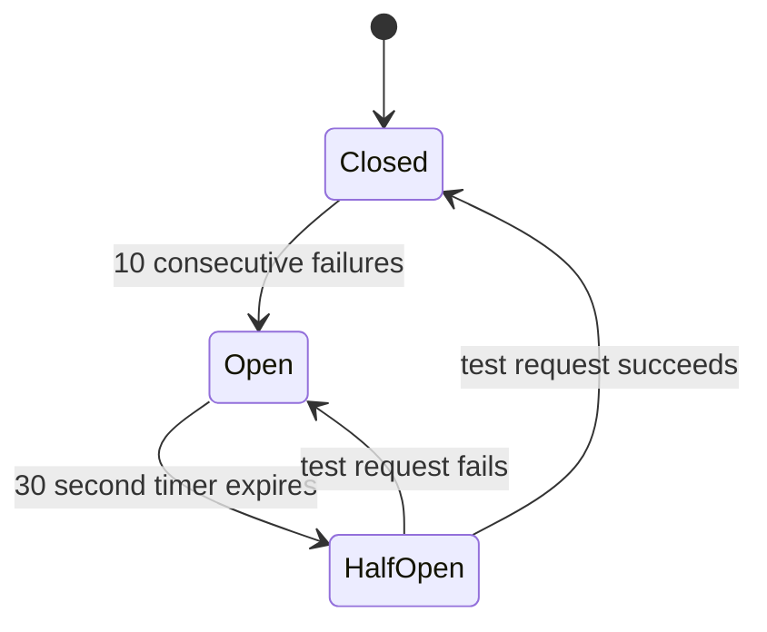

## The Real World Analogy

> [!info] Named after the fuse box in your house. When a short circuit happens, the fuse trips — stopping all electricity flow rather than letting the wire burn. Once the electrician fixes it, you reset the fuse and power comes back.

Same idea in software — **stop sending requests to a service you already know is broken.**

---

## The Problem Timeout + Retry Alone Can't Solve

```
Payment service has been failing for 5 minutes

Without circuit breaker:
  Every request → waits full timeout (2 seconds) → fails → retries → fails
  1000 requests/second × 2 second timeout = 2000 threads stuck at any moment
  Massive resource waste on a service you know is down
```

Timeout and retry handle **individual** request failures. Circuit breaker handles **sustained** failures — when you know a service is down, stop trying entirely.

---

## The Three States



### State 1 — Closed (Normal Operation)

```
All requests flow through normally
Circuit breaker counts failures in the background
10 consecutive failures → circuit trips → moves to OPEN
```

### State 2 — Open (Service Known to be Down)

```
ALL requests fail immediately — no waiting, no timeout
Returns error or cached fallback instantly
No requests sent to the broken service

Every 30 seconds → send ONE test request (moves to HALF-OPEN)
```

> [!success] Key benefit
> Requests fail in **microseconds** instead of waiting 2 seconds for timeout. Threads freed instantly.

### State 3 — Half-Open (Testing Recovery)

```
ONE test request allowed through
Success → circuit closes → normal operation resumes
Failure → circuit opens again → wait another 30 seconds
```

---

## Real World Pain Without It

> [!example] The Gemini API problem
> Calling Gemini flash — it starts failing. Without a circuit breaker:
> ```
> Request 1  → wait 10s timeout → fail → retry → fail
> Request 2  → wait 10s timeout → fail → retry → fail
> Request 3  → wait 10s timeout → fail → retry → fail
> ...
> Every user waits 10+ seconds before hitting the fallback
> ```
>
> With circuit breaker:
> ```
> Request 1-5 → fail (circuit counting)
> Request 6   → circuit opens
> Request 7+  → fail instantly → fallback in milliseconds
> ```

---

## Circuit Breaker + The Full Pattern

```
Request comes in
    ↓
Circuit OPEN? → fail immediately → graceful degradation
    ↓ (circuit closed)
Send request
    ↓
Timeout fires? → retry with backoff
    ↓
Max retries hit? → record failure → check threshold
    ↓
Threshold crossed? → open circuit
    ↓
Graceful degradation
```

> [!tip] Interview framing
> *"I'd wrap every downstream service call in a circuit breaker. After N consecutive failures the circuit opens — requests fail immediately instead of waiting for timeouts, freeing threads instantly. Every 30 seconds a test request checks if the service recovered. Combined with timeouts, retries, and graceful degradation, the system stays responsive even when dependencies are down."*
