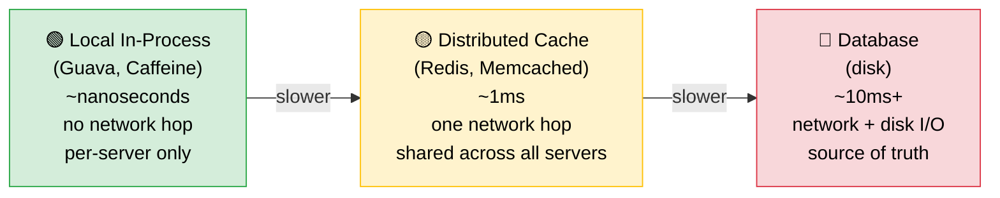
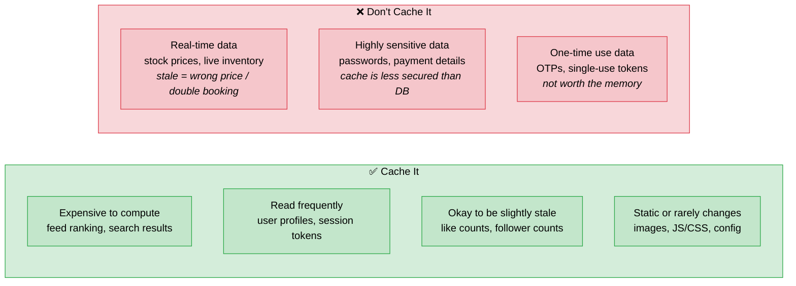

## What Is Caching

> [!info] Don't recompute or re-fetch something you've already computed. Store the result somewhere fast and serve it from there next time.

```
Instagram feed = 20+ DB queries = ~200ms minimum

With caching:
  First request  → hits DB, builds feed, stores result in cache
  Every request after → served from cache in ~1ms
  → User sees feed in 80ms
```

Same idea as Dynamic Programming memoization — store expensive results so you don't recompute them. The difference is scale: DP lives in one function, caching lives across requests, servers, and users.

---

## The Cache Hierarchy

> [!info] Three layers — each faster but smaller and less shared than the next.



---

## What To Cache

> [!info] Ask one question: "If this data is 500ms stale, does anything break?"



> [!important] Caching is primarily a **read** optimization — same data served many times from cache instead of DB. Writes can be cached too but come with trade-offs.

---

## Local vs Distributed Cache

### Local In-Process Cache

Each app server caches data in its own memory.

```
Request 1 → Server 1  → cache miss → fetches DB → stores locally
Request 2 → Server 1  → cache hit  ✓
Request 3 → Server 47 → cache miss → fetches DB again ✗
```

**The problem:**

```
User updates bio
→ Server 1 cache updated
→ Servers 2–100 still serve stale bio
→ inconsistent across servers
```

**Use for:** static config, feature flags, rarely changing data that's safe to be per-server.

---

### Distributed Cache (Redis / Memcached)

One shared cache, all servers read and write to it.

```
Request 1 → any server → cache miss → fetches DB → stores in Redis
Request 2 → any server → cache hit  ✓  (served from Redis)
Request 3 → any server → cache hit  ✓

User updates bio → invalidate one key in Redis → all servers see fresh data immediately
```

**Use for:** shared user data, sessions, feed results, anything that must be consistent across servers.

---

### Two-Level Caching (L1 + L2)

> [!tip] Best of both worlds — used by Instagram, Twitter, and most large-scale systems.

```
Request comes in
→ Check local cache (L1) — nanoseconds
  → hit  → return immediately
  → miss → check Redis (L2) — ~1ms
    → hit  → store in L1, return
    → miss → hit DB → store in Redis (L2) + local (L1) → return
```

```
L1 (local)    → nanoseconds, per-server, inconsistency risk
L2 (Redis)    → ~1ms, shared, consistent
DB            → ~10ms+, source of truth
```

---

## The Trade-off Summary

```
Local cache        → fastest, but inconsistent across servers
Distributed cache  → consistent, ~1ms overhead, shared
Two-level          → fast + consistent, more complexity
CDN                → for static assets, geographically distributed
```

> [!important] Hit ratio matters — if your cache hit rate is below 90%, you're paying the overhead of checking the cache on every request without enough benefit. Target >90% hit ratio before caching is worth the complexity.
