# Redis Data Structures

> [!info] Redis is an in-memory data store. Everything lives in RAM. That's why it's fast — no disk, no file system, just memory.

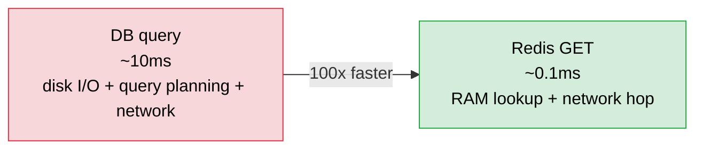

A natural question: isn't a file sitting on the same server's disk faster than a network hop to Redis?

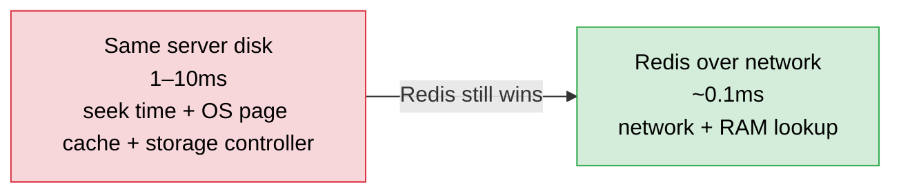

Disk I/O has to physically move through layers — storage controller, kernel buffers, OS scheduling. A network hop to a RAM store skips all of that.

The only thing faster than Redis is local in-process cache — that's why two-level caching exists:

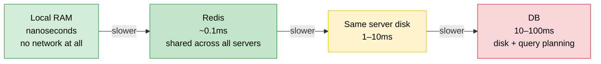

Redis is essentially **shared RAM over the network**. All your servers read and write to one place, so they all see consistent data. Local cache can't do that — if Server 1 updates a value, Server 2 still has the old one.

---

> [!info] Redis isn't just a key-value store that holds strings. It has built-in data structures — each one solves a specific problem at scale that a plain string or a DB query can't handle efficiently.

---

## String

The simplest structure. Key maps to a single value.

```
SET user:123:name "John"
GET user:123:name → "John"
```

Strings can also act as atomic counters:

```
INCR page:views → 1
INCR page:views → 2
INCR page:views → 3
```

One command, atomic. No race conditions. This is how Redis handles like counts, view counts, and rate limiting counters.

**Use for:** cached values, session tokens, counters.

---

## Hash

Key maps to a mini key-value map. Perfect for objects with multiple fields.

```
HSET user:123 name "John" age 28 city "NYC"

HGET user:123 name      → "John"
HGETALL user:123        → { name: John, age: 28, city: NYC }
HSET user:123 city "LA" ← update one field, nothing else touched
```

**Why not just serialize the whole object to JSON and store as a String?**

At 10 million users, 1 million city updates per day:

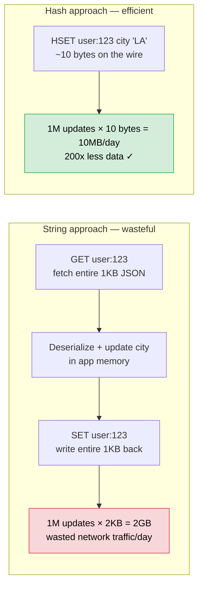

**Use for:** user profiles, product details, shopping carts.

---

## List

An ordered list of strings. Push to front or back, read a range.

```
LPUSH notifications:user:123 "someone liked your post"
LPUSH notifications:user:123 "someone followed you"

LRANGE notifications:user:123 0 9  → last 10 notifications, newest first
```

Already ordered because you push newest items to the front. No sorting needed at read time.

**Why not a DB table?**

50 million users × 100 notification events/day = 5 billion rows.

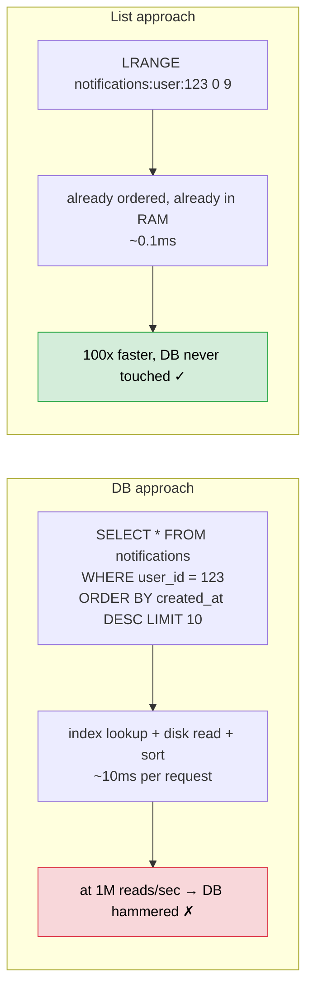

**Use for:** notification feeds, activity logs, recent history, task queues.

---

## Sorted Set

Like a Set but every member has a **score**. Redis keeps members sorted by score automatically.

```
ZADD leaderboard 9500 "alice"
ZADD leaderboard 8200 "bob"
ZADD leaderboard 9800 "charlie"

ZRANGE leaderboard 0 2 WITHSCORES → charlie(9800), alice(9500), bob(8200)
```

**Why not a List?**

Alice scores 500 more points:

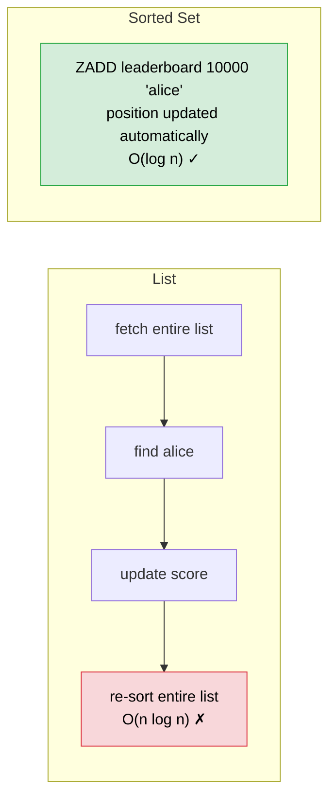

**Why not a DB?**

50 million players, scores updating every few seconds:

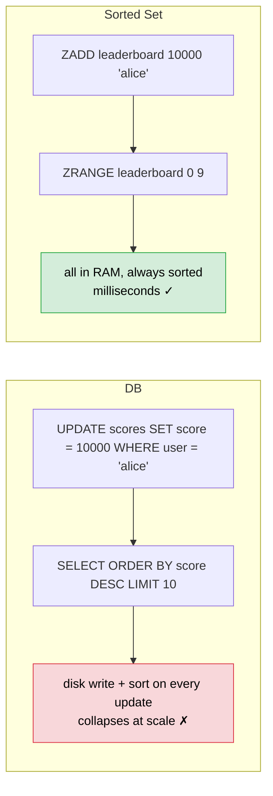

> [!tip] The Z prefix has no deep meaning — "S" was already taken by Sets. The original author needed a letter. Historical accident, don't look for logic.

**Use for:** leaderboards, trending posts, rate limiting (score = timestamp).

---

## Set

An unordered collection of unique strings. Duplicates ignored automatically.

```
SADD post:123:likes "alice"
SADD post:123:likes "bob"
SADD post:123:likes "alice"   ← duplicate, silently ignored

SCARD post:123:likes → 2
```

**Why not a List?**

Post has 1 million likes. Alice tries to like it again:

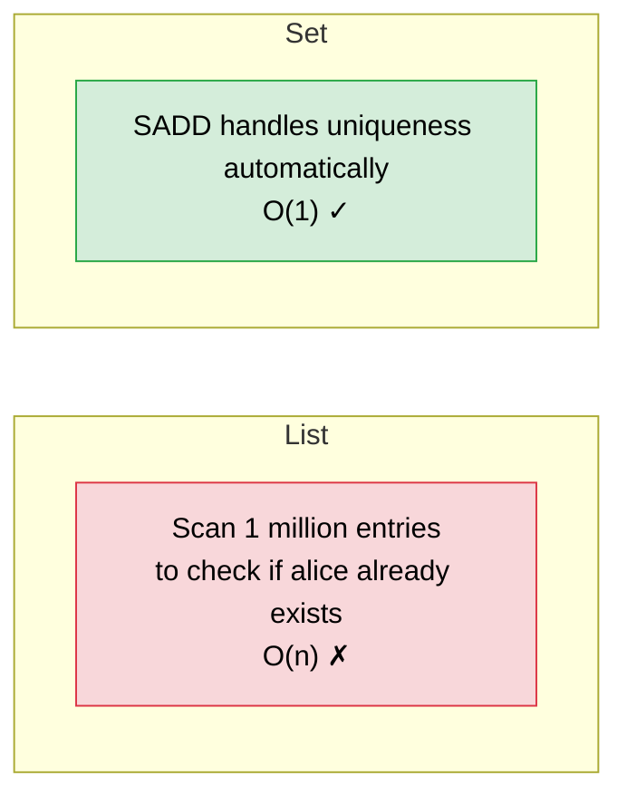

**The killer feature — set operations:**

```
SINTER followers:alice followers:bob  → mutual followers
SUNION followers:alice followers:bob  → everyone either follows
SDIFF  followers:alice followers:bob  → alice follows but bob doesn't
```

Finding mutual friends via a DB join is expensive at scale. `SINTER` in Redis is a RAM operation — milliseconds.

**Use for:** likes, tags, mutual friends, unique visitors.

---

## HyperLogLog

Counts unique items **approximately** using fixed memory regardless of input size.

**Why not just store every viewer in a Set?**

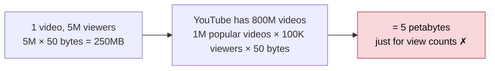

**How HyperLogLog works — the leading zeros trick:**

Every user ID gets hashed into a binary number. Hash functions produce random-looking output, so leading zeros follow a probability pattern:

```
hash("user:1")      → 00110101...   (2 leading zeros)
hash("user:2")      → 00001101...   (4 leading zeros)
hash("user:3")      → 10110010...   (0 leading zeros)
hash("user:99999")  → 00000001...   (7 leading zeros)
```

Leading zeros get rarer the longer they are:

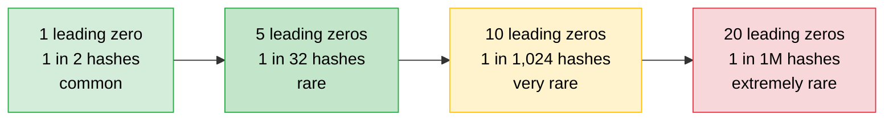

HyperLogLog only remembers **one number** — the maximum leading zeros seen so far:

```
Processed 1,000,000 user IDs
→ rarest hash seen had 20 leading zeros
→ 20 leading zeros happens ~1 in 1,000,000 times
→ estimate: ~1,000,000 unique users ✓

Memory used: just the number "20" — a few bytes
```

**Why 12KB and not just a few bytes?**

Tracking one global max is too noisy:

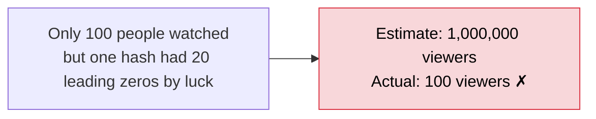

The fix: split users into **16,384 buckets**, track max per bucket, then average:

```
Bucket 1      → max = 18
Bucket 2      → max = 19
Bucket 3      → max = 3   ← lucky outlier, averaged out
Bucket 4      → max = 20
...
Bucket 16,384 → max = 17

Average across all buckets → stable, accurate estimate
One lucky outlier barely moves the average
```

```
16,384 buckets × 6 bits per bucket (leading zeros on 64-bit hash fits in 6 bits)
= 98,304 bits = 12KB — fixed forever, whether 1 user or 1 billion
```

**Why Redis and not just write to a DB?**

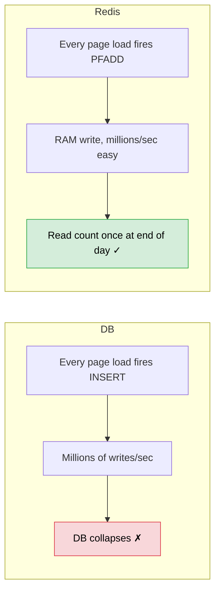

```
PFADD visitors:2026-04-04 "user:1" ... "user:5000000"
PFCOUNT visitors:2026-04-04 → ~5,000,000

Memory: always 12KB — whether 1 user or 1 billion
Error:  ~0.81% — 5,000,000 might come back as 5,040,500. Acceptable for view counts.
```

> [!important] HyperLogLog tells you HOW MANY unique items — not WHICH ones. You get the count, never the list.

> [!tip] More buckets = more accuracy = more memory. Redis chose 16,384 as the sweet spot — 0.81% error at just 12KB.

**Use for:** unique visitors, distinct search queries, video view counts — anything where approximate is fine and memory matters.

---

## Bitmap

**The problem:** track which users logged in today. Three possible solutions.

**Solution 1 — Redis Set**

```
SADD active:2026-04-04 "user:123"
SADD active:2026-04-04 "user:456"

Memory: 5M users × 50 bytes = 250MB/day
```

**Solution 2 — User ID as key, 1/0 as value**

```
SET active:2026-04-04:123  1
SET active:2026-04-04:456  1
SET active:2026-04-04:789  0

Memory: 5M users × ~60 bytes = 300MB/day  ← worse than Set
```

Each key carries Redis overhead — key string + value + metadata per entry.

**Solution 3 — Bitmap**

One key, one array. The array is indexed by user ID — just like a boolean array in DSA:

```java
boolean[] active = new boolean[100_000_000];

active[123] = true;   // user 123 logged in
active[456] = true;   // user 456 logged in
active[789] = false;  // user 789 didn't log in
```

Redis Bitmap is exactly this — but instead of `boolean` (1 byte each in Java), it uses actual bits (8x smaller):

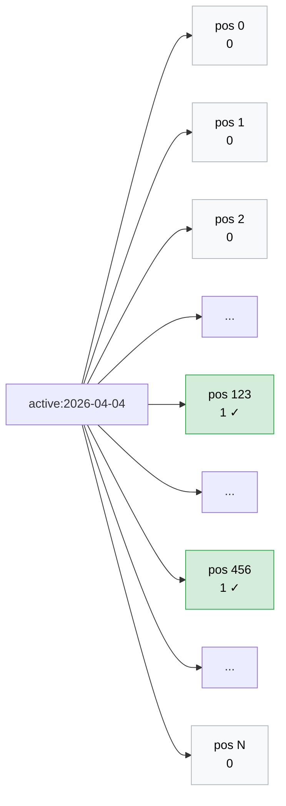

```
SETBIT active:2026-04-04 123 1    ← user 123 logged in
SETBIT active:2026-04-04 456 1    ← user 456 logged in

GETBIT active:2026-04-04 123  → 1    ← did user 123 log in? yes
GETBIT active:2026-04-04 789  → 0    ← did user 789 log in? no
BITCOUNT active:2026-04-04    → 2    ← total active users today
```

**How big is the array?**

The array size is determined by the **highest user ID**, not the number of logged-in users:

```
Highest user ID = 100,000,000
→ array needs 100M positions
→ 100M bits ÷ 8 = 12.5MB — fixed forever
```

Once sized, adding 1 active user or 80M active users costs zero extra memory:

```
Day 1: 1M users log in    → 12.5MB
Day 2: 80M users log in   → 12.5MB
Day 3: 1 user logs in     → 12.5MB
```

**All three compared:**

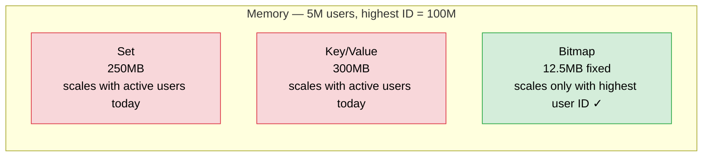

> [!important] The position IS the user ID. You never store the ID itself — user 123's answer simply lives at position 123 in the array. That's where all the savings come from.

> [!tip] Whenever you see a DSA problem using a boolean array indexed by ID — that's a bitmap in disguise.

**The one constraint:** user IDs must be integers. You can't do `SETBIT active "alice"` — you need `SETBIT active 123`. UUID-based systems need a mapping layer first.

**Use for:** daily active users, feature flags per user (is user 123 in the beta?), any yes/no fact per user.

---

## HyperLogLog vs Bitmap

> [!important] Two different questions — don't mix them up.

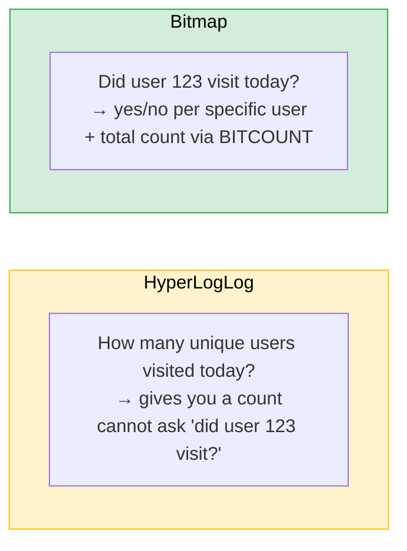

---

## Summary

| Data Structure | Best for | Key commands |
|---|---|---|
| String | Single value, atomic counters | `SET` / `GET` / `INCR` |
| Hash | Object fields, update one at a time | `HSET` / `HGET` / `HGETALL` |
| List | Ordered, push/pop, feeds, queues | `LPUSH` / `LRANGE` |
| Sorted Set | Scored + auto-sorted, leaderboards | `ZADD` / `ZRANGE` |
| Set | Unique members, set operations | `SADD` / `SCARD` / `SINTER` |
| HyperLogLog | Approximate unique count, fixed 12KB | `PFADD` / `PFCOUNT` |
| Bitmap | Yes/no per user, minimal memory | `SETBIT` / `GETBIT` / `BITCOUNT` |
