# Redis Patterns

---

## Distributed Lock

Multiple servers run the same background job — send email digests, process a payment, clean up expired sessions. Without coordination, every server picks up the same job simultaneously.

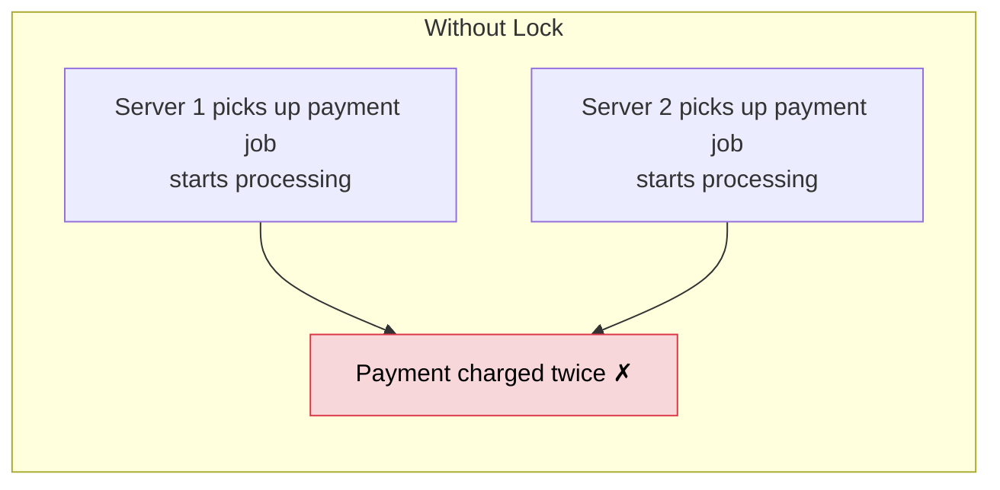

You need only one server to run the job at a time. That's a distributed lock.

**How Redis does it:**

```
SET lock:payment:123 "server1" NX PX 5000
```

```
NX       → only set if key does NOT exist
PX 5000  → auto-expire after 5000ms

→ key doesn't exist: set it, return OK   → you got the lock
→ key already exists: do nothing, nil    → someone else has it, skip
```

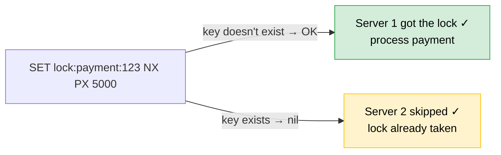

**Why the expiry?**

Server 1 gets the lock then crashes mid-job:

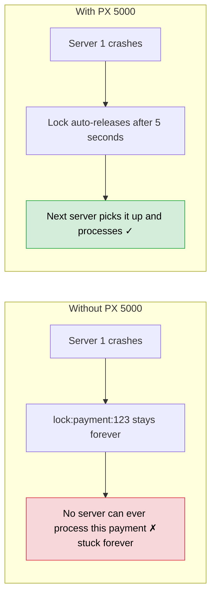

---

## Rate Limiter

Limit each user to 100 API requests per minute.

---

### Fixed Window — INCR + EXPIRE

```
User makes a request
→ INCR rate:user:123:2026-04-04-14:01   ← key includes current minute
→ if count == 1 → EXPIRE key 60s        ← start timer on first request
→ if count > 100 → reject
```

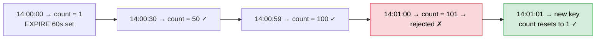

Simple — one integer key per user per minute. Resets automatically when key expires.

**The boundary problem:**

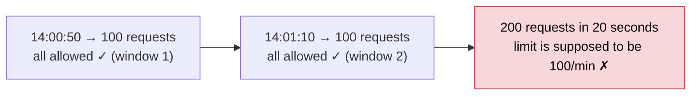

The window only asks "how many in this bucket?" — not "how many in the last 60 seconds?". At the boundary, a user can double their limit by straddling two windows.

---

### Sliding Window — Sorted Set

Track the timestamp of every request. Always look at the last 60 seconds from right now.

```
now = current timestamp in ms

ZADD rate:user:123 now "req:unique-id"          ← add this request (score = timestamp)
ZREMRANGEBYSCORE rate:user:123 0 (now - 60000)  ← remove requests older than 60s
count = ZCARD rate:user:123                     ← how many in last 60s?
if count > 100 → reject
```

No boundary problem — window slides with every request:

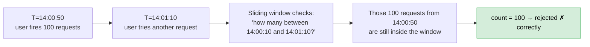

**Fixed Window vs Sliding Window:**

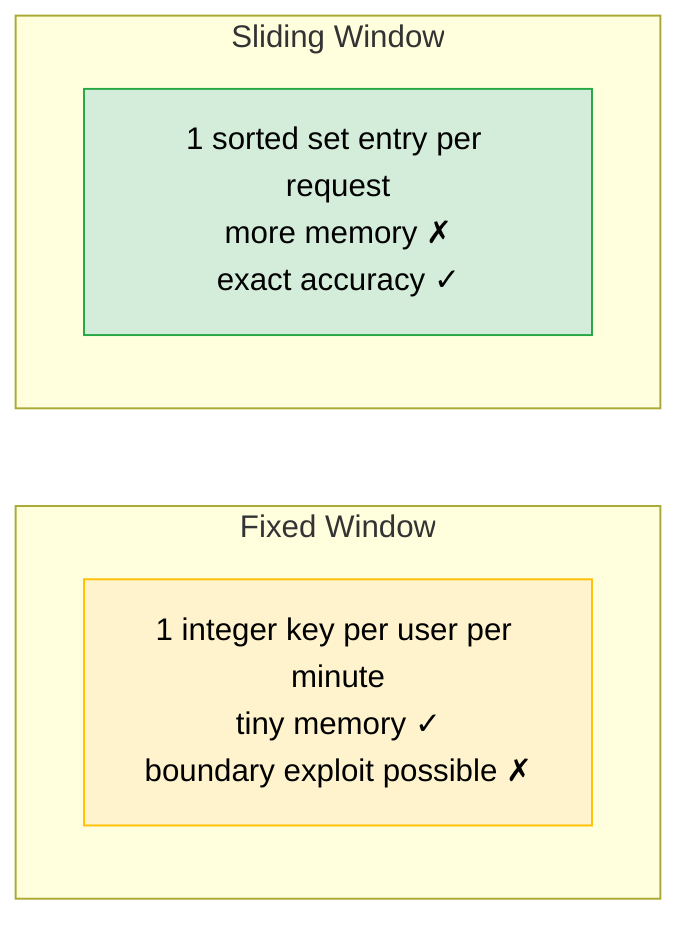

---

## Redis Sentinel

One Redis primary goes down — all cache reads and writes fail — every request falls through to DB — DB collapses.

**Sentinel** is a monitoring process that watches your Redis primary and automatically promotes a replica when the primary dies.

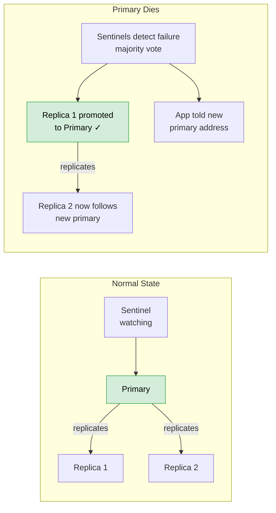

Your app doesn't talk to Redis directly — it asks Sentinel "who is the current primary?" and Sentinel points it to the right node.

**Why majority vote?**

If one Sentinel loses its network connection to the primary, it might think the primary is dead when it's actually fine. Requiring a majority prevents a single Sentinel from triggering a false failover.

**The unavoidable gap:**

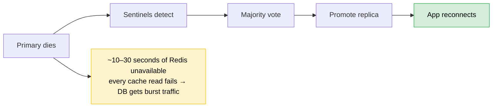

During that window every cache read fails and requests hit DB. This is an accepted trade-off — Sentinel minimises the window but doesn't eliminate it.

---

## Redis Cluster

Sentinel handles failover — what happens when a node dies.
Cluster handles sharding — what happens when data is too big for one node.

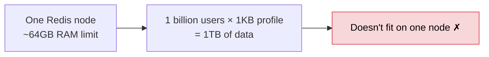

Redis Cluster splits data across multiple nodes automatically using **key slots** (0–16383):

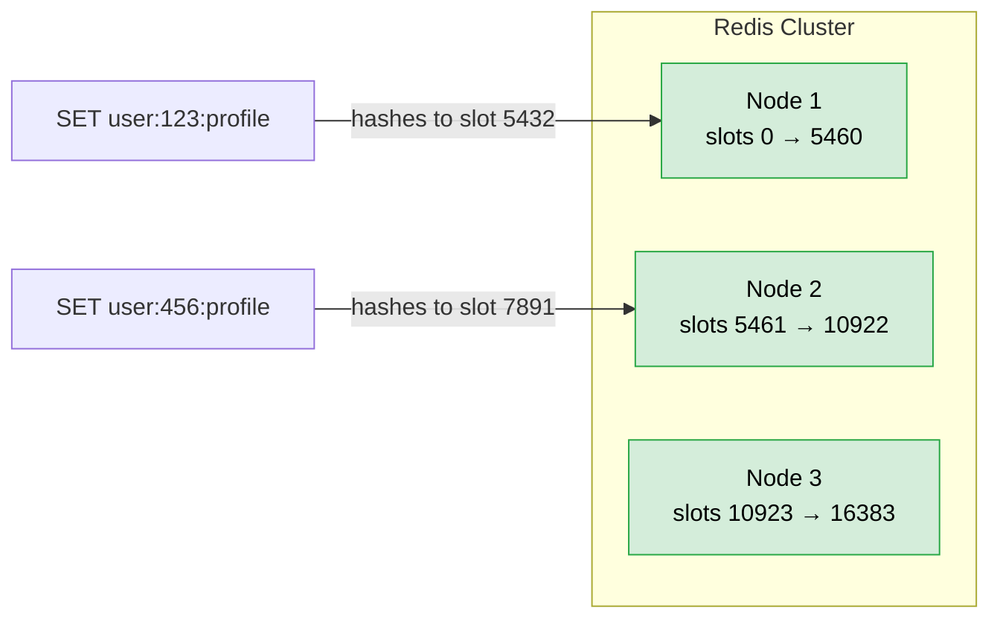

Your app doesn't need to know which node holds which key — the cluster handles routing. Each node also has its own replicas for failover, so you get sharding and availability together.

**Sentinel vs Cluster:**

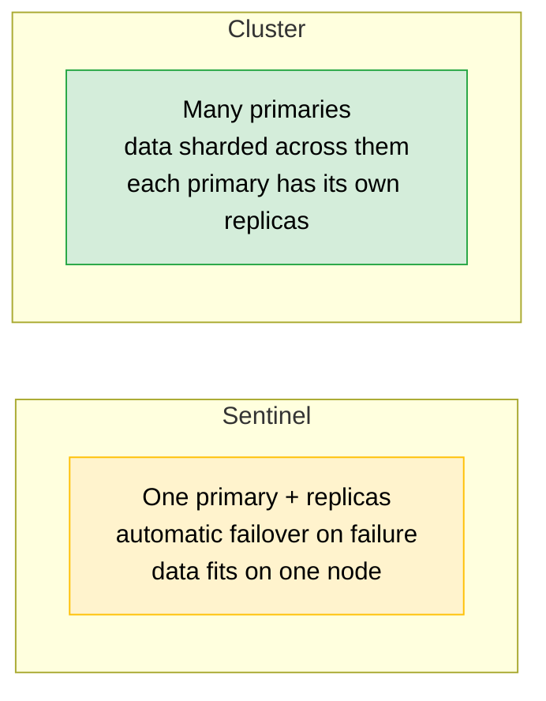
