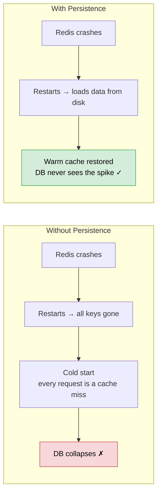
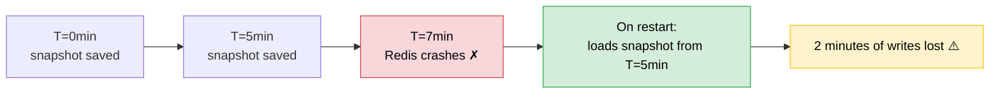
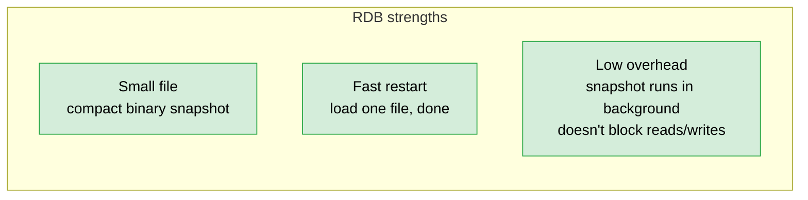
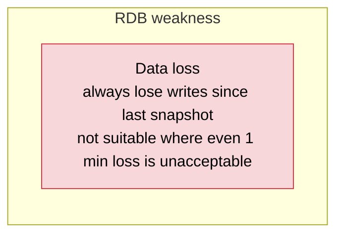
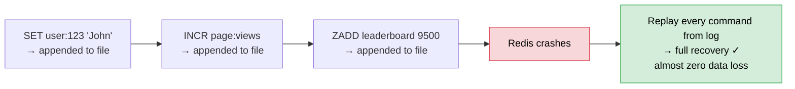
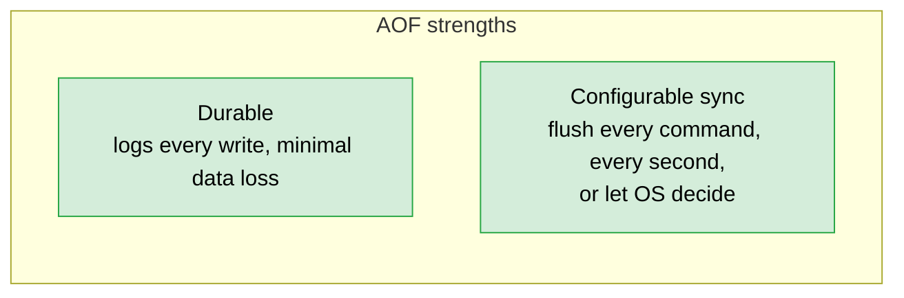
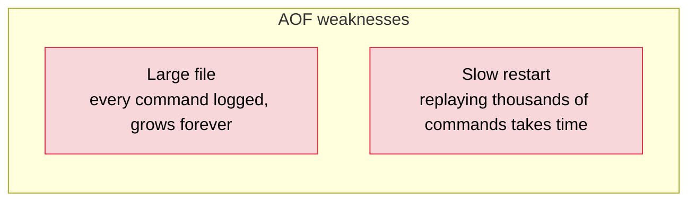
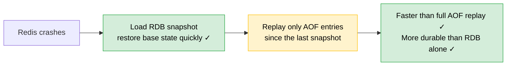

# Redis Persistence

> [!info] Redis is RAM. RAM is wiped on crash or restart. Persistence is how Redis saves its data to disk so it can recover — not for querying like a real DB, just for crash recovery.

Disk is only touched on crash recovery. Normal reads and writes still go to RAM — persistence doesn't slow down your cache.

---

## RDB — Periodic Snapshots

Every N minutes, Redis takes a full snapshot of everything in memory and writes it to disk.

**What's good:**

**What's bad:**

---

## AOF — Append Only File

Every write command gets logged to a file on disk immediately.

**What's good:**

**What's bad:**

---

## Hybrid — RDB + AOF Together

This is what Redis recommends for production.

---

## Summary

| Mode | How it works | Restart speed | File size | Data loss risk |
|---|---|---|---|---|
| RDB | Snapshot every N minutes | Fast | Small | Up to N minutes |
| AOF | Log every write | Slow | Large | Near zero |
| Hybrid | RDB for base + AOF for recent writes | Fast | Medium | Near zero — recommended for production |

> [!important] For most caching use cases, some data loss on crash is acceptable — cache is a copy of DB data anyway. RDB alone is often fine. Hybrid is for when you can't afford even a few minutes of cache miss after a restart.
