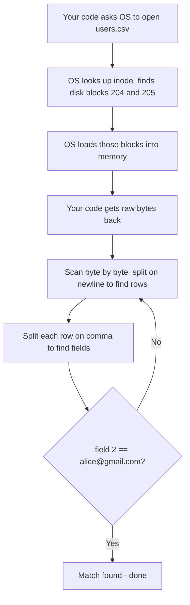

> [!info] Before understanding what databases do differently, you need to understand what happens when you store data in a plain file — all the way down to the disk. This is the baseline everything else is measured against.

---

## What the OS sees

Take a simple CSV with two rows:

```
1,Alice,alice@gmail.com
2,Bob,bob@gmail.com
```

To your application, this looks like rows and columns. To the OS, it looks like this:

```
1,Alice,alice@gmail.com\n2,Bob,bob@gmail.com\n
```

Just a sequence of bytes. The OS has no idea there are two rows. It has no idea what a comma means. It doesn't know this is user data.

What the OS *does* know is tracked in a structure called an **inode** — one per file:

```
inode for users.csv:
  file size     → 42 bytes
  permissions   → rw-r--r--
  disk blocks   → [block 204, block 205]   ← this is the key part
```

The inode tells the OS which physical blocks on disk hold this file's content. That's it. The OS is responsible for the real estate — which blocks belong to which file. Everything about what's *inside* those blocks is your application's problem.

---

## What happens when you search a file

When you write code to find Alice:

```python
for row in open("users.csv"):
    if row.split(",")[2] == "alice@gmail.com":
        print(row)
```

Here is everything that actually happens:



At 2 rows this is instant. At 100 million rows, you are loading gigabytes of blocks from disk and scanning every single byte — just to find one record. The OS loads whatever blocks the file occupies, hands you raw bytes, and steps back. All the scanning, splitting, and comparing is your application doing the work alone.

> [!danger] Nothing is helping your application find data faster. No index, no structure, no shortcuts. You are doing all the work yourself — and at scale, that work becomes the bottleneck.

---

## The core limitation

The problem is not the file format. The problem is that a file is just bytes — it has no companion structure that says "this value is at block X, offset Y."

If you wanted fast lookups, you would have to build that index yourself, maintain it on every write, and keep it in sync. At which point you are not just storing a file anymore — you are building a database. Which is exactly what databases are.
