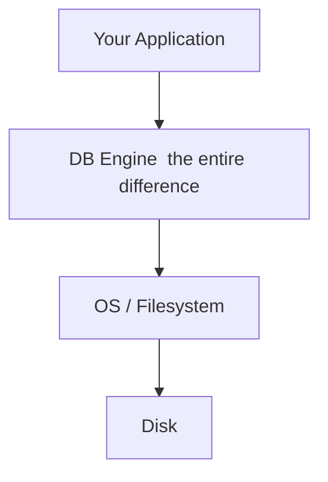
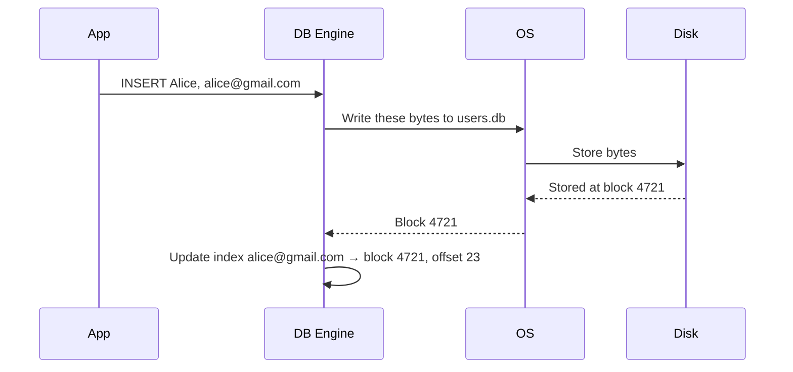
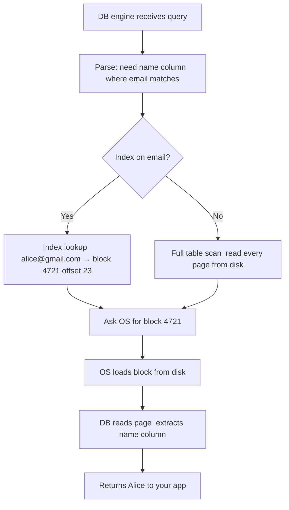
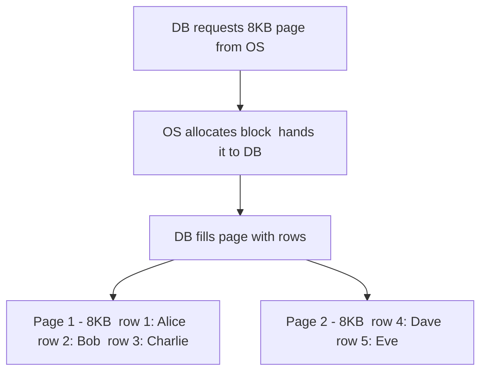
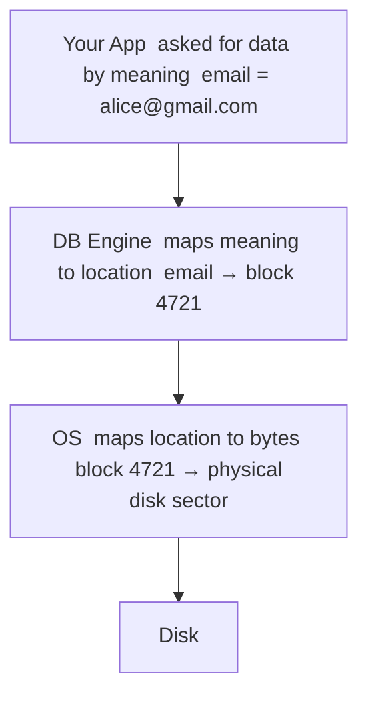

# How Storage Works — Databases

> [!info] A database does not bypass the OS. It uses the same filesystem, the same disk blocks. What it adds is a layer of intelligence on top — structures it builds and maintains itself so your application never has to scan everything to find something.

---

## The extra layer



The OS still manages which blocks on disk belong to which files. The DB engine maintains its own internal structures *inside* those files — structures the OS knows nothing about, but the DB built and owns completely.

---

## What happens at INSERT time

When you run:

```sql
INSERT INTO users VALUES (1, 'Alice', 'alice@gmail.com');
```



The OS decides where on disk the data lands — the DB never picks the block itself. It asks the OS to store data, the OS reports back where it landed, and the DB records that in the index. By the time you ever query, the mapping is already built.

> [!important] OS owns the real estate. DB owns the interior map. They are collaborating, not competing.

---

## What happens at SELECT time

```sql
SELECT name FROM users WHERE email = 'alice@gmail.com';
```



No byte-by-byte scanning. No application-side filtering. The DB jumped straight to the right block because it built the map at write time.

---

## How the DB controls locality — Pages

The DB doesn't write one row at a time to the OS. That would scatter rows randomly across disk and make every read expensive.

Instead, the DB requests a large chunk of space upfront — typically 8KB — called a **page**, and manages what goes inside it entirely on its own:



Alice and Bob end up in the same physical block — so one OS read fetches both. The DB controls the interior layout; the OS just manages which blocks on disk those pages occupy.

```
OS role  →  allocate / free chunks of disk space to the DB
DB role  →  decide what rows go inside those chunks
```

The OS is the landlord handing over empty floor space. The DB is the tenant deciding exactly where every piece of furniture goes inside.

> [!info] This is why DB page size matters in tuning. Bigger pages mean more rows per disk read — great for sequential scans. Smaller pages mean less wasted I/O when you only need one row. The DB is making that trade-off, not the OS.

---

## The full picture



Three layers, each with a clear responsibility. A raw file collapses the first two into one — your application has to do both jobs, which is why it has to scan everything every time.
