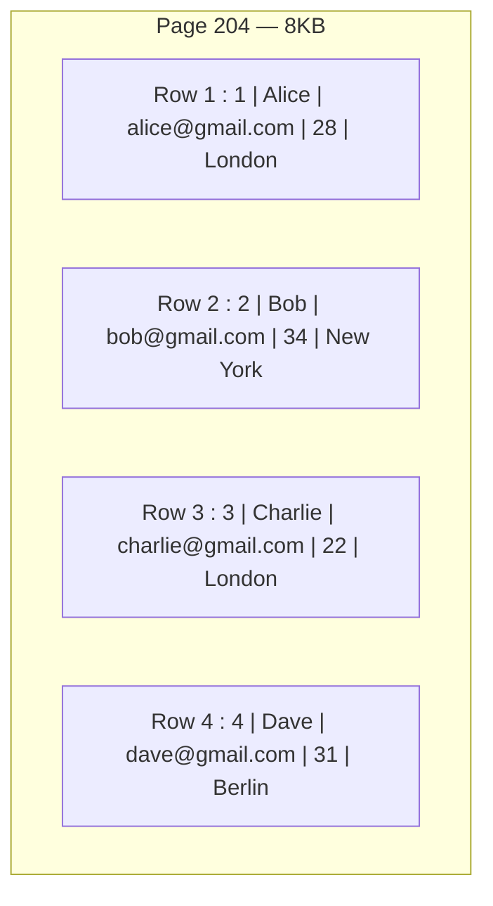
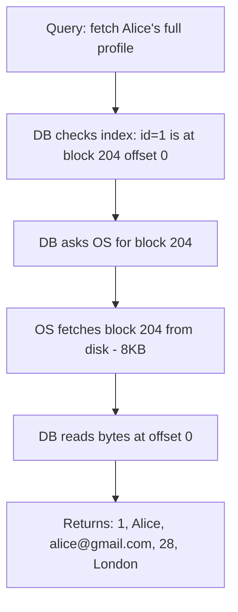
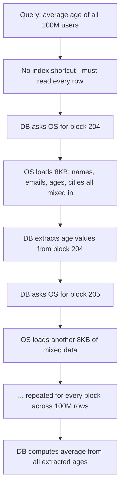
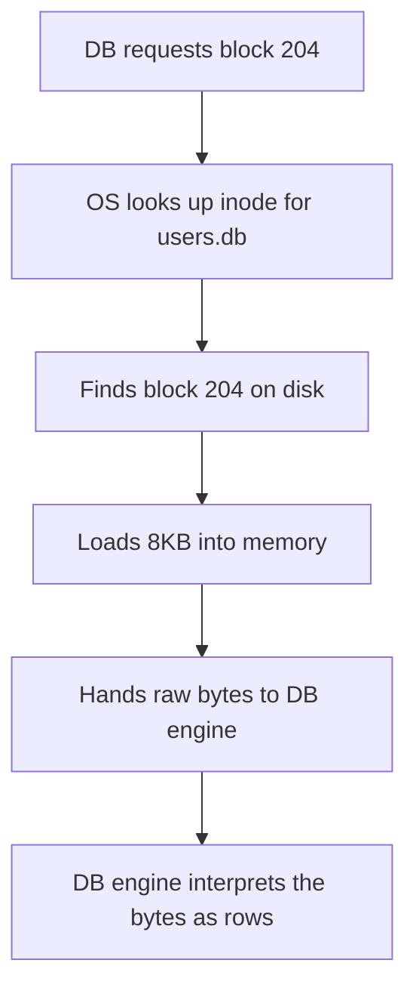

# Row-Oriented Storage

> [!info] Row-oriented storage is how most production databases — PostgreSQL, MySQL, SQLite — physically lay data out on disk. Understanding what the OS actually fetches when you run a query explains exactly when this layout wins and when it hurts.

---

## How data is packed into pages

The DB packs complete rows together into each page. One page holds as many full rows as fit within its 8KB:



Every column for a given row lives together, side by side, in the same block. The OS knows nothing about rows or columns — it just sees 8KB of bytes at block 204.

---

## What happens when you fetch a full profile

```sql
SELECT * FROM users WHERE id = 1;
```



One block read. Alice's entire row — name, email, age, city — is all packed together in block 204. The OS fetches the block once and the DB has everything it needs.

This is the strength of row-oriented storage. Individual record lookups are cheap because all the data you need is physically co-located on disk.

---

## What happens when you run an aggregation

```sql
SELECT AVG(age) FROM users;
```



The problem is clear: to get to the age column, the DB has to load every block — pulling names, emails, and cities off disk that it never needed. At 100 million users, that is gigabytes of irrelevant data loaded from disk just to extract one column.

> [!danger] Never run heavy aggregations against a row-oriented production database. Every column you don't need still gets loaded off disk. At scale this creates massive I/O pressure and competes with live user traffic.

---

## The OS perspective

The OS has no awareness of any of this. Its job is the same regardless:



Whether the query needs one column or all columns, the OS always loads the full 8KB block. The waste in aggregation queries happens because the DB asked for blocks it had to — the data it needs is mixed in with data it doesn't, and there is no way to fetch half a block.

---

## When row-oriented wins

```
Full record reads      → user profiles, order details, session data
Transactional writes   → insert one row, update one row, delete one row
Mixed column queries   → SELECT name, email, age WHERE id = 42
OLTP workloads         → many small reads and writes on individual records
```

> [!important] Row-oriented is the right layout when your queries are about individual records — give me everything about this user, update this order, delete this session. The OS fetches one block and the DB has everything co-located.
