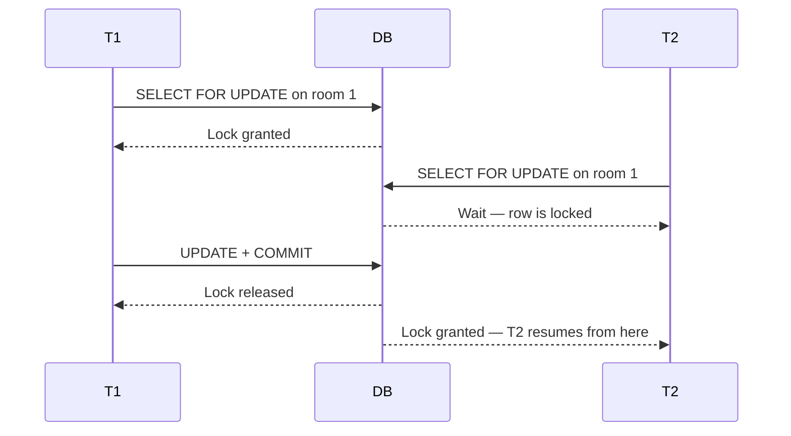
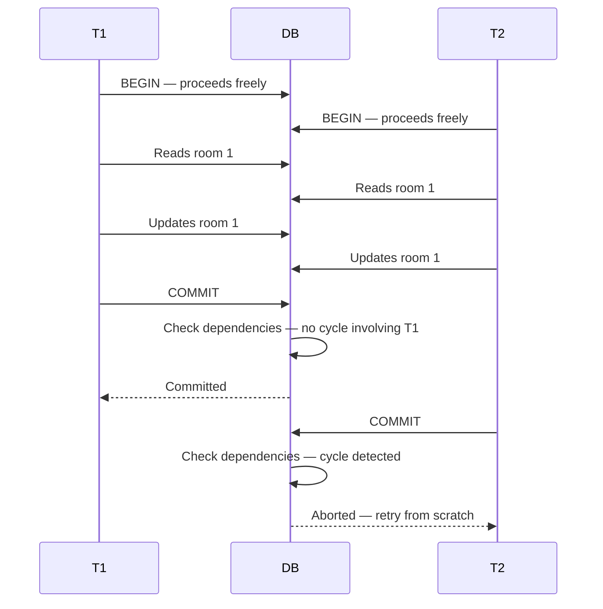

# Pessimistic vs Optimistic Locking

> [!info] SELECT FOR UPDATE and SERIALIZABLE both prevent lost updates — but they take opposite philosophies to get there. One locks upfront and makes others wait. The other lets everyone proceed freely and checks for conflicts at the end. Understanding the difference explains why SERIALIZABLE is slower under contention.

---

## The two philosophies

```
Pessimistic  →  assumes conflict WILL happen
             →  lock the row before doing anything
             →  make others wait
             →  no wasted work

Optimistic   →  assumes conflict WON'T happen
             →  let everyone proceed freely
             →  verify at commit time
             →  abort and retry if conflict found
```

`SELECT FOR UPDATE` is pessimistic. `SERIALIZABLE` (via SSI) is optimistic.

---

## How SELECT FOR UPDATE works — Pessimistic

You tell the DB exactly which row to lock before you do any work:

```sql
BEGIN;
SELECT * FROM rooms WHERE id = 1 FOR UPDATE;  -- lock acquired here
-- only this transaction can touch room 1 now
UPDATE rooms SET available = false WHERE id = 1;
COMMIT;  -- lock released
```

When a second transaction tries to lock the same row, it hits the lock immediately and waits:



T2 never restarted. It paused at the lock point and resumed from there. No work was thrown away.

The lock is also surgical — only `room 1` is locked. Every other transaction in the system is completely unaffected. No global overhead.

---

## How SERIALIZABLE works — Optimistic (SSI)

No upfront lock. Both transactions proceed freely — reading, writing, doing their work. The DB runs a background bookkeeper called SSI (Serializable Snapshot Isolation) that watches all concurrent transactions for a dangerous pattern called a **read-write cycle**.

A read-write cycle looks like this:

```
T1 reads a row that T2 later writes
T2 reads a row that T1 later writes
→ these two are now circularly dependent
→ no serial ordering of T1 and T2 could produce this result
→ one must be aborted
```

The DB tracks who read what and who wrote what across every running transaction — all the time, not just the conflicting ones. This system-wide tracking is the source of the overhead.

The conflict is only detected at commit time:



T2 did all its work — reads, writes, everything — and then had it thrown away at the last moment. It must now re-execute the entire transaction from the beginning.

---

## Why SERIALIZABLE is slower under contention

Two reasons:

**1. Constant SSI tracking overhead**
Every transaction at SERIALIZABLE level pays the cost of dependency tracking, even transactions that never conflict. The bookkeeper runs system-wide, always.

**2. Late conflict detection = wasted work**

```
FOR UPDATE    →  conflict caught early, at lock time
              →  T2 waits, no work lost, resumes from the wait point

SERIALIZABLE  →  conflict caught late, at commit time
              →  T2's entire transaction is discarded
              →  full retry from the beginning
```

The later you catch a conflict, the more work gets thrown away. Under high contention, SERIALIZABLE transactions keep aborting and retrying — each retry does full work again, finds another conflict, aborts again.

> [!danger] Under heavy contention, optimistic locking degrades badly. Every retry is a full transaction re-executed from scratch. If conflicts are frequent, you're burning compute on work that keeps getting discarded.

---

## When each approach wins

```
Pessimistic (SELECT FOR UPDATE)
  → conflicts are frequent
  → better to wait upfront than repeatedly do work and throw it away
  → targeted — only locks the specific row you care about
  → no wasted work, predictable latency

Optimistic (SERIALIZABLE / SSI)
  → conflicts are rare
  → no point making everyone wait for a collision that almost never happens
  → system-wide overhead is acceptable when aborts are infrequent
  → simpler code — no developer needs to remember FOR UPDATE
```

> [!important] The right choice depends on your conflict rate, not your correctness requirement. Both prevent lost updates. The question is whether you pay the cost upfront (wait) or at the end (retry).

---

## In the hotel booking context

Both options correctly prevent double booking. The difference is purely operational:

```
REPEATABLE READ + SELECT FOR UPDATE
  → T2 waits at the lock while T1 books
  → T2 then sees room is taken → exits cleanly
  → one DB round trip saved, no retry

SERIALIZABLE
  → T2 proceeds, does all its work
  → gets aborted at commit time
  → retries from scratch, now sees room is taken → exits
  → more work done, more DB round trips
```

For a hotel booking at scale — where many users might attempt the same room simultaneously — pessimistic locking is the better choice. The conflict rate is high enough that optimistic retry loops become expensive.
