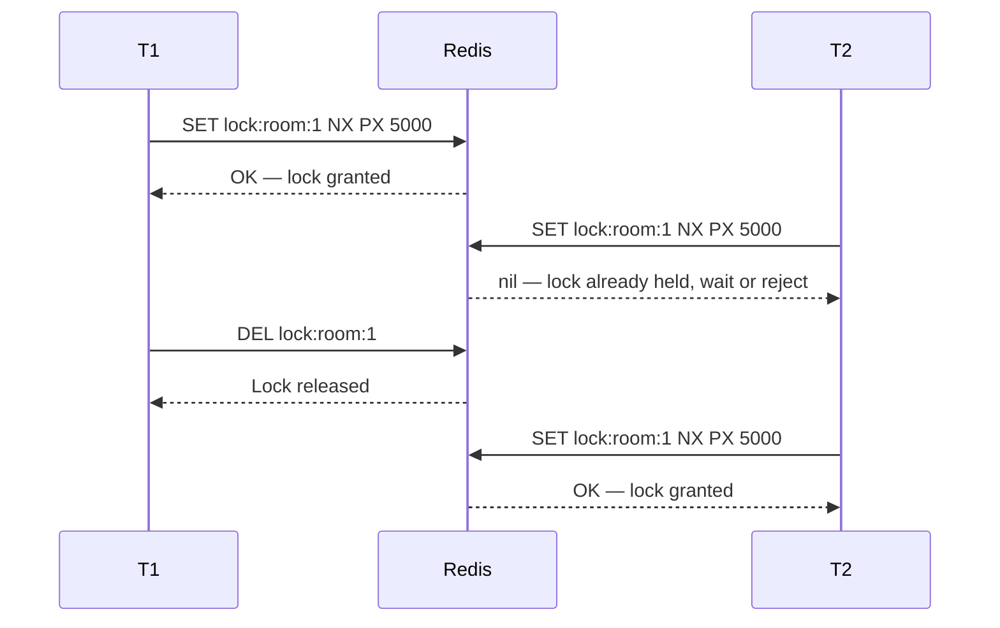
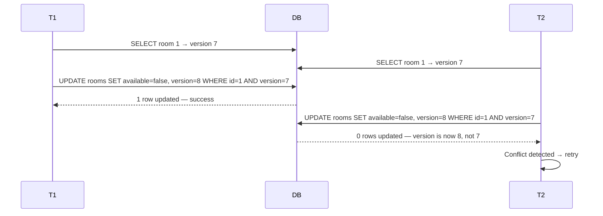

# External Locking Strategies

> [!info] SELECT FOR UPDATE and SERIALIZABLE are the DB handling locking internally. But the same guarantees can be implemented outside the DB entirely — useful when your logic spans multiple services, multiple servers, or when you want conflict detection without touching isolation levels at all.

---

## The full picture

```
Internal to DB:
  SELECT FOR UPDATE  →  pessimistic, row lock inside the DB
  SERIALIZABLE       →  optimistic, SSI conflict detection inside the DB

External:
  Redis lock         →  pessimistic, distributed lock outside the DB
  Version column     →  optimistic, conflict detected at write time via version mismatch
  Timestamp          →  optimistic, weaker version of versioning
```

---

## Redis Distributed Lock — Pessimistic

The DB equivalent of `SELECT FOR UPDATE`, but works across multiple servers and services.

Before touching the resource, acquire the lock in Redis:

```
SET lock:room:1 "token" NX PX 5000
  NX  → only set if key does not exist (atomic check-and-set)
  PX  → auto-expire after 5000ms (safety net if the holder crashes)
```



**Why use this over SELECT FOR UPDATE?**

`SELECT FOR UPDATE` only protects within a single DB connection — it cannot coordinate between two separate application servers hitting the same DB. A Redis lock is a single shared point of coordination that any server can reach, making it the right tool when your booking logic spans multiple services or instances.

> [!important] The PX expiry is critical. If the lock holder crashes before releasing the lock, the key auto-expires and the system recovers. Without it, the lock is held forever and the resource is permanently blocked.

> [!danger] Redis lock alone is not enough — you still need to handle the case where the lock expires mid-operation. Always set PX conservatively long, and validate state again before committing.

---

## Optimistic Locking with Version Column — Optimistic

No locks held at all. A `version` integer column on the row acts as a conflict detector at write time.

```sql
-- Schema
ALTER TABLE rooms ADD COLUMN version INTEGER DEFAULT 0;

-- T1 and T2 both read the same row
SELECT id, available, version FROM rooms WHERE id = 1;
-- Both get: { id: 1, available: true, version: 7 }
```



The `WHERE version=7` clause is the entire mechanism. If the version has changed since T2 read it, the UPDATE matches zero rows. T2 checks the affected row count — if 0, it knows a conflict happened and retries.

**Why this works:**
- No lock is held between read and write
- The check-and-update is atomic at the DB level
- Under low contention, everyone proceeds without waiting
- Under high contention, the retry cost climbs — same tradeoff as SERIALIZABLE

> [!important] Always check the affected row count after the UPDATE. If it returns 0, the version didn't match — you must retry the full read-modify-write cycle.

---

## Timestamp-based — Optimistic

Same idea as versioning but uses a `last_modified` timestamp instead of an integer:

```sql
UPDATE rooms
SET available = false, last_modified = NOW()
WHERE id = 1 AND last_modified = '2026-04-09 10:42:31.000';
```

**Why this is weaker than versioning:**

At high throughput, two transactions can read and write within the same millisecond — timestamps collide and the conflict is missed. An integer version counter increments on every write with no ambiguity — two writes can never produce the same version number.

```
Version column   →  1, 2, 3, 4...  never collides
Timestamp        →  can collide at sub-millisecond resolution under load
```

> [!danger] Avoid timestamp-based optimistic locking for high-throughput systems. Use an integer version column instead.

---

## Choosing the right approach

| Situation | Approach | Why |
|---|---|---|
| Single DB, single service | SELECT FOR UPDATE | Simplest, no extra infrastructure |
| Multiple services / servers | Redis distributed lock | DB row locks don't cross service boundaries |
| Low contention, want no locks | Version column (optimistic) | No waiting, conflict detected at write time |
| High contention | SELECT FOR UPDATE or Redis lock | Optimistic retry loops get expensive under frequent conflicts |
| High throughput, need optimistic | Version column | Never use timestamps — they collide |
