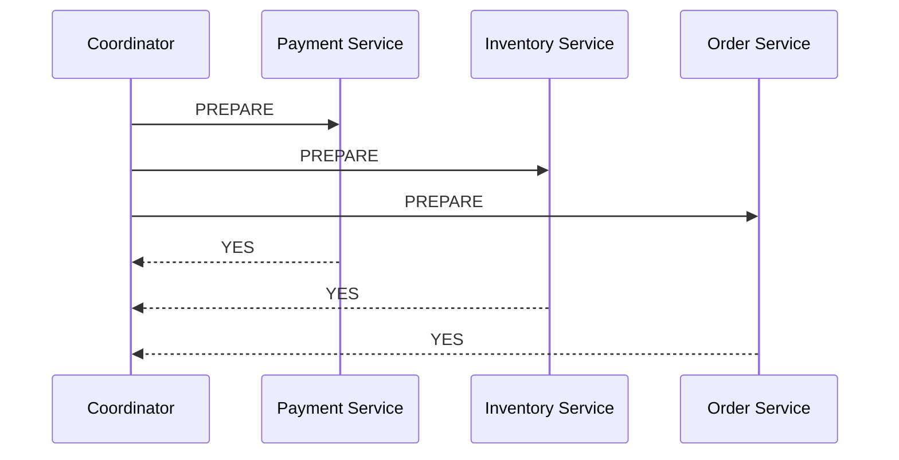
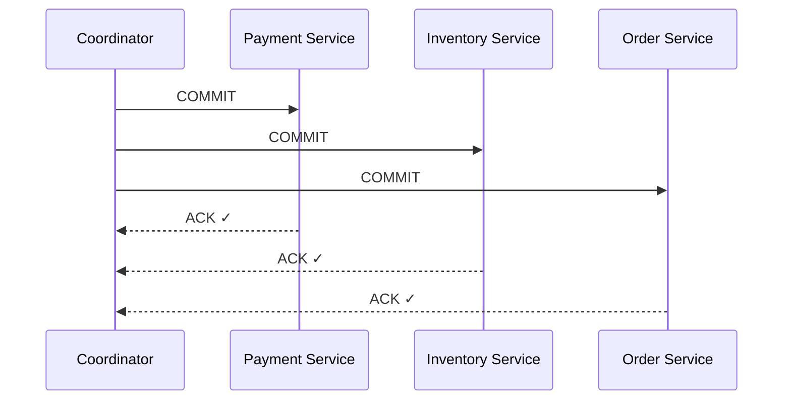

> [!info] Two-Phase Commit (2PC) is a protocol that coordinates multiple services to either all commit or all rollback a transaction. A central coordinator asks every participant "are you ready?" before anyone commits — ensuring no partial commits.


## The core idea

You are the **coordinator** — the one responsible for making sure all three services commit or rollback together. You can't just send "commit" to all three simultaneously and hope for the best — one might fail mid-way. So you split the process into two phases:

1. **Ask everyone if they're ready** — collect votes
2. **Based on the votes — commit or abort**

---

## Are the three services sequential or parallel?

Before going into the phases — this is important to get right.

Payment, Inventory, and Order are **independent services with independent databases**. They don't call each other. The coordinator talks to all three directly.

Within each phase, the coordinator sends messages to all participants **in parallel** — not one after the other:

```
Coordinator sends PREPARE to Payment   ──┐
Coordinator sends PREPARE to Inventory ──┼──  all at the same time
Coordinator sends PREPARE to Order     ──┘

Each service prepares independently, locks its own resource, replies YES or NO
```

The two **phases** however are strictly sequential — Phase 2 cannot start until the coordinator has collected every single vote from Phase 1. One missing vote and Phase 2 waits.

```
Phase 1 (PREPARE) → wait for ALL votes → Phase 2 (COMMIT or ABORT)
         ↑
         sequential between phases, parallel within each phase
```

---

## Phase 1 — Prepare

The coordinator sends a `PREPARE` message to all participants simultaneously. Each service independently:

- Locks the resource it needs (the row it's about to update)
- Writes its intention to its local WAL (so it can recover if it crashes)
- Replies **YES** (ready to commit) or **NO** (something went wrong)



All three said YES. The coordinator now knows every participant is ready and has locked their resources. Phase 1 is complete — Phase 2 can begin.

---

## Phase 2 — Commit

Since all participants voted YES, the coordinator sends `COMMIT` to all three simultaneously. Each service commits its local transaction and releases its locks.



All three committed. The distributed transaction succeeded atomically.

---

## The happy path looks perfect

In the happy path, 2PC gives you true atomicity across multiple databases. No partial commits. Either all three commit or none do. And because participants prepare in parallel and commit in parallel, you're only paying two sequential network round trips — not six.

```
Total latency = Phase 1 round trip + Phase 2 round trip
              = 2 × network RTT
              (not 6 — the parallel messages within each phase don't stack)
```

But there are serious problems hiding in this protocol when things go wrong. Those are covered in the next file.

> [!important] Locks are held across both phases
> Every participant holds its locks from the moment it votes YES in Phase 1 until it receives COMMIT/ABORT in Phase 2. That's two full network round trips of lock time. At high traffic — thousands of transactions per second — this becomes a severe bottleneck.

---

## What "holding locks" actually means — and what it doesn't

A common misconception: 2PC requires a shared codebase or shared database. It doesn't.

Each service is completely independent — separate codebase, separate deployment, separate database. The locks are **local locks inside each service's own database**:

```
Payment Service (its own Postgres):
  → locks row: users WHERE id = 42
  → no other transaction in Payment's DB can touch that row

Inventory Service (its own Postgres):
  → locks row: items WHERE id = 99
  → no other transaction in Inventory's DB can touch that row

Order Service (its own Postgres):
  → locks row in orders table
  → no other transaction in Order's DB can touch it
```

Three separate databases. Three separate locks. The coordinator just coordinates them over the network. Services don't need to know about each other's code or schema.

The real constraint is **infrastructure control** — not code organisation:

```
2PC works when:
✓  you own all the services and their databases
✓  all databases support the XA/2PC protocol
✓  you control the network between them

2PC breaks when:
✗  a participant is an external organisation (a bank, a third-party API)
   → you cannot tell HDFC's database to hold a lock
   → they won't expose that level of control to you
```

This is exactly why GPay can't use 2PC across banks — not because the codebases are separate, but because HDFC and SBI will never let an external system hold locks inside their databases.
