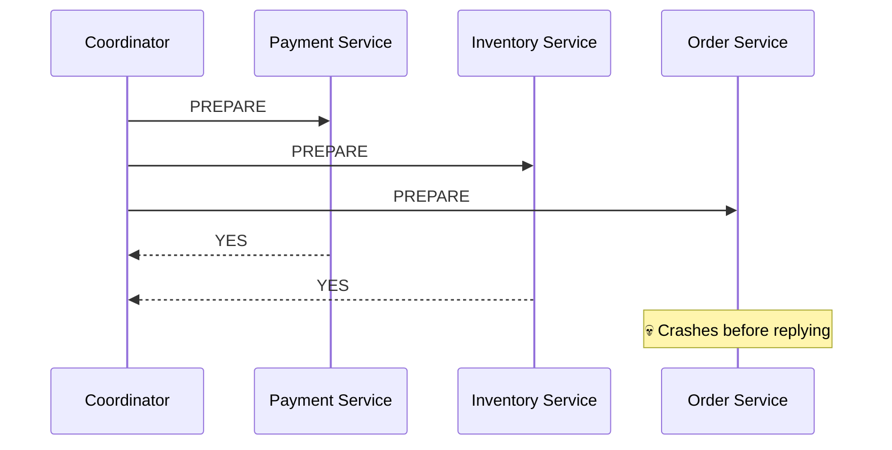
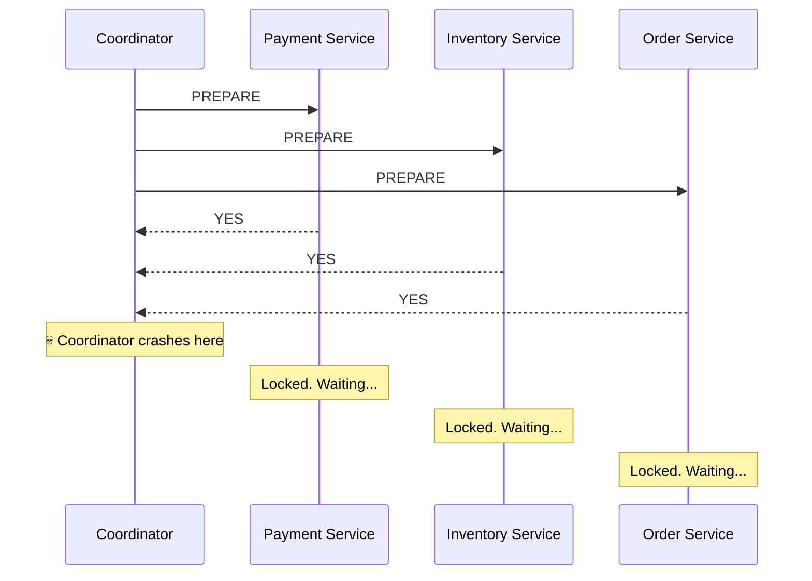
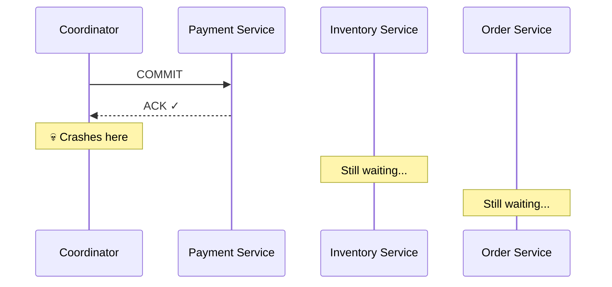
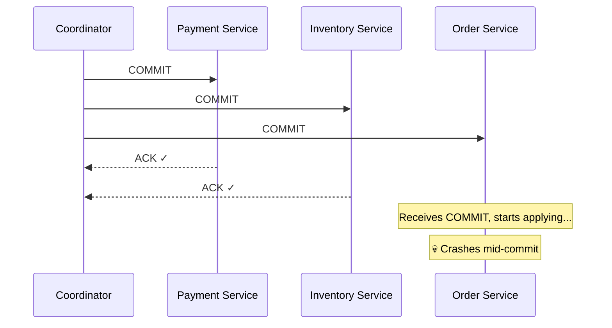
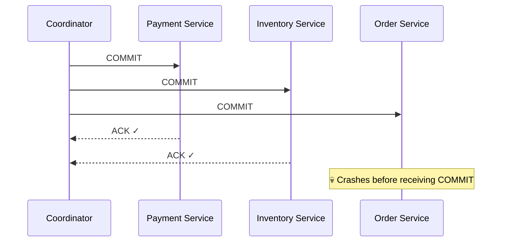

> [!info] 2PC looks clean in the happy path. The problems surface when things go wrong — and there are more failure modes than just the coordinator crashing. Every node in the system can fail at different points, and each produces a different kind of mess.

---

## Failure 1 — Participant crashes during Phase 1 (before voting)

A participant crashes before it can send its YES/NO vote back to the coordinator.

**What happens:** The coordinator waits for O's vote. After a timeout it treats the missing vote as NO and sends ABORT to everyone.

**Outcome:** Clean rollback. Payment and Inventory never committed anything — they just locked resources and released them on ABORT. No inconsistency.

This is the **safe failure case** — crashing before voting means you never promised anything.

---

## Failure 2 — Coordinator crashes after Phase 1, before Phase 2

All participants voted YES and are now holding their locks, waiting for the coordinator's COMMIT or ABORT.

**What happens:** Participants are stuck. They cannot proceed because they don't know what the coordinator decided. They cannot rollback on their own either — the coordinator might have sent COMMIT to one participant before crashing.

**Outcome:** All participants hold their locks indefinitely. The system is **blocked** until the coordinator recovers. This is called an **in-doubt transaction**.

> [!danger] The blocking problem
> Participants voted YES — they promised they're ready. They cannot unilaterally rollback because another participant may have already committed. They must wait. Locks are held. Other transactions queue behind them.

---

## Failure 3 — Coordinator crashes mid-Phase 2 (partial commit)

The coordinator sends COMMIT to some participants, then crashes before reaching the rest.

**What happens:** Payment Service committed — money is deducted. Inventory and Order are still in-doubt, holding locks.

**Outcome:** The system is in a **permanently inconsistent state** until the coordinator recovers. If Inventory and Order rollback on their own — the user got charged but no order exists. They cannot safely rollback. They must wait.

**This is the most dangerous failure case in 2PC.**

---

## Failure 4 — Participant crashes during Phase 2 (after receiving COMMIT)

The coordinator sends COMMIT to all participants. One participant receives the COMMIT, starts applying it, then crashes mid-commit.

**What happens:** Order Service crashes after receiving COMMIT but before finishing. When it recovers, it checks its WAL. Because it wrote the COMMIT decision to WAL before applying it (this is why WAL is written first), it knows it should commit — it replays the WAL and finishes the commit.

**Outcome:** Self-healing on recovery. The WAL ensures the participant always knows what it was supposed to do. No inconsistency.

> [!important] WAL saves you here
> In Phase 1, every participant writes its YES vote to its WAL before sending it. In Phase 2, every participant writes the COMMIT/ABORT decision to its WAL before applying it. On crash recovery, the participant reads its WAL and knows exactly what to do — no ambiguity.

---

## Failure 5 — Participant crashes before receiving Phase 2 message

The coordinator sends COMMIT to all participants. Before the message reaches Order Service, Order Service crashes.

**What happens:** Order Service recovers with no COMMIT in its WAL. It doesn't know the outcome. It contacts the coordinator asking "what was the decision for transaction XYZ?"

The coordinator checks its own WAL — it wrote COMMIT before sending out the messages — and tells Order Service to commit.

**Outcome:** Order Service commits on recovery. Consistent. This requires the coordinator to be up and reachable when Order Service recovers.

---

## Failure 6 — Network partition (message lost in transit)

The coordinator sends COMMIT but the network drops the message before it reaches a participant. The participant never receives it.

**What happens:** Same as Failure 5 from the participant's perspective — it never got the COMMIT. On timeout it contacts the coordinator asking for the decision.

**Outcome:** Coordinator retries the COMMIT. Eventually consistent — but during the partition window, the participant is blocked holding its lock.

---

## All failure cases summarised

| Failure | When | Outcome |
|---|---|---|
| Participant crashes before voting (Phase 1) | Pre-vote | Safe — coordinator times out, sends ABORT, clean rollback |
| Coordinator crashes after all votes, before Phase 2 | Post-vote | Blocking — participants hold locks indefinitely, in-doubt |
| Coordinator crashes mid-Phase 2 (partial COMMIT) | Mid-commit | Dangerous — partial commit, permanent inconsistency until coordinator recovers |
| Participant crashes mid-commit (after receiving COMMIT) | Mid-apply | Self-healing — WAL replay on recovery, no inconsistency |
| Participant crashes before receiving Phase 2 message | Pre-receive | Recoverable — asks coordinator for decision on recovery |
| Network drops Phase 2 message | In-transit | Recoverable — coordinator retries, participant blocked during partition |

> [!danger] The fundamental problem
> 2PC cannot handle a coordinator crash mid-Phase 2 without blocking. Participants are stuck in-doubt until the coordinator comes back. There is no safe way to resolve this without external intervention. This is an inherent limitation of the protocol — not a bug that can be fixed.

The solutions to these failures are covered in the next file.
