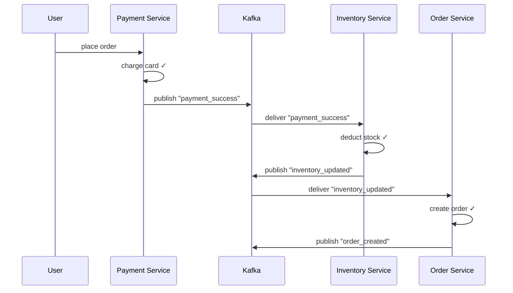
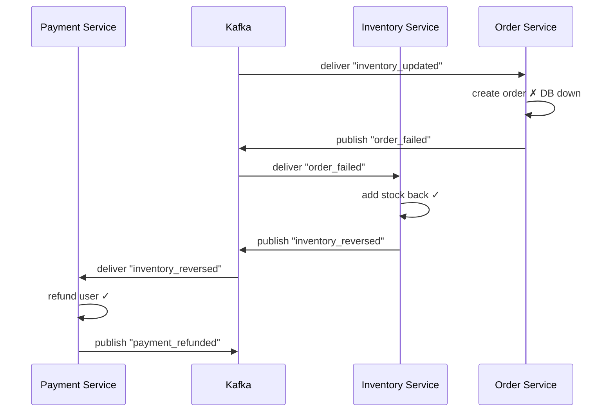
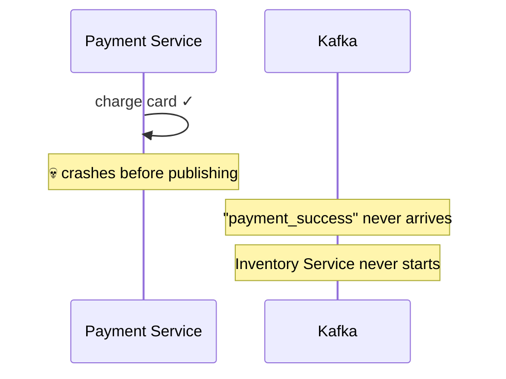
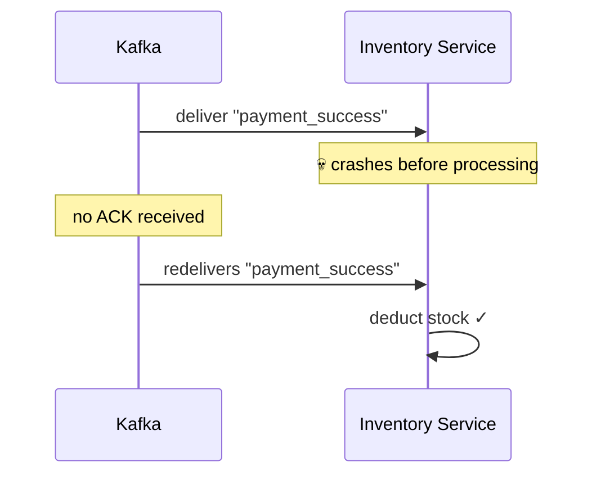
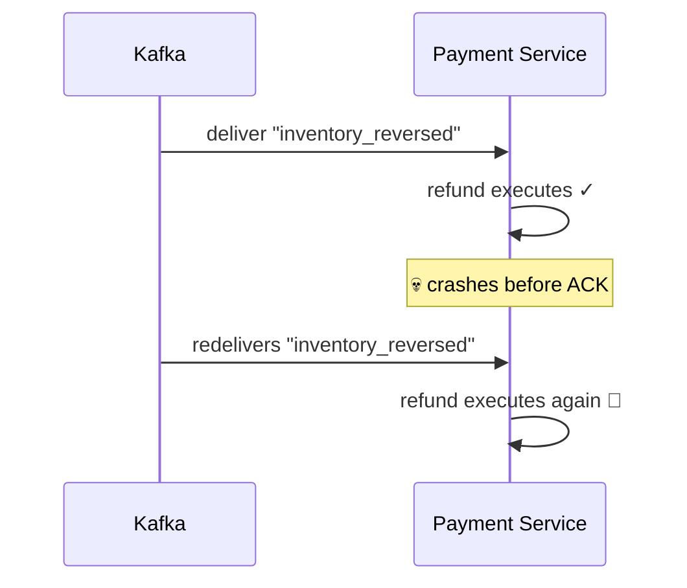
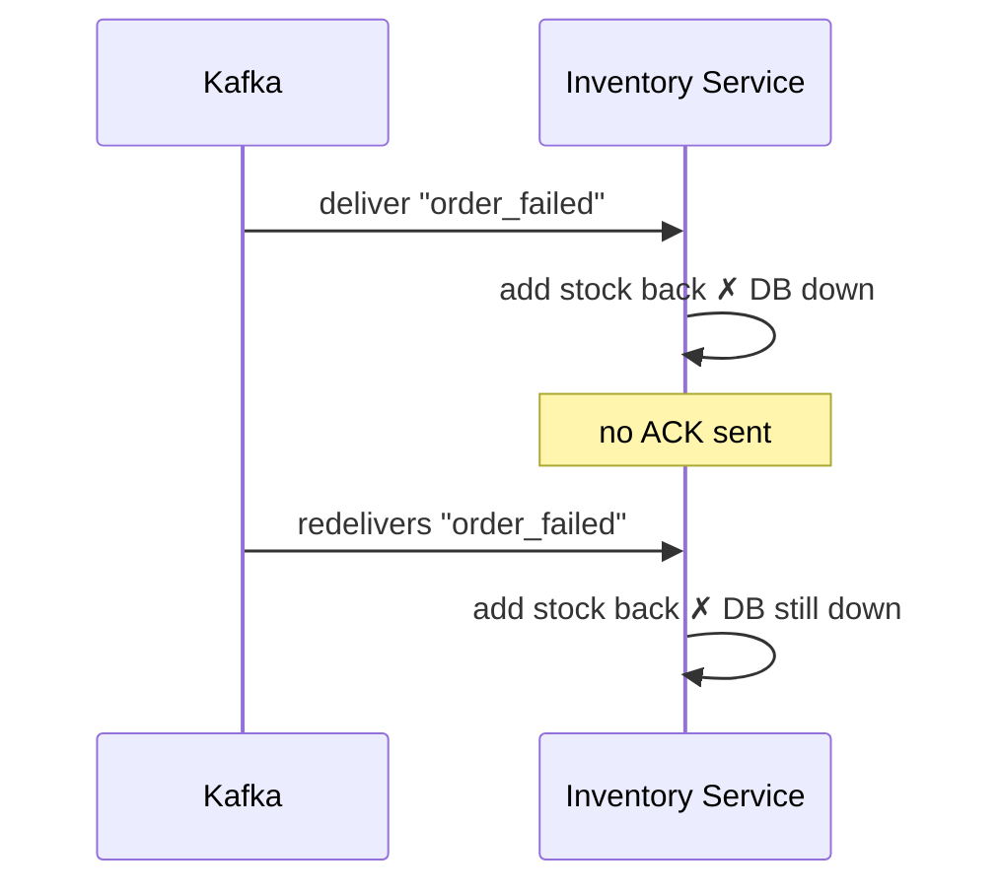

> [!info] Choreography
> There is no central brain. Each service listens to Kafka, reacts to events by doing its local work, and publishes its own events for the next service to pick up. Services coordinate by reacting to each other — like dancers following the music, not a conductor.


## The happy path — Swiggy order

A user places an order. Three services need to act in sequence.



No coordinator. Each service:
1. Does its local work
2. Publishes a success event
3. The next service picks it up and continues

---

## The failure path — Order Service crashes

Order Service fails. Now the saga needs to unwind.



Each service listens to **both success and failure events**. On failure, it runs its compensating transaction and publishes a reversal event for the previous service to pick up. The saga unwinds itself automatically.

---

---

## Failure cases and solutions

### Failure 1 — Service crashes before publishing its event

Payment Service charges the card successfully but crashes before it can publish `"payment_success"` to Kafka.



**What happens:** The saga never progresses. Inventory Service is waiting for an event that never comes. The user got charged but the order was never placed.

**Solution — Outbox pattern:**

Never publish directly to Kafka from the service. Instead, write the event to an outbox table in the same local DB transaction as the business operation:

```
Transaction:
  1. charge card  (payments table)
  2. write "payment_success" to outbox table
  → single ACID commit — both succeed or both fail

Separate outbox poller:
  → reads outbox table
  → publishes to Kafka
  → marks row as published
```

If the service crashes after the DB commit, the outbox row is already written. The poller picks it up on recovery and publishes to Kafka. The event is never lost.

---

### Failure 2 — Service crashes after receiving event but before processing

Inventory Service receives `"payment_success"` from Kafka but crashes before deducting stock.



**What happens:** Kafka never received an ACK, so it redelivers the message when Inventory Service recovers. Inventory Service processes it on the second delivery.

**Solution — Kafka at-least-once delivery + idempotency:**

Kafka guarantees at-least-once delivery — if no ACK, it redelivers. This means your service might process the same event twice. Make every operation idempotent:

```python
# check before acting
if inventory.status != "deducted_for_order_123":
    deduct_stock()
    inventory.status = "deducted_for_order_123"
    db.save(inventory)
# second delivery → already deducted → skip
```

---

### Failure 3 — Service crashes after processing but before ACK (double processing risk)

Payment Service receives `"inventory_reversed"`, runs the refund, but crashes before sending the ACK to Kafka.



**What happens:** Kafka redelivers the message. The refund runs twice — user gets double refunded.

**Solution — idempotency check before acting:**

```python
if payment.status != "refunded":
    process_refund()
    payment.status = "refunded"
    db.save(payment)
# second delivery → status already "refunded" → skip
```

Same pattern as Failure 2. Every step in a choreography saga must be idempotent — assume every message will be delivered more than once.

---

### Failure 4 — Compensation itself fails

Order Service publishes `"order_failed"`. Inventory Service tries to add stock back — but its DB is down. The compensation fails.



**What happens:** Kafka keeps redelivering. Inventory Service keeps failing. The compensation is stuck — stock is not restored. The saga is in a permanently inconsistent state until the DB recovers.

**Solution — retry with exponential backoff + dead letter queue:**

```
Retry 1 → fails → wait 1s
Retry 2 → fails → wait 2s
Retry 3 → fails → wait 4s
...
After N retries → send to Dead Letter Queue (DLQ)
```

The DLQ holds the failed message. An alert fires. A human or automated process investigates — manually restores stock, or triggers a different compensation path. The system never silently loses the failure.

> [!danger] Compensation failure is the hardest problem in Saga
> There is no automatic resolution. If the compensating transaction keeps failing, you need human intervention or a fallback path. This is why payment systems combine Saga with end-of-day reconciliation — to catch anything that fell through.

---

### Failure 5 — Kafka goes down mid-saga

Payment succeeds. Kafka goes down before delivering `"payment_success"` to Inventory Service.

**What happens:** Inventory Service never starts. The saga is frozen mid-way. User is charged, order is not placed.

**Solution — Kafka replication + durability:**

Kafka is itself replicated across brokers. `"payment_success"` is written to Kafka's replicated log before Payment Service gets an ACK. So if one Kafka broker goes down, another has the message. The message is not lost.

```
Payment Service → Kafka leader (writes to replicated log)
                      → Broker 1 ✓
                      → Broker 2 ✓
                      → Broker 3 ✓
→ ACK sent to Payment Service only after replication
```

If the entire Kafka cluster goes down and comes back up — messages are replayed from the log. Inventory Service will eventually receive `"payment_success"`.

This is why using Kafka (durable, replicated log) matters over a simple message queue like RabbitMQ which can lose messages if not configured carefully.

---

### Failure 6 — Saga gets stuck with no further events (silent failure)

A service processes an event, its DB call fails, it doesn't publish anything — not a success event, not a failure event. The saga simply stops. No compensation runs. No alert fires.

```
Inventory Service receives "payment_success"
→ DB call fails silently
→ publishes nothing
→ Order Service never starts
→ Payment Service never gets a reversal signal
→ user is charged, nothing happens
```

**Solution — saga timeout + monitoring:**

Every saga should have a timeout. If an order hasn't completed within N minutes, an external monitor fires an alert or triggers a forced compensation:

```
Order placed at 10:00 AM
Order not completed by 10:05 AM → timeout triggers
→ compensate: refund payment, restore stock
```

In choreography this is harder to implement because no single service owns the full saga state. This is one of the core reasons teams move to orchestration — the orchestrator tracks the full state and can enforce timeouts centrally.

---

## All failure cases summarised

| Failure | What happens | Solution |
|---|---|---|
| Service crashes before publishing event | Saga stuck, event never sent | Outbox pattern — write event to DB in same transaction |
| Service crashes before processing event | Kafka redelivers, processed on recovery | Kafka at-least-once + idempotency |
| Service crashes after processing, before ACK | Double processing on redelivery | Idempotency check before every operation |
| Compensation itself fails | Saga stuck in inconsistent state | Retry + exponential backoff + Dead Letter Queue |
| Kafka goes down mid-saga | Messages lost, saga frozen | Kafka replication — messages survive broker failure |
| Silent failure — no event published | Saga never progresses, no alert | Saga timeout + monitoring + forced compensation |

---

## The debugging problem

Six months later, a bug is reported — an order got charged but never refunded. Where do you start?

In choreography, the full flow is **spread across multiple services and multiple Kafka topics**:

```
payment_success       → Payment Service logs
inventory_updated     → Inventory Service logs
order_failed          → Order Service logs
inventory_reversed    → Inventory Service logs
payment_refunded      → Payment Service logs (missing?)
```

You have to trace through Kafka logs across 3 different services to reconstruct what happened to order 123. There is no single place that shows you the full picture.

This is choreography's biggest operational weakness — **distributed observability**. You need distributed tracing (e.g. Jaeger, Zipkin) and correlation IDs on every event just to follow one order through the system.

---

## Choreography — trade-offs

| Strength | Weakness |
|---|---|
| No single point of failure | Hard to debug — flow is spread across services |
| Fully decentralised | Each service must implement idempotency independently |
| Services are loosely coupled | Easy to lose track of the overall saga state |
| Simple to add new steps — just listen to an event | No single place to see "what happened to order 123" |
