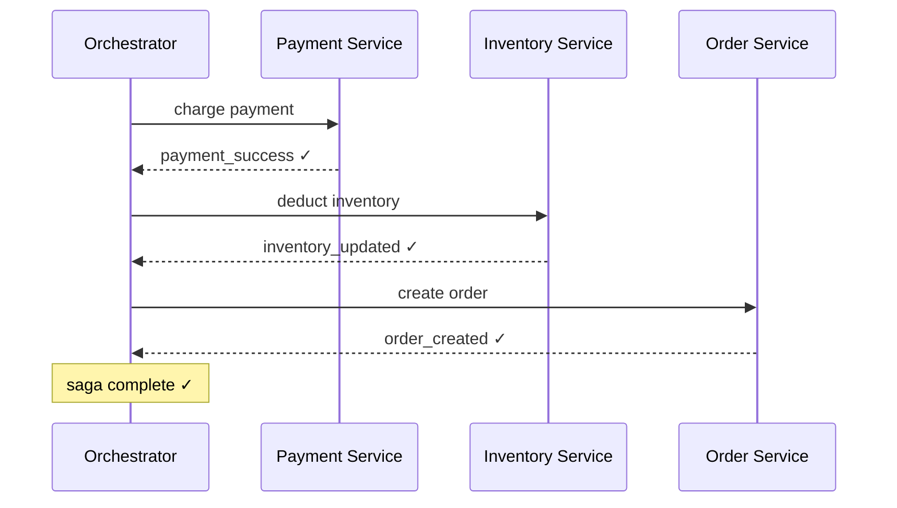
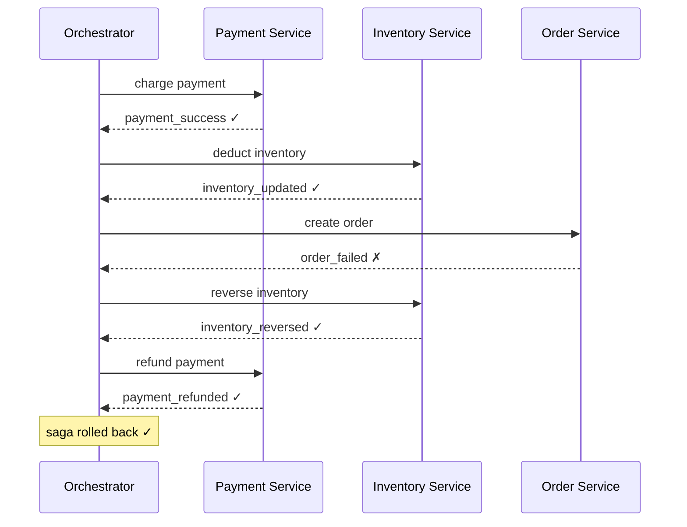
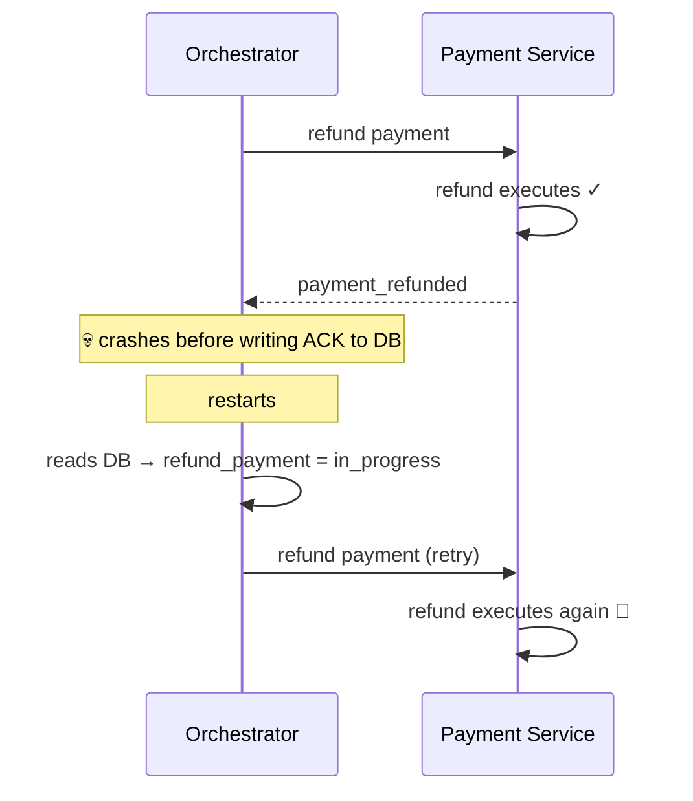
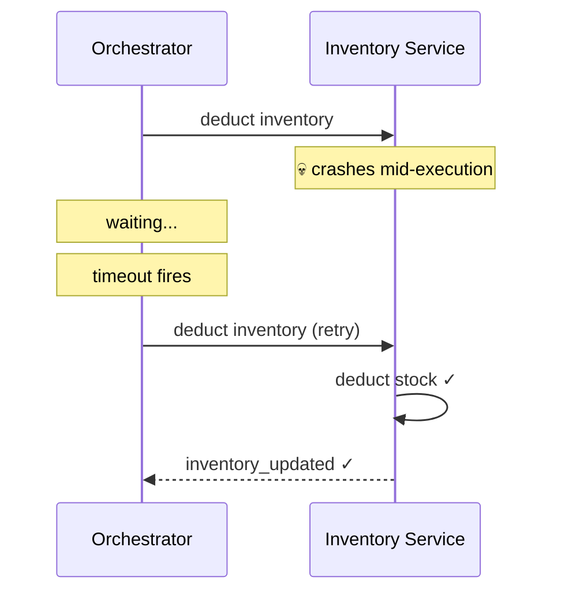
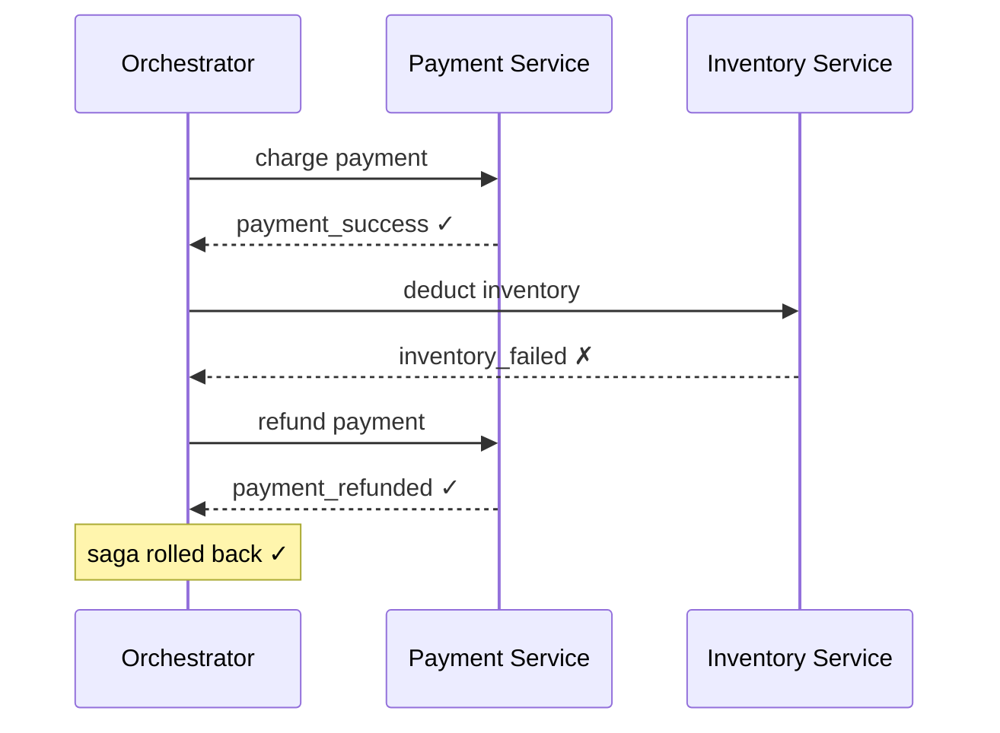
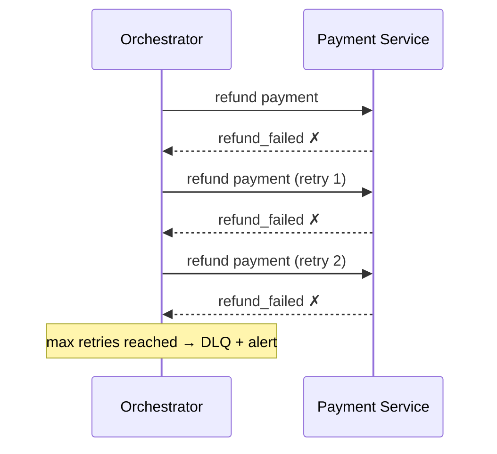
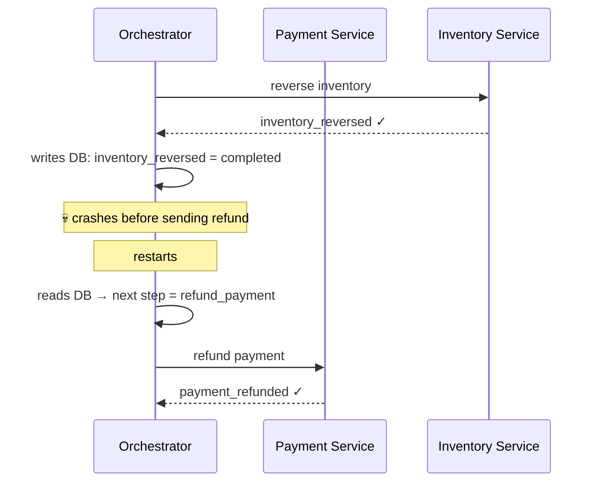

> [!info] Saga Orchestration
>  knows the entire flow and tells each service what to do next — step by step. Services don't talk to each other directly. They only talk to the orchestrator. The full story of every saga lives in one place.


## The happy path — Swiggy order



One brain. The orchestrator drives every step. The full flow of the saga lives in the orchestrator's state — not scattered across Kafka topics and service logs.

---

## The failure path — Order Service fails



When Order Service fails, the orchestrator knows exactly which steps succeeded and triggers compensating transactions in reverse — without anyone else needing to know about the failure.

---

## Debugging is trivial

Six months later, a bug is reported for order 123. You open the orchestrator's state for that order:

```
order_id: 123
step 1 → charge_payment     → SUCCESS  (10:01:32)
step 2 → deduct_inventory   → SUCCESS  (10:01:33)
step 3 → create_order       → FAILED   (10:01:34) ← here
step 4 → reverse_inventory  → SUCCESS  (10:01:35)
step 5 → refund_payment     → FAILED   (10:01:36) ← and here
```

The full picture in one place. You instantly see that the refund failed — you know exactly where to look.

This is orchestration's biggest operational advantage — **centralised observability**.

---

---

## Failure cases and solutions

### Failure 1 — Orchestrator crashes before recording ACK (double execution)

The orchestrator sends "refund payment" to Payment Service. Payment Service executes the refund and replies. The orchestrator crashes before recording the ACK in its DB.



**What happens:** The orchestrator retries because its DB still shows the step as in-progress. The refund runs twice — user double refunded.

**Solution — orchestrator persists state before sending, services are idempotent:**

Orchestrator side:
```
1. Write to DB: step=refund_payment, status=in_progress
2. Send "refund payment" to Payment Service
3. Receive ACK
4. Write to DB: step=refund_payment, status=completed
```

On restart, the orchestrator reads its DB, sees the step is in-progress, and retries. But Payment Service handles the retry safely:

```python
# Service side idempotency
if payment.status != "refunded":
    process_refund()
    payment.status = "refunded"
    db.save(payment)
# retry → already refunded → skip
```

Both sides must be fault-tolerant independently. The orchestrator retries. The service ignores duplicates.

---

### Failure 2 — Service crashes without responding

The orchestrator sends "deduct inventory" to Inventory Service. Inventory Service crashes mid-execution and never responds.



**What happens:** The orchestrator waits for a response, hits its timeout, and retries. Inventory Service recovers and processes the command on the retry.

**Solution — orchestrator timeout + retry with exponential backoff + service idempotency:**

```
Attempt 1 → no response → wait 1s
Attempt 2 → no response → wait 2s
Attempt 3 → success ✓
```

Service must be idempotent — if the first execution partially ran before the crash, the retry must not double-deduct stock.

---

### Failure 3 — Service responds with failure

Inventory Service receives "deduct inventory" but its DB is down. It responds with an explicit failure.



**What happens:** The orchestrator receives the failure, knows exactly which steps succeeded, and triggers compensating transactions in reverse. Only Payment Service needs to be compensated — Order Service never started.

**This is orchestration's advantage over choreography** — the orchestrator knows the exact saga state at all times. No guessing, no tracing across Kafka topics.

---

### Failure 4 — Compensation itself fails

The orchestrator tries to refund the payment as a compensating transaction — but Payment Service's DB is down and the refund fails.



**What happens:** The orchestrator retries with exponential backoff. After N failures, it marks the saga as stuck and sends the failed step to a Dead Letter Queue (DLQ). An alert fires.

**Solution — retry + DLQ + manual intervention:**

```
Orchestrator DB:
  order_id: 123
  step: refund_payment
  status: STUCK
  last_error: "Payment DB timeout"
  retry_count: 5
```

A human or automated recovery process investigates — retries the refund once Payment DB recovers, or escalates to finance for manual resolution. This is why payment systems combine Saga with end-of-day reconciliation — to catch anything the automated retries couldn't resolve.

> [!danger] Compensation failure requires human intervention
> There is no automatic resolution when the compensating transaction itself keeps failing. The orchestrator surfaces it clearly — stuck step, error log, DLQ alert. In choreography the same failure is far harder to detect because no single service owns the full saga state.

---

### Failure 5 — Orchestrator crashes mid-compensation

The orchestrator has already started compensating — reversed inventory — then crashes before refunding the payment.



**What happens:** The orchestrator persisted every completed step to its DB before crashing. On restart it reads its DB, sees inventory was reversed but payment was not refunded yet, and resumes from exactly that point.

**Solution — durable orchestrator state in DB:**

The orchestrator's DB is the source of truth for the saga. Every step — forward and compensating — is written to the DB before being executed. On recovery, the orchestrator replays from the last known state.

This is why a production orchestrator (like Temporal or AWS Step Functions) persists every event to a durable store — it can always recover to exactly where it left off, no matter how many times it crashes.

---

### Failure 6 — Saga timeout — service never responds and retries exhausted

Inventory Service never responds to "deduct inventory" — not a failure message, just silence. The orchestrator retries but hits its max retry limit.

**What happens:** The saga is stuck in-progress. The user is charged but the order is neither placed nor cancelled.

**Solution — saga-level timeout with forced compensation:**

```
Order placed at 10:00 AM
Saga must complete by 10:05 AM

10:05 AM → saga timeout fires
Orchestrator checks current state:
  payment → SUCCESS
  inventory → IN_PROGRESS (stuck)

Orchestrator forces compensation:
  → cancel inventory step
  → refund payment
```

The orchestrator owns the clock for the entire saga. If it hasn't completed within the deadline, it compensates everything that succeeded so far and marks the order as failed. The user gets a refund. No silent money loss.

---

## All failure cases summarised

| Failure | What happens | Solution |
|---|---|---|
| Orchestrator crashes before recording ACK | Retries on recovery, double execution risk | Persist state before sending + service idempotency |
| Service crashes without responding | Orchestrator hits timeout, retries | Timeout + exponential backoff retry + idempotency |
| Service responds with failure | Orchestrator knows exact state, triggers compensation | Orchestrator drives reverse compensation in order |
| Compensation itself fails | Saga stuck in inconsistent state | Retry + DLQ + alert + manual intervention |
| Orchestrator crashes mid-compensation | Compensation incomplete on restart | Durable orchestrator DB — resumes from last known state |
| Saga timeout — retries exhausted | Order stuck, user charged but no action | Saga-level timeout + forced compensation |

---

## Orchestration — trade-offs

| Strength | Weakness |
|---|---|
| Full saga state in one place — easy to debug | Orchestrator is a single point of failure (mitigated by making it fault-tolerant) |
| Clear flow — easy to reason about | Orchestrator becomes a bottleneck at very high throughput |
| Easier to implement idempotency — one source of retries | More upfront complexity — need to build and maintain the orchestrator |
| Centralised monitoring and alerting | Services are coupled to the orchestrator |
