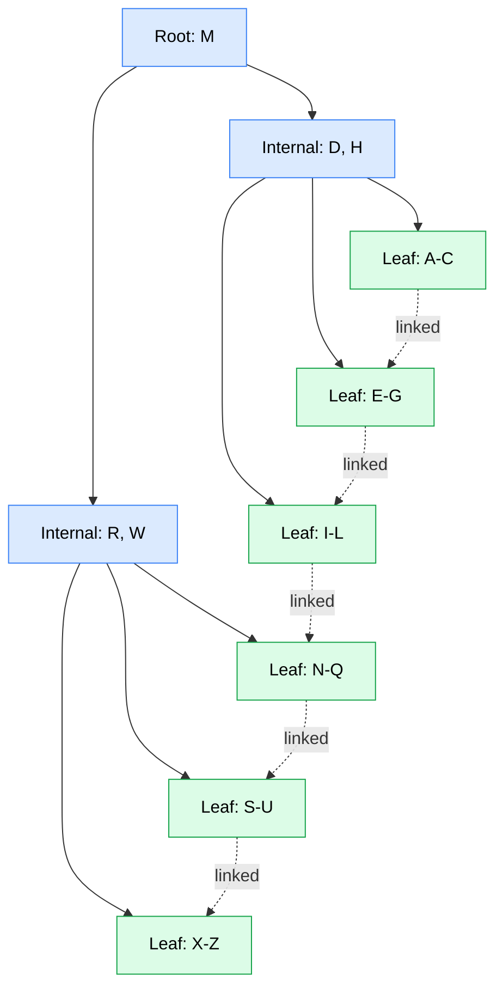
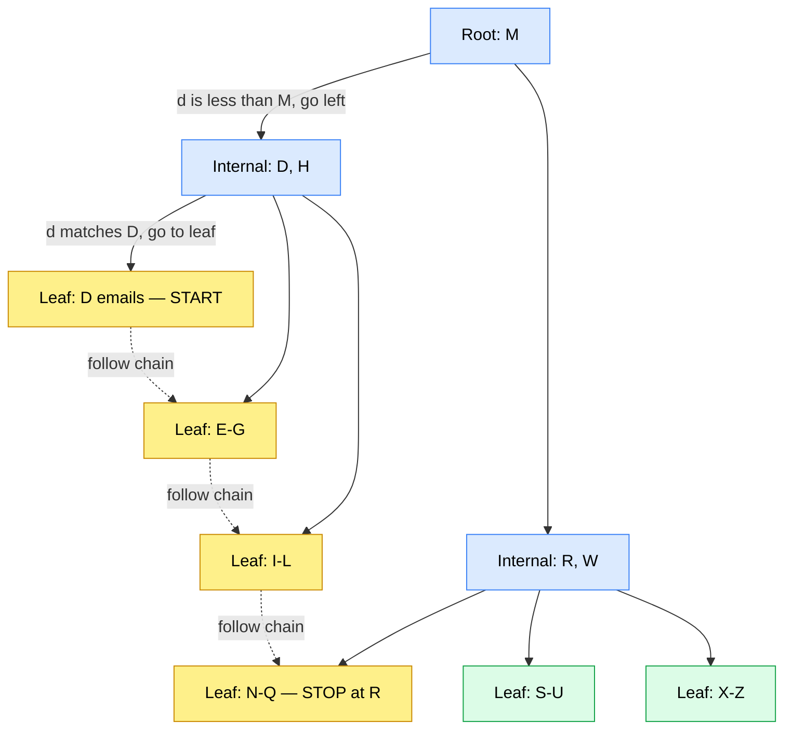
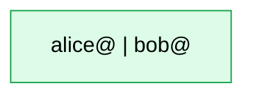
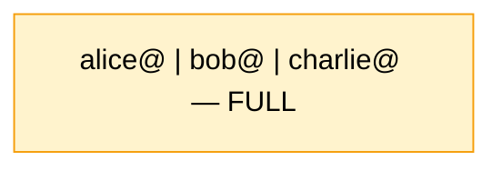
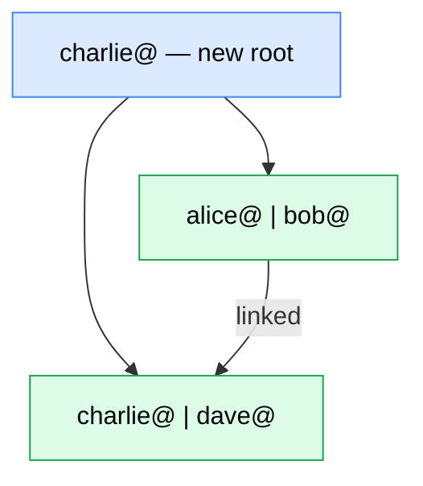
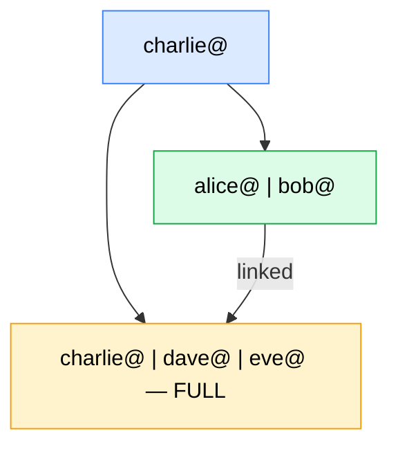
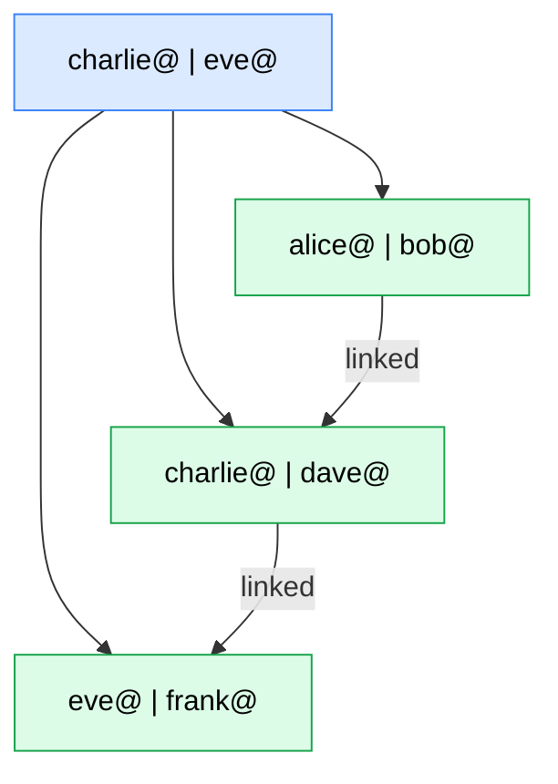
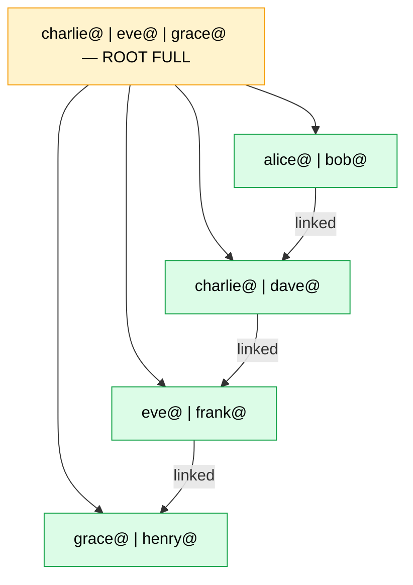
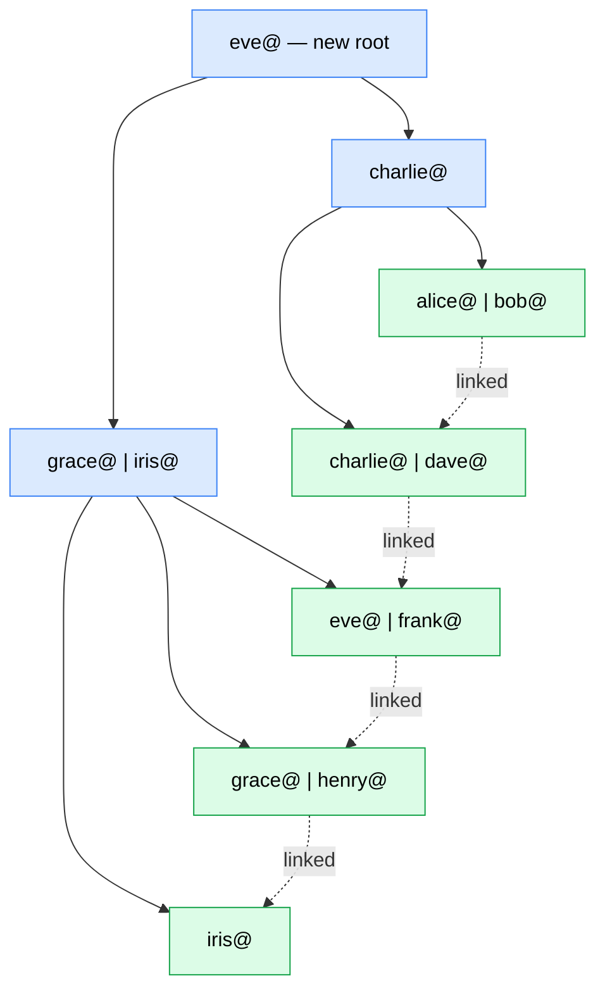

## The Problem Hash Index Left Unsolved

Hash index gives you O(1) exact lookups — perfect for `WHERE email = 'alice@gmail.com'`. But it completely breaks down the moment you ask for a range.

Most real-world queries aren't exact lookups. They're ranges:

```
"Show all orders placed between Jan 1 and Jan 31"
  → WHERE date BETWEEN '2024-01-01' AND '2024-01-31'

"Find all users who signed up in the last 7 days"
  → WHERE created_at > NOW() - INTERVAL 7 DAYS

"Get all messages in this chat from the last 24 hours"
  → WHERE timestamp > NOW() - INTERVAL 24 HOURS

"Show transactions above $1000"
  → WHERE amount > 1000
```

Every single one is impossible with a hash index. Hash values have no order — there's no concept of "between" or "greater than" in a hash table.

Even exact lookups are just a special case of a range query where the range happens to be size 1:

```
Exact lookup  → WHERE email = 'alice@'      → range of size 1
Range query   → WHERE date BETWEEN x AND y  → range of size n
```

What you need is an index that keeps values **sorted** — so you can binary search to a starting point and scan forward. That's B+ Tree.

---

## The Problem With Sorted Arrays

The naive approach to a sorted index — a sorted array. Every email stored in order:

```
[aaron@, alice@, bob@, charlie@, dave@, ... 100 million entries ...]
```

Range query — find all emails starting with "a": binary search to find the first "a", then scan forward. Fast ✓

But a new user signs up with `aaron@gmail.com`. It needs to go right at the beginning. Every single entry after it must shift one position to make room.

```
Insert aaron@ at position 1:
→ shift 100,000,000 entries one position right
→ O(n) on every insert ✗
```

At 100 million rows, one insert requires 100 million shift operations. Completely unusable at scale.

```
Sorted array    → range queries fast ✓, inserts catastrophically slow ✗
We need         → sorted structure + fast inserts
```

That's exactly the problem B+ Tree solves.

---

## The Structure

Instead of one flat sorted array, B+ Tree organises data into a **tree of sorted nodes** with two critical rules:
1. **All actual data lives only in the leaf nodes at the bottom**
2. **Leaf nodes are linked together in a chain left to right**



- **Root and internal nodes (blue)** — only store keys and pointers to children. No actual data.
- **Leaf nodes (green)** — store the actual index entries (email → row pointer). All data lives here.
- **Leaf chain** — every leaf node points to the next leaf, forming a linked list across the bottom.

The `+` in B+ Tree specifically refers to this linked leaf chain. A plain B Tree doesn't have it.

---

## Why the Leaf Chain Matters — Range Queries

Say you want all users whose email is between `d@` and `r@`.



Step 1 — traverse from root to find the starting leaf: O(log n)
Step 2 — follow the leaf chain forward until you hit "r": O(k)

No jumping back up to the root. No re-traversing the tree. Just follow the chain.

```
Range query cost:
  Find start → O(log n)  — traverse root to leaf
  Scan range → O(k)      — follow leaf chain, k = number of results
Total: O(log n + k) ✓
```

---

## How Inserts Work — Step by Step

Let's build a B+ Tree from scratch with a max of **3 entries per node**. We insert emails one by one and watch the tree grow.

---

**Step 1 — Insert: alice@**


One leaf node. Done.

---

**Step 2 — Insert: bob@**



Still fits. Sorted automatically.

---

**Step 3 — Insert: charlie@**



Node is now full. Next insert will trigger a split.

---

**Step 4 — Insert: dave@ — SPLIT**

Node is full — can't fit a 4th entry. Split the leaf into two, push the middle value up to a new root.



Only the split node and its parent were touched — not every row in the table.

---

**Step 5 — Insert: eve@**

Traverse from root: "eve" > "charlie" → go right → land on [charlie@, dave@] → insert.



Right leaf is full again.

---

**Step 6 — Insert: frank@ — SPLIT again**



Three leaf nodes, all linked. Root now has two keys.

---

**Step 7 — Insert: grace@, henry@ — Root fills up**



---

**Step 8 — Insert: iris@ — ROOT SPLITS — tree grows taller**

When the root splits, the tree gains a new level. This is how B+ Tree grows in height — always from the root upward, never downward.



The tree grew taller from the root — always balanced. Every leaf is at the same depth no matter how many inserts happen.

---

## Why This Is Fast

**Lookups** are O(log n) — binary search from root to leaf, at most one comparison per level.

**Writes** are also O(log n) — and splits don't change that. Here's why.

When you insert, you traverse root → leaf. That path is log n levels deep — it's the height of the tree. If a split is needed, it propagates back **upward along that same path**. It can never go sideways, never touch other branches.

```
Tree height = 27 levels (log₂ of 100M rows)

Worst case: every node on the path is full
  → split leaf           → 1 split
  → split parent         → 1 split
  → split grandparent    → 1 split
  → ... up to root       → 1 split (tree grows one level)

Total splits = 27 = tree height = log n
```

Each split is O(1) — divide the node in half, push one key up. You're never touching other branches, never shifting millions of entries like a sorted array would require.

```
Insert into B+ Tree:
  Traverse down    → O(log n)   find the right leaf
  Insert           → O(1)       add to leaf
  Splits upward    → O(log n)   at most one split per level on the path back up
  Total            → O(log n)   ✓

Insert into sorted array:
  Find position    → O(log n)
  Shift everything after        → O(n)    ✗
```

The splits are bounded by the height of the tree, and height is always log n because the tree stays balanced. That's the whole point of the split mechanism — instead of one node growing unbounded, it stays small, and height only grows by 1 when the root itself splits.

---

## Why Databases Use B+ Tree as the Default Index

```
✓ Exact lookups  → O(log n) — traverse root to leaf
✓ Range scans    → O(log n + k) — find start, follow leaf chain
✓ Inserts        → O(log n) — find leaf, insert, split if needed
✓ Always balanced → splits keep all leaves at same depth
✓ Leaf chain     → range scans never need to climb back up the tree
```

Every major SQL database — PostgreSQL, MySQL, Oracle, SQL Server — uses B+ Tree as the default index structure. When you run `CREATE INDEX`, you're creating a B+ Tree.

> [!info] The `+` in B+ Tree = linked leaf nodes. This single addition over a plain B Tree is what makes range queries efficient — find the start, follow the chain, never touch the internal nodes again.

> [!important] B+ Tree is optimised for **reads and balanced writes**. But every insert may trigger splits and the tree must stay sorted — all writes go to a specific location on disk (random I/O). For systems with extreme write rates — millions of writes per second — this becomes a bottleneck. That's the problem LSM Tree solves next.
