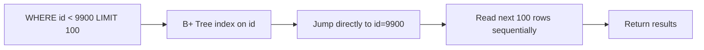
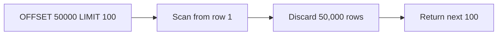

## The insight

The problem with OFFSET is that it's a position in a moving list. The fix is to anchor to a **specific row** instead — one that doesn't move regardless of what gets inserted or deleted around it.

The last row you returned is the perfect anchor. Use its ID as a reference point and ask: "give me the next 100 rows after this specific row."

This is **cursor-based pagination**. The "cursor" is just an identifier pointing to a specific row in the dataset — usually the ID or timestamp of the last item on the current page.

---

## How it works

```sql
-- Page 1 — no cursor yet, just fetch the first 100
SELECT * FROM tweets ORDER BY id DESC LIMIT 100

-- Returns tweets with IDs: 9999, 9998, 9997, ... 9900
-- Last tweet ID: 9900 → this becomes the cursor

-- Page 2 — use the cursor
SELECT * FROM tweets WHERE id < 9900 ORDER BY id DESC LIMIT 100

-- Returns tweets with IDs: 9899, 9898, ... 9800
-- Last tweet ID: 9800 → new cursor for page 3
```

Each page response includes the cursor for the next page. The client stores it and sends it with the next request.

---

## Why this is fast

`WHERE id < 9900` with an index on `id` is an O(log n) index lookup. Postgres uses the B+ tree to jump directly to the row with id=9900 and reads forward from there. No scanning. No counting. No throwing away rows.



Compare to OFFSET:



At any depth — page 1, page 500, page 5000 — cursor pagination performs identically. It always jumps straight to the cursor and reads forward.

---

## Why this is stable

New tweets being inserted don't affect you. Your cursor points to a specific tweet ID — say 9900. Whether 1,000 new tweets arrive with IDs 10,000–11,000, your next page still starts at id < 9900. The new tweets are above your cursor, not below it. They don't shift anything.

```
Page 1 fetched:  tweets 9999 → 9900  (cursor = 9900)
1,000 new tweets arrive with IDs 10,000–11,000
Page 2 fetched:  WHERE id < 9900 → tweets 9899 → 9800
→ No duplicates. No skipped rows. Perfectly stable.
```

Deleted tweets are handled equally cleanly — if a tweet between your cursor and the next batch gets deleted, that ID simply doesn't appear. No shift in positions, no duplicate or missing pages.

---

## The trade-off — no random page access

With OFFSET you can jump to any page directly: "give me page 50" → `OFFSET 5000`. Simple.

With cursor pagination, you can only navigate sequentially. To get to page 50, you need the cursor from page 49. There's no way to compute "the cursor for page 50" without having fetched pages 1 through 49 first.

```
OFFSET:  "jump to page 50" → OFFSET 5000 → works (slowly)
Cursor:  "jump to page 50" → impossible without page 49's cursor
```

This makes cursor pagination incompatible with page-number UIs — the kind where you click "1, 2, 3 ... 50" to jump around.

---

## When to use each

```
Infinite scroll          → cursor-based  (Twitter, Instagram, news feeds)

Next / Previous only     → cursor-based  (any sequential navigation)

Page number UI           → offset        (only for small datasets, infrequent writes)

Admin panels             → offset is fine (small data, no concurrent write pressure)
```

The rule of thumb: if users can keep scrolling indefinitely and the underlying data changes frequently — cursor pagination is the only correct choice.

> [!tip] Interview framing
> "I'd use cursor-based pagination for the feed — the client sends the ID of the last tweet it received, the server queries WHERE id < cursor LIMIT 100. It's O(log n) via the index at any depth, and it's stable under concurrent inserts. Offset pagination would cause duplicates as new tweets arrive and degrades to a full scan at depth."

> [!important] Cursor doesn't have to be an ID
> The cursor can be any unique, ordered column — a timestamp, a composite of (timestamp, id) for stability when multiple rows share the same timestamp. The key requirement: the cursor must uniquely identify a position in the ordered result set.
