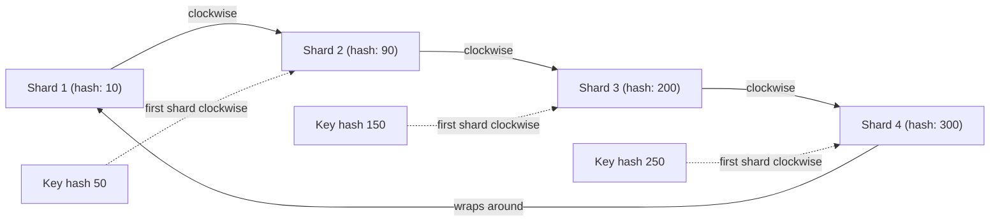
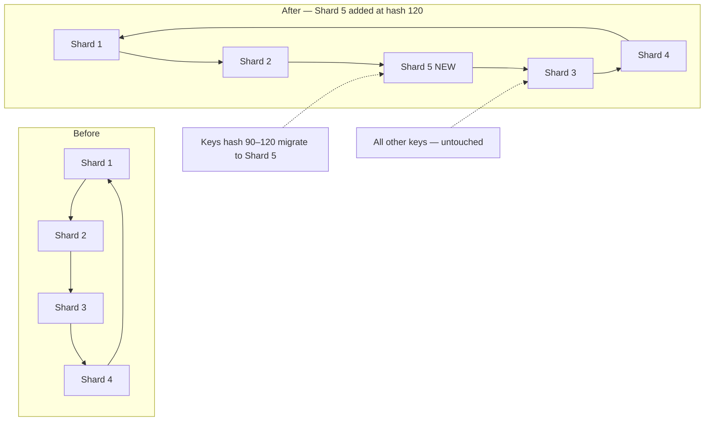

> [!question] Hash-based sharding works great — until you add or remove a shard. Then almost all your data routes to the wrong place. How do you fix this?

## The problem with naive hashing

Naive hash-based sharding uses modulo:

```
shard = user_id % 4

user_id 423,891,204 % 4 = 0 → Shard 1
user_id 100,000,001 % 4 = 1 → Shard 2
```

Simple. Works great — until you add a 5th shard:

```
user_id 423,891,204 % 5 = 4 → Shard 5   ✗ completely different shard!
user_id 100,000,001 % 5 = 1 → Shard 2   (same, got lucky)
```

Adding one shard causes ~80% of all keys to map to a different shard. You have to migrate hundreds of millions of rows across servers while the system is live under production traffic. Catastrophic.

The same happens when a shard goes down — all its keys must remap instantly to the remaining shards, causing a massive, sudden reshuffling.

---

## Consistent hashing — the fix

Place both shards and keys on a ring (0 to 2³²). Each key is assigned to the **first shard clockwise** from its hash position on the ring.



Now add a 5th shard between Shard2 and Shard3 (hash position 120):



Only keys that sat between Shard2 and Shard5 (hash 90–120) need to move. Everything else stays completely untouched — ~1/N of data remaps instead of ~80%.

The same property applies when a shard is removed — only the keys that were owned by the removed shard move to the next clockwise neighbour. Everything else stays put.

---

## Virtual nodes — solving uneven distribution

With few physical shards on the ring, the arc sizes between them are uneven. One shard might own 40% of the key space, another only 10%.

The fix is **virtual nodes (vnodes)** — each physical shard gets multiple positions on the ring (typically 150–200):

```
Physical Shard 1 → virtual positions at hash 10, 85, 190, 310, ...
Physical Shard 2 → virtual positions at hash 45, 130, 250, 380, ...
Physical Shard 3 → virtual positions at hash 20, 100, 220, 400, ...
```

Each shard now owns many small arcs scattered around the ring instead of one large arc. The key space is much more evenly distributed. When a shard is added or removed, its load is spread across all remaining shards proportionally rather than dumped entirely on one neighbour.

---

## Where consistent hashing is used

```
Cassandra     → routes writes/reads to the correct node on the ring

DynamoDB      → same concept, underpins the Dynamo architecture

Memcached     → distributes cache keys across cluster nodes

CDN routing   → routes user requests to the nearest edge server
```

> [!important] Consistent hashing is not just a sharding concept
> It appears in distributed caches, CDNs, and load balancers — anywhere you need to distribute keys across a changing set of nodes with minimal remapping. In an interview, whenever you mention a distributed cache or shard topology that might change, mentioning consistent hashing shows you understand what happens at the infrastructure level.
