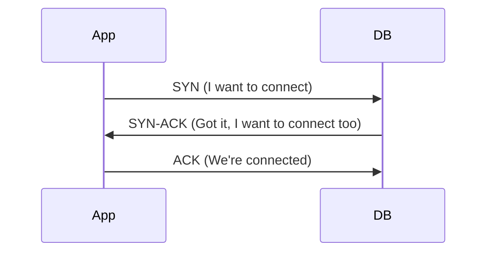
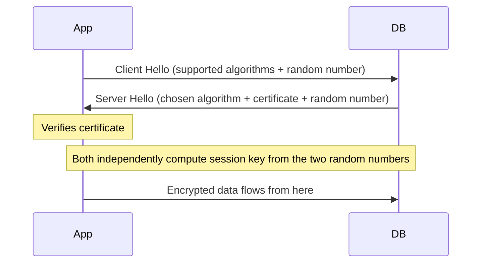
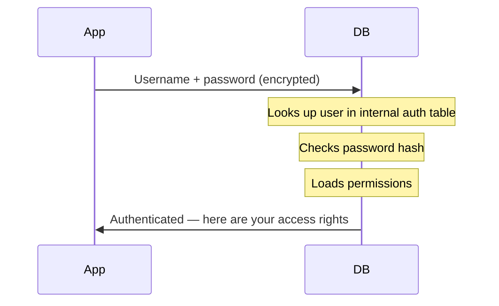
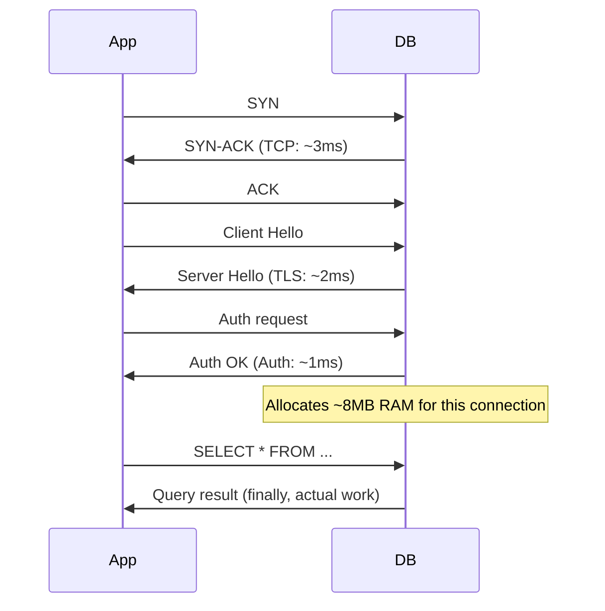

>[!info] Opening a database connection is expensive
>TCP handshake, TLS negotiation, authentication, memory allocation. At high concurrency, paying that cost on every request kills your DB. A connection pool pays that cost once at startup and reuses connections across thousands of requests.

# The Cost of Opening a Database Connection

## The naive approach

Every time a user makes a request, your app needs to talk to the database. The simplest approach: open a fresh connection, run the query, close the connection. Repeat for every request.

At 10 requests per second — annoying overhead but manageable. At 10,000 requests per second — your database collapses. To understand why, you need to know exactly what happens every time you open a connection.

---

## Step 1 — TCP Three-Way Handshake

Before your app can send a single byte to the database, it needs to establish a TCP connection. This is a three-message exchange:



Three messages, three network round trips. On a local network each round trip is ~1ms.

**Cost: ~3ms, before a single query runs.**

---

## Step 2 — TLS Handshake

If the connection is encrypted (and it should be), the app and DB now need to agree on how to encrypt traffic. This is a separate exchange on top of the TCP connection.



The clever part: the session key is never transmitted. Both sides compute it independently using the two random numbers and the agreed algorithm. An eavesdropper who sees all the messages still cannot compute the key.

TLS 1.3 (modern) adds 1 extra round trip. TLS 1.2 (older) added 2.

**Cost: ~1-2ms on top of TCP.**

---

## Step 3 — Database Authentication

With a secure channel established, the app now needs to prove to the database who it is.



The DB has to do a lookup in its own internal user/permissions table. Another round trip, another ~1ms.

**Cost: ~1ms.**

---

## Step 4 — Memory Allocation

This is the hidden cost most people miss.

Postgres uses a **one-process-per-connection** model. When a connection is opened, Postgres forks a dedicated OS process for it. Not a thread — a full process. That process needs its own:

- Stack memory
- Query execution buffers
- Sort and hash working memory (`work_mem`)
- Local cache of catalog info (table schemas, indexes, permissions)

```
Per connection memory:
  Stack + buffers:     ~1-2MB
  work_mem (default):  ~4MB
  Catalog cache:       ~1-2MB
  ─────────────────────────
  Total:               ~5-10MB per connection
```

At 1,000 concurrent connections:
```
1,000 × 8MB = 8GB RAM
→ just for connection overhead
→ before storing a single row of data
→ before running a single query
```

---

## The full cost summary



**Total overhead per fresh connection: 6-10ms + 5-10MB RAM**

At 10,000 RPS with fresh connections:
```
10,000 × 8MB  = 80GB RAM just for connections
10,000 × 8ms  = your DB spending all its time handshaking, not querying
```

> [!danger] The real problem
> It's not just the latency. Each Postgres connection is a full OS process. At 10,000 connections, the OS is context-switching between 10,000 processes. That overhead alone degrades query performance — the CPUs are busy managing processes instead of running queries.
