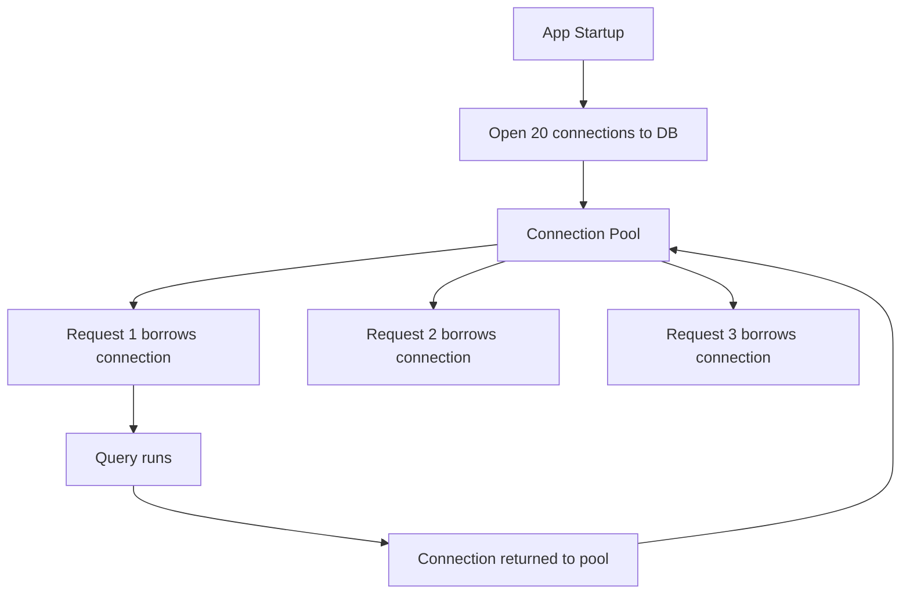
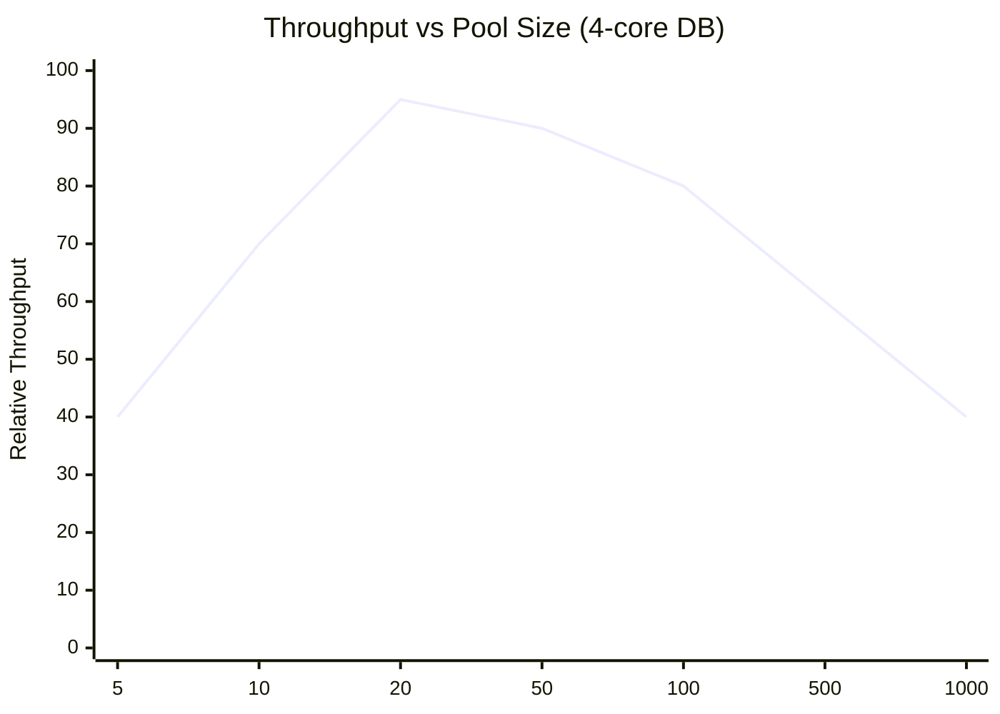
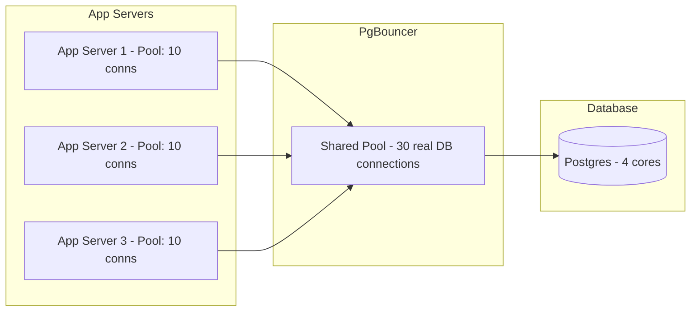

## The fix — open connections once, reuse them forever

The insight is simple: the expensive part is *opening* a connection, not *using* one. So open a fixed set of connections at startup, keep them alive, and hand them out to requests as needed.

This is a **connection pool**.



The TCP handshake, TLS negotiation, DB auth, and memory allocation all happen **once at startup** for each pooled connection. Every request after that goes straight to running the query — zero setup overhead.

---

## What happens under load

Say the pool has 20 connections and 100 requests arrive simultaneously:

```
Pool: [conn1][conn2]...[conn20]  (20 available)

Request 1-20:   each borrows a connection → query runs immediately
Request 21-100: wait in queue

conn1 finishes in 5ms → returned to pool
Request 21 borrows conn1 → runs immediately
...
```

The queue is fine in practice. Queries take milliseconds, so connections cycle back quickly. A request waits perhaps 5-10ms instead of paying 6-10ms of fresh connection overhead.

> [!important] The key insight
> You're not reducing work — you're amortising the setup cost. Instead of 10,000 requests each paying 8ms of connection overhead, 20 connections pay 8ms once, and 10,000 requests share them.

---

## What happens if the pool is too small

```
Pool size: 5 connections
Incoming: 1,000 requests/second
Each query takes: 20ms

Max throughput = 5 connections × (1000ms / 20ms) = 250 requests/second
```

750 requests per second are queued. Queue grows faster than it drains. Response times spike. Requests timeout. Users see errors.

**Fix: increase pool size — but carefully.**

---

## What happens if the pool is too large

Feels like more connections = more throughput. But no.

Your DB server has a fixed number of CPU cores. Say 4 cores — at any moment, only 4 queries can physically run in parallel.

With a pool of 1,000 connections:
```
4 queries running on CPUs
996 Postgres processes sitting idle, waiting their turn
OS context-switching between 1,000 processes constantly
→ CPU cycles burned on process management, not query execution
→ actual query throughput drops
```

With a pool of 20 connections:
```
4 queries running on CPUs
16 processes waiting — OS switches between 20 total
Near-zero context-switching overhead
→ almost all CPU time goes to running queries
```

Same hardware. Same queries. 20 connections outperforms 1,000 connections.



---

## How to size the pool

A reliable rule of thumb:

```
Pool size per app server = DB CPU cores × 2
```

The `×2` accounts for queries that aren't pure CPU work — when a query waits on disk I/O, another query can use that core. But beyond 2× the core count, you're just adding overhead.

```
DB server: 4 cores
→ Pool size: 8-10 connections per app server

DB server: 16 cores
→ Pool size: 32-40 connections per app server
```

If you have multiple app servers, each maintains its own pool. Total connections to DB = pool size × number of app servers. Keep this within the DB's comfortable connection limit (usually a few hundred).

---

## Why the app pool alone is not enough — you also need PgBouncer

The app-level pool works per app server instance. Each app server maintains its own fixed pool of connections. This is fine when you have a handful of servers.

But when you scale horizontally, the math turns against you:

```
10 app servers  × 10 connections each = 100 connections to Postgres   ✓ fine

50 app servers  × 10 connections each = 500 connections to Postgres   ⚠ getting heavy

200 app servers × 10 connections each = 2,000 connections to Postgres ✗ Postgres collapses
```

Each connection costs ~8MB RAM on the DB server. 2,000 connections = 16GB just for connection overhead before a single query runs. Postgres has a hard limit on max connections — beyond it, new connections are simply rejected.

The app pool has no visibility across servers. App Server 1 doesn't know App Server 2 has idle connections. Each one just keeps its own pool open regardless.

**PgBouncer fixes this by sitting between all your app servers and the DB as a single shared pool.**

```
App Server 1   ──┐
App Server 2   ──┤
App Server 3   ──┼──► PgBouncer (30 real DB connections) ──► Postgres
...            ──┤
App Server 200 ──┘
```

All 200 app servers talk to PgBouncer. PgBouncer maintains only 30 real connections to Postgres. Postgres sees 30 steady warm connections — regardless of how many app servers you add.

So both work together, at different levels:

```
App pool    → reduces overhead per app server (local reuse)
PgBouncer   → caps total connections hitting Postgres as you scale (global safety)
```

| Tool          | Use case                                                                          |
| ------------- | --------------------------------------------------------------------------------- |
| **PgBouncer** | Postgres — sits as infrastructure-level proxy, shared pool across all app servers |
| **HikariCP**  | Java apps — app-level connection pool library, extremely low overhead             |
| **RDS Proxy** | AWS managed — sits in front of RDS/Aurora, handles pooling automatically          |


## The complete picture



1,000 app threads across all servers share 30 DB connections. The DB sees 30 steady warm connections — not thousands. Query throughput is maximised, memory overhead stays flat no matter how many app servers you add.

> [!tip] Interview framing
> "Under high concurrency, raw DB connections become the bottleneck — each one costs TCP handshake, TLS, auth, and ~8MB of RAM on the DB server. I'd use an app-level pool like HikariCP to reuse connections locally, and PgBouncer in front of the DB to cap total connections globally as we scale horizontally. Pool size ≈ DB CPU cores × 2."
