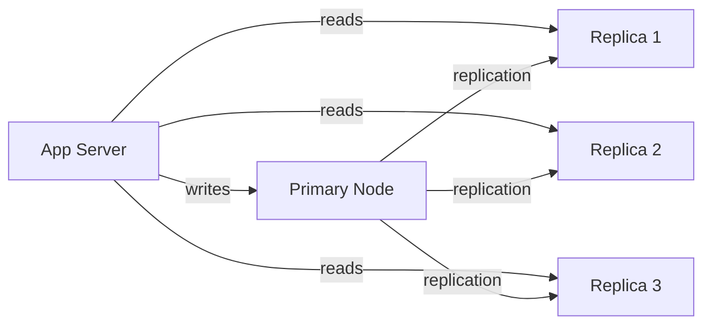
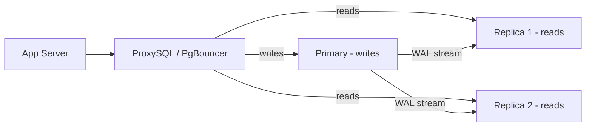

## The setup

You have one **primary** node that handles all writes. You have one or more **replica** nodes that handle all reads. Replicas are copies of the primary — same data, same schema.



You can add replicas to scale reads horizontally. Three replicas means three times the read throughput. The primary stays focused on writes only.

---

## How replicas stay in sync — WAL Streaming

Every write to the primary first goes to the **Write-Ahead Log (WAL)** — an append-only file that records every change made to the database. This is what makes crash recovery possible (the WAL survives a crash, the DB replays it on restart).

Replicas use this same WAL to stay in sync. Each replica opens a persistent streaming connection to the primary:

```
Replica → Primary: "stream me everything from WAL position 1042 onwards"
Primary → Replica: pushes new WAL entries as they're written
Replica:           applies each entry locally, in order
```

This is not polling — it's a continuous stream. Changes flow from primary to replica as they happen. The replica applies them immediately. The delay between a write landing on the primary and appearing on the replica is typically 10-100ms under normal load. This is called **replication lag**.

---

## Routing at the application layer

Your application is responsible for routing queries to the right node. The logic is simple:

```
INSERT / UPDATE / DELETE → send to Primary
SELECT                   → send to any Replica
```

In practice this is handled by:

- **A connection pool library** (HikariCP, for example) configured with separate pools for primary and replicas
- **A proxy** like ProxySQL (MySQL) or PgBouncer (Postgres) that intercepts queries and routes them automatically based on query type
- **AWS RDS Proxy / Aurora** — managed, handles routing transparently



The application talks to the proxy as if it's a single database. The proxy handles the routing transparently.

---

## Load balancing across replicas

If you have multiple replicas, reads are distributed across them — round robin, least connections, or latency-based. Each replica handles a fraction of the read traffic.

> [!important] What read/write splitting gives you
> - Reads and writes no longer compete for the same connections and locks
> - Read capacity scales horizontally — add replicas, add read throughput
> - Primary is protected — only handles writes, never overwhelmed by read traffic
>
> What it does NOT give you:
> - Instant consistency on reads — replicas may be slightly behind (see Replication Lag)
> - Automatic failover — if primary dies, you need a separate mechanism to promote a replica
