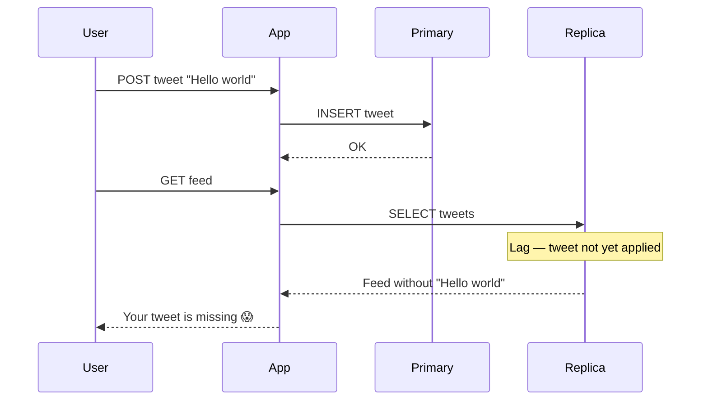
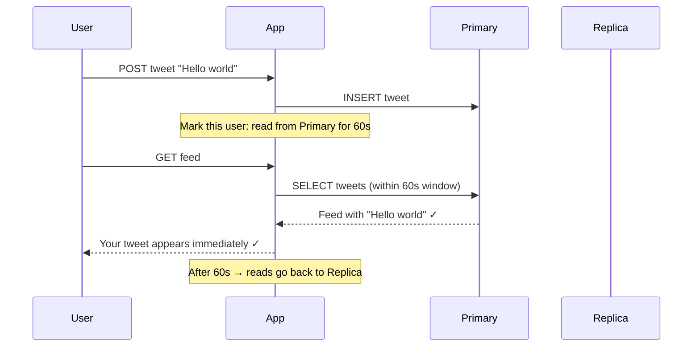

## The lag problem

Replication is asynchronous. The primary writes to the WAL, the replica streams it and applies it — but there's a small delay. Under normal conditions this is 10-100ms. Under heavy write load or a slow network, it can be more.

This means a replica **is always slightly behind the primary**. It's serving data that is almost — but not exactly — current.

```
Time 0ms:   User posts a tweet → written to Primary ✓
Time 0ms:   User refreshes feed → read goes to Replica
Time 50ms:  Replica receives and applies the tweet
→ User's own tweet is missing from their feed for ~50ms
```

This is called **replication lag**, and it leads directly to the read-your-own-writes problem.

---

## Read-Your-Own-Writes Violation

You write something. You immediately read it back. You don't see it.

This is a **read-your-own-writes violation** — one of the most jarring consistency problems in user-facing systems. A user posts a tweet, refreshes, and it's gone. A user updates their profile picture, navigates away, comes back — old picture. Confusing and trust-destroying.



---

## The fix — route recent writes to primary

After a user writes something, route **their reads** to the primary for a short window — typically 30-60 seconds. By then, replication lag has caught up and the replica is consistent.



Only that specific user's reads are affected. Everyone else continues reading from replicas as normal. The primary handles a tiny fraction of extra read traffic — just the user's own reads, for a brief window.

---

## Implementation options

**Option 1 — Time-based:** after a write, set a flag in the session (or a cookie) — "route reads to primary until timestamp X." Simple, works well.

**Option 2 — Token-based (replication position):** the primary returns its current WAL position after a write. On the next read, route to a replica only if that replica has caught up to that WAL position. More precise but more complex.

Most systems use Option 1 — the time-based approach is simple and the 60-second window is conservative enough to cover almost all realistic lag scenarios.

---

## What happens if the primary goes down?

During a primary failure, a replica is promoted to become the new primary — standard failover. But during the failover window (typically 30-60 seconds), the system may be unavailable or degraded.

For users in the read-your-own-writes window, their reads can't go to the primary. The guarantee breaks temporarily.

This is accepted as a known trade-off:

```
Normal operation:    read-your-own-writes guaranteed ✓
Primary failure:     brief inconsistency window → failover → guarantee restored ✓
```

For truly critical writes — a payment confirmation, a booking — you don't rely on the DB at all for immediate feedback. You show the user a locally cached version of what they just submitted (optimistic UI) and reconcile with the DB once it's stable.

> [!danger] Common interview trap
> Don't promise read-your-own-writes consistency without acknowledging replication lag. The correct framing is: "reads go to replicas by default, but after a write I route that user's reads to the primary for a short window to avoid seeing stale data."

> [!tip] Interview framing
> "Reads go to replicas — they're eventually consistent due to replication lag, typically 10-100ms. To handle read-your-own-writes, after a user writes something I route their reads to the primary for 60 seconds. After that window, lag has caught up and they go back to replicas."
