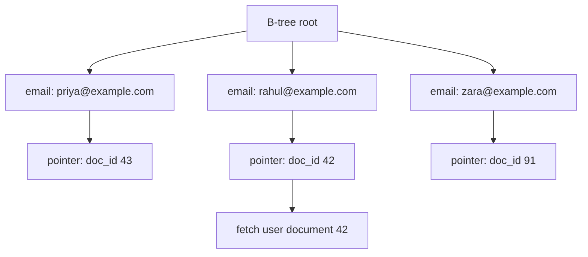
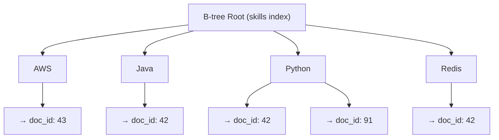
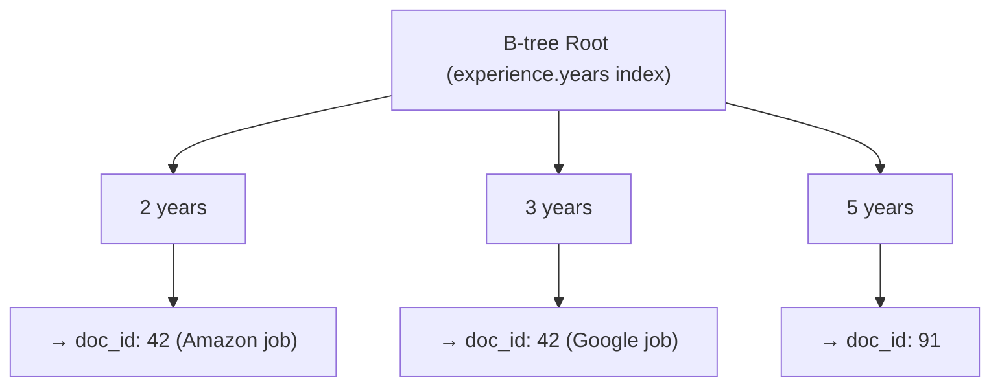

> [!info] MongoDB can index any field — including fields buried inside arrays and nested objects. Without indexes, every query scans every document. With the right indexes, queries are O(log n) regardless of collection size. Same B-tree mechanics as SQL, applied to a flexible document structure.

## The problem without indexes

```
Query: find all users where skills contains "Python"

Without index:
  → scan document 1 → check skills array → no match
  → scan document 2 → check skills array → match ✓
  → scan document 3 → check skills array → no match
  → ... repeat for every document in the collection

10M documents → 10M checks → O(n) → unacceptably slow
```

---

## Regular index — flat field

Same as SQL. B-tree on a top-level field.

```javascript
db.users.createIndex({ "email": 1 })
```



Query `email = "rahul@example.com"` → B-tree lookup → doc_id: 42 → fetch document. One operation.

---

## Multikey index — arrays

This is where MongoDB differs from SQL. When you index an array field, MongoDB creates one index entry **per array element**. Every element in every document's array becomes a searchable entry.

```javascript
db.users.createIndex({ "skills": 1 })
```



Query `skills = "Python"` → B-tree lookup → [doc_id: 42, doc_id: 91] → fetch those 2 documents only. Never touches doc_id: 43.

---

## Nested field index — inside objects

MongoDB can index fields inside nested objects using dot notation.

```javascript
db.users.createIndex({ "experience.years": 1 })
```



Query `experience.years >= 3` → B-tree range scan → [doc_id: 42, doc_id: 91].

---

## Combined query — intersection

```javascript
db.users.find({
  "skills": "Python",
  "experience.years": { $gte: 3 }
})
```

```
Step 1: skills index        → [doc_id: 42, doc_id: 91]
Step 2: experience.years index → [doc_id: 42, doc_id: 91]
Step 3: intersection        → [doc_id: 42, doc_id: 91]
Step 4: fetch documents     → 2 documents returned ✓
```

MongoDB uses both indexes, intersects the results, fetches only matching documents. Never scans the full collection.

---

## What SQL cannot do that MongoDB can

```
SQL:    CREATE INDEX ON users(email)          ✓ flat column
        CREATE INDEX ON users(skills[*])      ✗ array elements not indexable

MongoDB: createIndex({ "email": 1 })          ✓
         createIndex({ "skills": 1 })         ✓ multikey — each array element indexed
         createIndex({ "experience.years": 1 }) ✓ nested field
```

---

## The same rules apply as SQL

> [!important] Indexes make reads fast but writes slower — every write must update all indexes on that collection. Don't index every field. Index the fields your most frequent queries filter on.

```
Low cardinality field (e.g. boolean "is_active")  →  bad index, barely reduces scan
High cardinality field (e.g. email, user_id)      →  good index, highly selective
Write-heavy collection with rarely-queried fields →  skip the index
```
