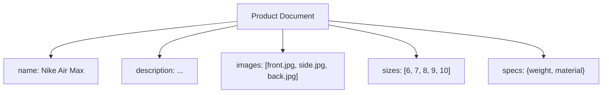
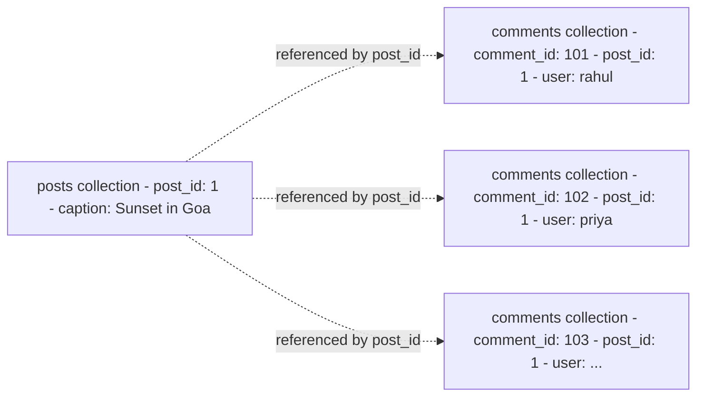

> [!info] This is the most important data modelling decision in MongoDB. Every time you have two related entities, you choose: embed one inside the other, or store them separately and reference by ID. Get this wrong and you either fetch too much data or make too many round trips.

---

## The two approaches

**Embedding** — nest the related data directly inside the parent document:

```json
{
  "post_id": 1,
  "caption": "Sunset in Goa",
  "comments": [
    { "user": "rahul", "text": "beautiful!" },
    { "user": "priya", "text": "where is this?" }
  ]
}
```

One document, one fetch, everything you need.

**Referencing** — store separately, link by ID (like a SQL foreign key):

```json
// posts collection
{ "post_id": 1, "caption": "Sunset in Goa" }

// comments collection
{ "comment_id": 101, "post_id": 1, "user": "rahul", "text": "beautiful!" }
{ "comment_id": 102, "post_id": 1, "user": "priya", "text": "where is this?" }
```

Two collections, two fetches, joined in application code.

---

## The rule — bounded vs unbounded

The single question that determines which approach to use:

```
Will this array grow without a known upper limit?

Yes (unbounded) → reference
No  (bounded)   → embed
```

---

## When embedding wins — product catalog

A shoe on Flipkart. When someone opens the product page you always need:

```json
{
  "product_id": 101,
  "name": "Nike Air Max",
  "description": "Lightweight running shoe",
  "images": ["front.jpg", "side.jpg", "back.jpg"],
  "sizes": ["6", "7", "8", "9", "10"],
  "specs": { "weight": "300g", "material": "mesh" }
}
```

- Images: a seller uploads 3–8 images. Fixed, never grows after listing.
- Sizes: 6–10, maybe 12 options. Fixed.
- Specs: defined at creation, never changes.

These are **bounded** — known upper limit, always fetched together with the product, never updated independently. One document fetch renders the entire product page.



---

## When embedding breaks — Instagram comments

A post goes viral. 50,000 comments.

```
50,000 comments × ~200 bytes = 10MB per document
MongoDB document limit: 16MB → you'll hit it on a popular post ✗

Load post page   → fetch entire 10MB document every time ✗
Add a comment    → rewrite the entire 10MB document ✗
```

Comments are **unbounded** — they grow forever, have no upper limit, and users often want them separately (paginated, not all at once).



Reference them. Fetch comments separately, paginated. The post document stays small regardless of how many comments it gets.

---

## Denormalization — duplicating data to avoid round trips

When you reference, you sometimes still need data from the referenced document on every read. For example, every post in a feed needs the author's name and avatar.

Option 1 — reference only:
```
Fetch 20 posts → for each post, fetch the author → 21 round trips ✗
```

Option 2 — embed a snapshot of what you need:
```json
{
  "post_id": 1,
  "caption": "Sunset in Goa",
  "author": {
    "user_id": 42,
    "name": "Rahul",
    "avatar_url": "cdn.example.com/avatars/rahul.jpg"
  }
}
```

One fetch, author info included. But now `name` and `avatar_url` are duplicated across every post Rahul ever wrote.

**The trade-off:**

```
Denormalize  →  fast reads, data duplication, update propagation problem
Normalize    →  clean data, multiple round trips on every read
```

---

## Handling stale denormalized data

If Rahul updates his avatar, the new URL needs to propagate to all his posts. Two approaches used in practice:

```
Option 1: lazy update
  → don't update old posts at all
  → new posts get new avatar, old posts keep old avatar
  → most users never notice stale avatars on old content
  → Instagram does this

Option 2: background job
  → when user updates avatar, queue an async job
  → job updates avatar_url in all posts by that user
  → eventually consistent — posts show old avatar for a few seconds/minutes
```

Neither option gives you SQL's guarantee of a single source of truth. This is the cost of denormalization.

---

## Decision map

```
Is the related data bounded (fixed upper limit)?
  Yes → embed
  No  → reference

Is the related data always fetched with the parent?
  Yes → embed
  No  → reference

Will the related data grow to thousands of items?
  Yes → reference (16MB document limit)
  No  → embed

Do you need to update the related data independently?
  Yes → reference
  No  → embed
```

> [!tip] Interview framing
> "In MongoDB I'd embed bounded, co-fetched data — specs, images, sizes — and reference unbounded or independently-fetched data — comments, likes, orders. For denormalized fields like author name on a post, I'd accept eventual consistency via a background update job rather than paying multiple round trips on every read."
