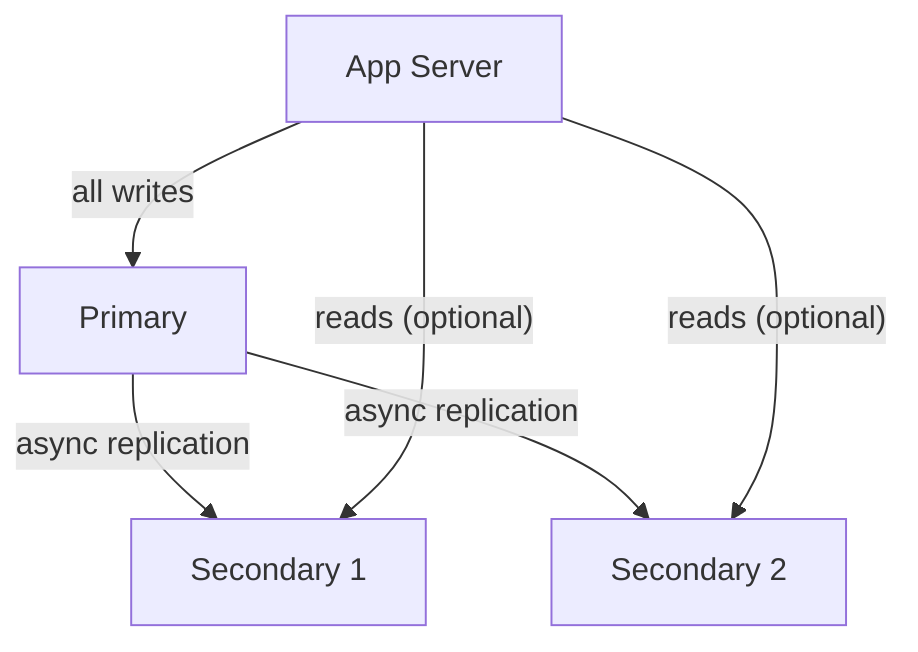
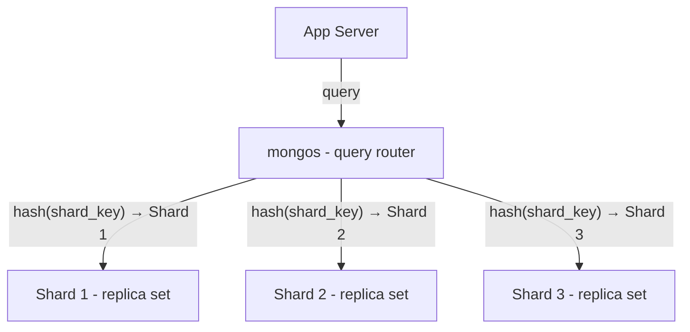
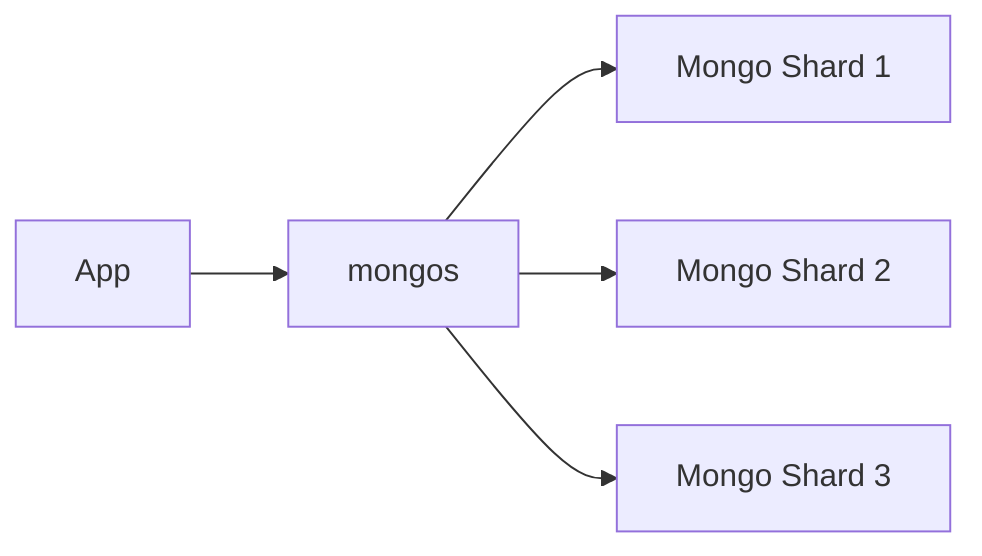
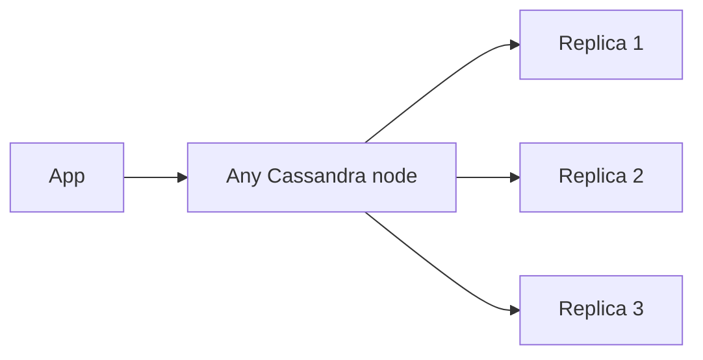

> [!info] MongoDB's replication and sharding follow the same fundamentals covered in the database replication and sharding notes — primary-replica, consistent hashing, quorum writes. The MongoDB-specific pieces are: replica sets as the replication unit, write concern levels for tunable durability, and mongos as the transparent query router.


## Replica Sets — MongoDB's replication unit

A replica set is one primary and one or more secondaries. All writes go to the primary. **Secondaries replicate asynchronously**.



If the primary goes down, the secondaries hold an election and promote one of themselves to primary automatically. No manual intervention needed.

---

## Write Concern — tunable durability

Write concern controls how many nodes must confirm a write before MongoDB returns success to your application. You set it per-operation.

```
w: 0        →  fire and forget — don't even wait for primary acknowledgement ,fastest, zero durability guarantee
               use for: metrics, analytics, logs where losing a write is acceptable

w: 1        →  primary confirmed (default)
               primary has written it, secondaries may not have replicated yet
               risk: primary crashes before replicating → write lost
               use for: non-critical writes, high-throughput event storage

w: majority →  more than half the nodes confirmed
               survives primary crash — majority already have the data
               slower (waits for replication round trip)
               use for: user profile updates, orders, payments, anything critical
```

This is the same R + W > N quorum principle from replication notes — majority write ensures at least one surviving node has the data after any single-node failure.

```
3-node replica set, w: majority = 2 nodes must confirm

Write arrives → primary writes → secondary 1 writes → "success" returned
             → secondary 2 replicates in background

Primary crashes → secondary 1 still has the write → no data loss ✓
```

---

## Sharding — scaling beyond one replica set

When a single replica set can't handle the data volume or write throughput, MongoDB shards across multiple replica sets. Each shard is itself a replica set.

You pick a **shard key** — MongoDB hashes it and routes to the right shard. Same consistent hashing you know from DynamoDB and the sharding notes.

The MongoDB-specific piece is **mongos** — a query router that sits between your application and the shards:



Your application connects to mongos as if it's a single MongoDB instance. mongos knows which shard holds which key ranges, routes the query, returns the result. The sharding is completely transparent to the application.

---

## Why mongos feels different from Cassandra and Postgres

MongoDB has a dedicated routing layer in front of the shards.



That is different from Cassandra. Cassandra does not have a separate `mongos`-style router process. The client can talk to any Cassandra node, and that node becomes the **coordinator** for the request. The coordinator figures out which replicas own the partition, forwards the request, waits for enough responses based on the consistency level, and returns the result.



So Cassandra still has routing behavior, but the routing is handled by an ordinary cluster node acting as coordinator, not by a dedicated router tier.

Plain Postgres is different again. It usually has no built-in distributed query router because plain Postgres is not a natively sharded distributed database. If you shard Postgres, the routing is usually pushed into the application or into an additional system such as Citus.

> [!important] MongoDB = dedicated router (`mongos`). Cassandra = any contacted node can coordinate. Plain Postgres = no native distributed router because sharding is not the default model.

---

## Summary

```
Replica set    →  1 primary + N secondaries, automatic failover

Write concern  →  w:0 (fire/forget) → w:1 (primary) → w:majority (quorum)

Sharding       →  consistent hashing on shard key, each shard is a replica set

mongos         →  transparent query router, app talks to one endpoint

Cassandra      →  no separate router tier, any node can act as coordinator

Postgres       →  no native sharded query router in plain Postgres
```

> [!tip] Interview framing
> "MongoDB replication uses replica sets — one primary, multiple secondaries, automatic failover. Write concern is tunable: w:majority for critical data to ensure quorum durability, w:1 for high-throughput non-critical writes. For horizontal scaling, MongoDB shards via consistent hashing with a mongos router that makes sharding transparent to the application."
