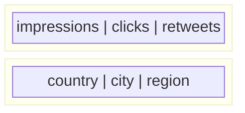

Column-oriented storage solves the write problem. But there are two more ideas that make column-family stores genuinely powerful for analytics and time-series use cases: **column families** and **row keys**. These two concepts work together to make range queries fast and disk I/O minimal.

## Column families — grouping related columns

Not all columns are accessed together. In Twitter analytics, you have two very different types of data:

```
Engagement data:   impressions, clicks, retweets
Geographic data:   country, city, region
```

An analyst running "give me all engagement metrics for tweet_1" has no interest in geographic data. An analyst running "give me the country breakdown for tweet_1" has no interest in engagement metrics. These two groups are almost never queried together.

If all columns lived in one giant block on disk, a query for engagement data would still have to read past the geographic columns sitting in between:


**The database reads left to right across the block**. `country`, `city`, and `region` are loaded from disk and immediately thrown away — wasted I/O.

The fix is to store related columns together in their own section of disk. That grouping is called a **column family**:



Now a query for engagement data only touches the engagement column family. The geo section is physically elsewhere on disk — it's never read, loaded, or discarded. Pure zero wasted I/O.

> [!info] What is a column family?
> A column family is a group of columns that are stored together on disk because they are frequently accessed together. You define column families when you design your schema — this is a deliberate upfront design decision, not something the database figures out automatically.

> [!important] One column family per query
> The design principle in Cassandra is: if two columns are always queried together, they belong in the same column family. If they're almost never queried together, split them into separate families. Getting this wrong means reading data you don't need on every query.

---

## What a Cassandra table actually looks like

When you put column families together with actual data, a Cassandra table looks visually similar to a SQL table — but the underlying storage is completely different:

```
Row Key                    | engagement                           | geo
                           | impressions | clicks   | retweets    | country | city
---------------------------|-------------|----------|-------------|---------|-------
tweet_1#IN#2026-04-01-03pm |    4200     |   310    |    89       |   IN    | Mumbai

tweet_1#IN#2026-04-01-04pm |    5100     |   400    |    91       |   IN    | Mumbai

tweet_1#US#2026-04-01-03pm |    1100     |   200    |    45       |   US    | NYC

tweet_2#IN#2026-04-01-03pm |    9800     |   750    |   210       |   IN    | Delhi
```

Three things stand out here:

**1. The row key** — the leftmost column is not just an ID. It's a structured composite key: `tweet_id # country # timestamp`. This structure is intentional and critical.

**2. Column families as separate storage** — `engagement` and `geo` are stored in separate sections of disk. The table view above is a logical representation; physically, they don't live together.

**3. Sparse columns** — if a row doesn't have geo data, those cells simply don't exist. Unlike SQL, there's no `NULL` stored — the cells are just absent. This matters enormously at scale.

> [!danger] NULLs vs absence
> In SQL, a missing value is `NULL` — a placeholder that still occupies space and must be stored and read. In Cassandra, a missing cell has zero storage cost. At billions of rows where most cells are empty, this difference becomes enormous savings in disk space.

---

## Row keys — how sorting enables fast range queries

The row key is not just an identifier. In Cassandra, **all rows are stored sorted by their row key** on disk. This is the feature that makes range queries fast.

For our Twitter analytics, the rows on disk look like:

```
tweet_1#IN#2026-04-01-01am  →  { engagement data }
tweet_1#IN#2026-04-01-02am  →  { engagement data }
tweet_1#IN#2026-04-01-03am  →  { engagement data }
...
tweet_1#IN#2026-04-01-11pm  →  { engagement data }
tweet_1#US#2026-04-01-01am  →  { engagement data }
...
tweet_2#IN#2026-04-01-01am  →  { engagement data }
```

Because rows are sorted, all hours for `tweet_1#IN` are **physically adjacent on disk**. A query for "give me tweet_1's India impressions for the last 24 hours" becomes a single **sequential scan** of a small contiguous section of disk — no jumping around, no index lookups across the whole table.


Compare this to SQL, where those same 24 rows could be scattered across hundreds of disk blocks depending on insert order. SQL would have to chase pointers all over disk — many random reads instead of one sequential scan.

> [!info] Sequential reads vs random reads
> Sequential reads on disk are orders of magnitude faster than random reads. A sequential read just continues forward from where it is. A random read requires seeking to a new location — expensive on HDDs, and still significant on SSDs. Sorted row keys turn range queries into sequential reads, which is the same principle that makes LSM tree SSTables fast.

This is not a coincidence — it's the same insight. Cassandra uses LSM trees internally precisely because they produce sorted SSTables, which then make row-key-sorted range queries fast. The whole system is designed around sequential I/O.

> [!tip] Row key design is the most critical schema decision in Cassandra
> The row key determines sort order, which determines what queries are fast. Design your row key around your most common query pattern — entity first, then time. `tweet_1#IN#timestamp` makes per-tweet per-country time-range queries fast. A different key design serves different queries. You cannot have it both ways.
