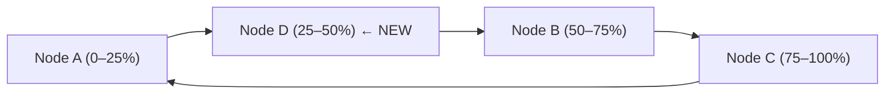
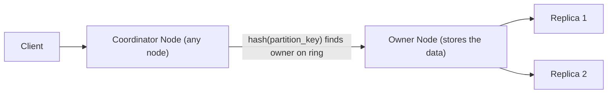

# Cassandra Ring Architecture

Cassandra is a distributed database — no single machine can hold 100 billion rows of analytics data. So the first question is: how does Cassandra decide which node stores which row?

---

## The naive approach — and why it breaks

The obvious answer is modulo hashing. Hash the partition key, divide by the number of nodes, and use the remainder to pick a node:

```
node = hash(partition_key) % N
```

This works fine until you add a node. The moment `N` changes from 10 to 11, almost every key hashes to a different node. The database has to redistribute the majority of its data across the cluster every time you scale. At billions of rows, this is catastrophic — the cluster becomes unavailable during reshuffling, and the reshuffling takes hours.

> [!danger] Mod-N hashing breaks at scale
> Adding one node to a 10-node cluster forces ~90% of data to move. In a system absorbing 58,000 writes/second, this is an outage-level event, not a routine scaling operation.

---

## The ring — consistent hashing

Cassandra uses **consistent hashing** instead. Every possible hash value from 0 to 2^64 is laid out as a ring. Each node is assigned a position on the ring and owns all the keys between itself and the previous node.


When a write arrives, Cassandra hashes the partition key and finds where it falls on the ring. That determines which node is responsible for storing it.

```
partition key: tweet_1#IN
hash value:    0.45  (falls in 33–66% range)
→ routed to Node B
```

Now when you add a new node — say Node D — it takes a position on the ring between two existing nodes. Only the keys in that slice move. Everything else stays exactly where it is.



Node D takes a slice from Node B's range. Only Node B's data in the 25–50% range moves. Nodes A and C are completely untouched.

> [!info] Consistent hashing
> A technique where the hash space is a ring and each node owns a contiguous arc of it. Adding or removing a node only moves the data in the affected arc — not the entire dataset.

---

## The coordinator — how writes are routed

No client talks directly to the storage node. Every node in Cassandra can act as a **coordinator** — it receives the client request, figures out which node owns the data, and forwards it there.



The client doesn't need to know the ring topology. It connects to any node, that node acts as coordinator, routes to the right place, and handles replication. This is what makes Cassandra **masterless** — there is no single node that all writes must go through.

> [!important] Masterless architecture
> Every node in Cassandra can be a coordinator. There is no primary node bottleneck. This is a deliberate design choice for availability — if any node goes down, other nodes continue serving requests without an election or failover.

---

## Gossip — how every node knows the ring

The coordinator can only route to the right node if it knows the full ring topology — which nodes are alive, and which node owns which range. But if there's no master to ask, how does every node know this?

The answer is the **gossip protocol**. Every second, each node picks 1–3 random neighbours and exchanges what it knows about the cluster — which nodes are alive, which are down, and who owns which range of the ring. Each neighbour merges that information with what it already knows and passes it on in the next round.

```
Node A → tells Node C → "Node B is alive, owns range 33–66%"
Node C → tells Node E → same info + everything C knows
Node E → tells Node B → merged picture from across the cluster
```

It spreads exactly like gossip in an office — no single person tells everyone, but within a few seconds everyone knows everything. After a few rounds, every node has a complete, consistent picture of the entire ring with no central server involved.

This is what makes the coordinator pattern work. When a client connects to any node, that node already has the full ring map locally. It computes the owner with a hash, and routes directly — no lookup, no master to ask.

```
Cassandra:
Client → Any Node → "I already know the ring, key X is on Node C" → Node C
                     (pure local computation via gossip-maintained ring map)
```

> [!info] Gossip protocol
> A decentralised communication pattern where each node periodically shares its known cluster state with a few random neighbours. Information propagates exponentially — within seconds, every node converges on the same view of the cluster.

> [!important] Gossip is also how failures are detected
> If a node stops responding to gossip messages, its neighbours mark it as suspect, then down. The cluster reroutes traffic away from it automatically — no human intervention, no central monitor required.
