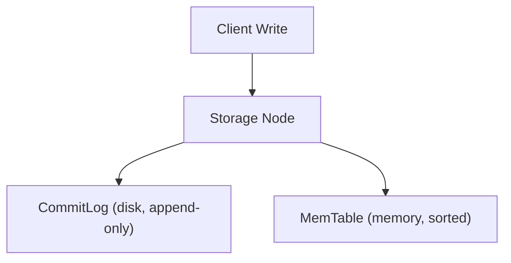
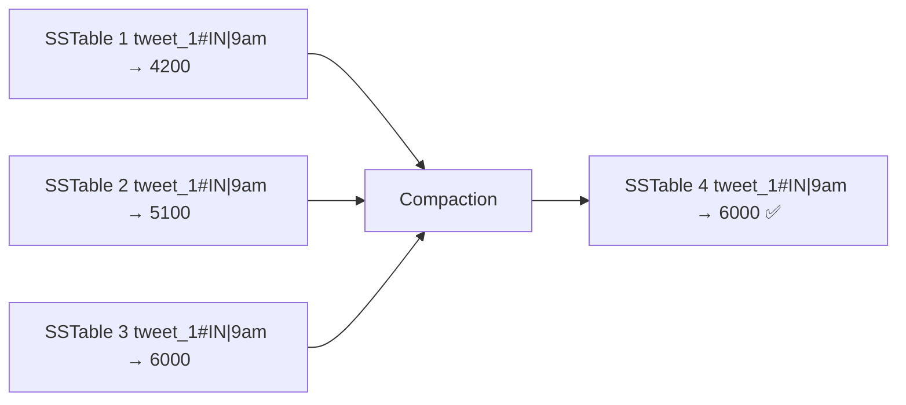
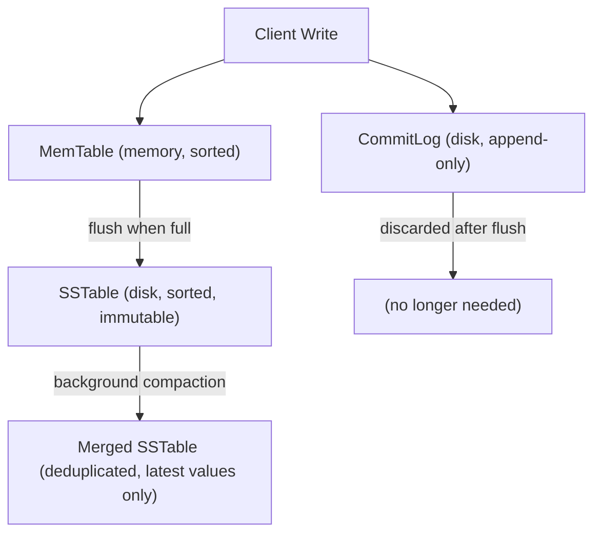

# The Cassandra Write Path

Once the coordinator has routed a write to the correct node, what actually happens inside that node? This is the write path — and every step exists for a specific reason.

---

## The two simultaneous destinations

When a write arrives at a node, it goes to two places **at the same time**:



These are not sequential — both happen together before the write is acknowledged to the client.

**CommitLog** is an append-only file on disk. Every write is appended to the end — no seeking, no sorting, just sequential writes. It exists purely for durability. If the server crashes, the CommitLog survives on disk and can be replayed to reconstruct anything that was in memory.

**MemTable** is an in-memory sorted data structure — think of it as a balanced tree or skip list. Writes land here and are immediately available for reads. It holds data in sorted order by partition key and clustering column, which is what makes it possible to flush a sorted SSTable later.

> [!important] This is not a dual write problem
> Dual write refers to two independent systems that can go out of sync — if one fails, the other is inconsistent with no way to detect it. CommitLog and MemTable are not independent. The CommitLog is the source of truth; the MemTable is derived from it. If the server crashes mid-write, Cassandra replays the CommitLog on restart to rebuild the MemTable. One always reconstructs from the other.

> [!info] Why sequential CommitLog writes are fast
> Hard drives and SSDs both handle sequential writes far faster than random writes. Random writes require seeking to the correct disk location. Sequential writes just append to the end. The CommitLog turns every incoming write into a sequential append — that's why Cassandra can absorb 58,000 writes/second where SQL would melt.

---

## MemTable flush — when memory fills up

The MemTable is bounded. When it reaches a size threshold, it is **flushed to disk** as an **SSTable** — a Sorted String Table. The SSTable is:

- **Sorted** — by partition key and clustering column, same order as the MemTable
- **Immutable** — once written, never modified. Updates don't overwrite; they create new SSTables.
- **On disk** — persistent, survives restarts


Once the flush is complete, the corresponding CommitLog segment is discarded — it's no longer needed for recovery because the data is safely on disk in the SSTable.

---

## Compaction — the accumulation problem

Writes keep coming. The MemTable keeps filling up and flushing. Over time, you accumulate many SSTables on disk:

```
SSTable 1:  tweet_1#IN | 9am  → impressions: 4200
SSTable 2:  tweet_1#IN | 9am  → impressions: 5100   ← same key, updated value
SSTable 3:  tweet_1#IN | 9am  → impressions: 6000   ← updated again
```

The same key now has three different versions across three different files. A read for that key has to check all three and figure out which version is newest. The more SSTables accumulate, the slower reads become.

**Compaction** solves this. It merges multiple SSTables into one, keeping only the most recent version of each key:



After compaction, reads only need to check one file instead of three. Compaction runs in the background and is one of the main ways Cassandra maintains read performance over time.

> [!tip] Cassandra never updates in place
> In SQL, an update modifies the existing row on disk. In Cassandra, every write is an append. Updates are new SSTable entries with a newer timestamp. The old value is not deleted immediately — it's superseded during compaction. This is what allows Cassandra to turn all writes into sequential appends.

---

## The full write path



For how deletes work in this append-only system — see `05-Tombstones.md`.
