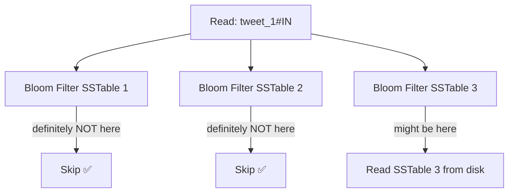
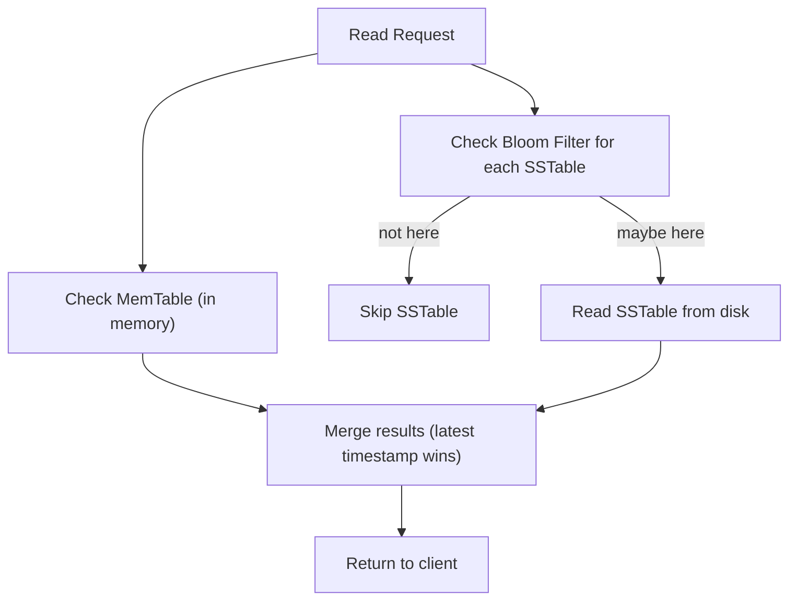
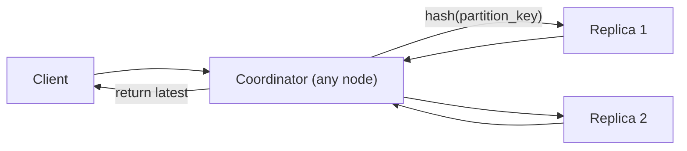

# The Cassandra Read Path

Reads in Cassandra are more complex than writes — and deliberately so. The write path is optimised for speed and throughput; the read path pays a small price for that by having to look in multiple places. Cassandra uses a key structure to make that price as small as possible.

---

## The problem — data is in multiple places

When a read comes in for a key, the latest version of that data could be in:

1. The **MemTable** — if it was written recently and not yet flushed
2. One or more **SSTables on disk** — if it was flushed but compaction hasn't merged everything yet

A naive implementation would check every SSTable for every read. At 50 SSTables, that's 50 disk reads just to answer one query. Catastrophically slow.

Cassandra solves this with a **Bloom Filter** — one per SSTable, kept in memory.

---

## Bloom Filters — ruling out SSTables without reading them

Before Cassandra touches any SSTable on disk, it asks the Bloom Filter: "does this key exist in this file?"

The Bloom Filter gives two possible answers:

- **Definitely not here** — the key is 100% absent from this SSTable. Skip it entirely. Zero disk I/O.
- **Might be here** — the key is probably in this SSTable. Go read it from disk.

A Bloom Filter never misses a key that exists — it will always say "might be here" for a key that is genuinely present. But it can give **false positives** — occasionally saying "might be here" for a key that isn't there. That just means one unnecessary disk read. Wrong answer is never returned, only occasionally wasted I/O.

> [!info] Why Bloom Filters work here
> In a cluster with 50 SSTables, the Bloom Filter might rule out 47 of them instantly, in memory, with no disk I/O. Only 3 need to be read. Without Bloom Filters, every read would require 50 disk reads. The whole read path is designed to minimise disk touches.

> [!important] Bloom Filters are probabilistic
> They cannot tell you "yes, this key is definitely here." They can only say "no, definitely not here" or "maybe." The false positive rate is configurable — lower false positives requires more memory for the filter. This is a classic space vs accuracy trade-off.

---

## The full read path

Once the Bloom Filters have ruled out as many SSTables as possible, Cassandra reads the remaining candidates and merges the results:

The merge step is where compaction pays off — the fewer SSTables that survived compaction, the fewer files need to be read and merged on every query.

> [!tip] Read performance degrades without compaction
> If compaction falls behind — because write throughput is very high — SSTables accumulate. Bloom Filters help, but more files still means more disk reads per query. Compaction is not just storage housekeeping; it directly determines read latency.

---

## Coordinator routing on reads

Just like writes, reads are also routed through a coordinator. The coordinator hashes the partition key, finds the node(s) that own the data on the ring, and requests the data from them.

How many replicas the coordinator contacts depends on the **consistency level** configured for the read — which is covered in the next file.
